# ARCH-MODEL-001: Model Selection Decision Tree (Mermaid Flowchart)

**Document ID**: ARCH-MODEL-001-FLOWCHART
**Created**: 2025-10-27
**Version**: 1.0
**Purpose**: Visual decision tree for AI model selection

---

## USAGE INSTRUCTIONS

**How to Use This Flowchart**:
1. Start at the top (TASK TYPE)
2. Follow the arrows based on your task characteristics
3. Arrive at the optimal model recommendation
4. Check context size and priority constraints
5. Use the recommended model + fallback

**Rendering**:
- GitHub/GitLab: Auto-renders Mermaid
- VS Code: Install "Markdown Preview Mermaid Support" extension
- Online: Copy to https://mermaid.live/

---

## PRIMARY DECISION TREE

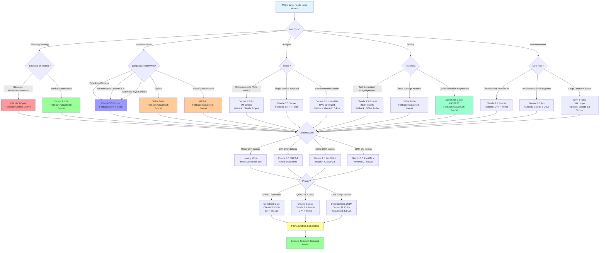

---

## AGENT-SPECIFIC DECISION TREES

### LIV HANA (ORCHESTRATOR)

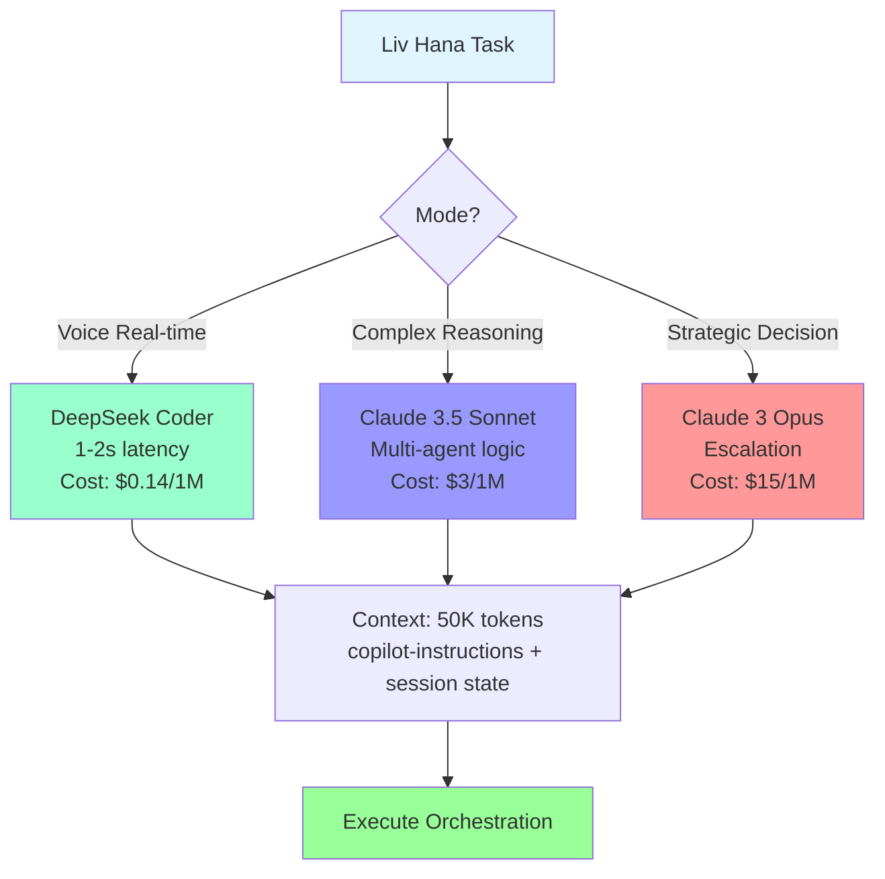

### PLANNING AGENT

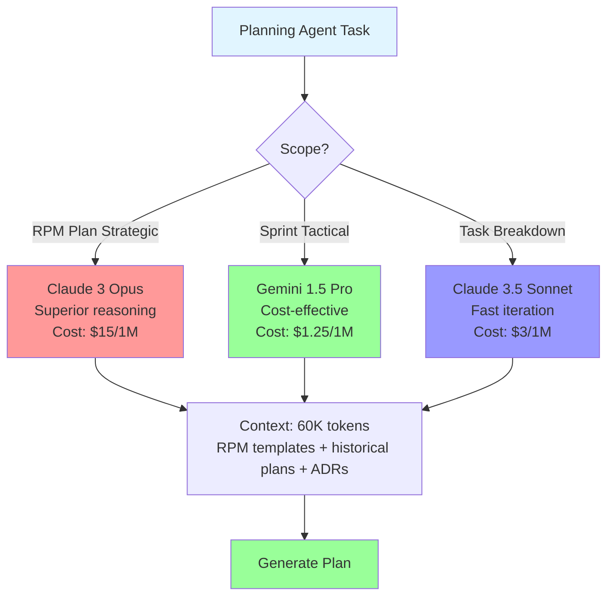

### RESEARCH AGENT

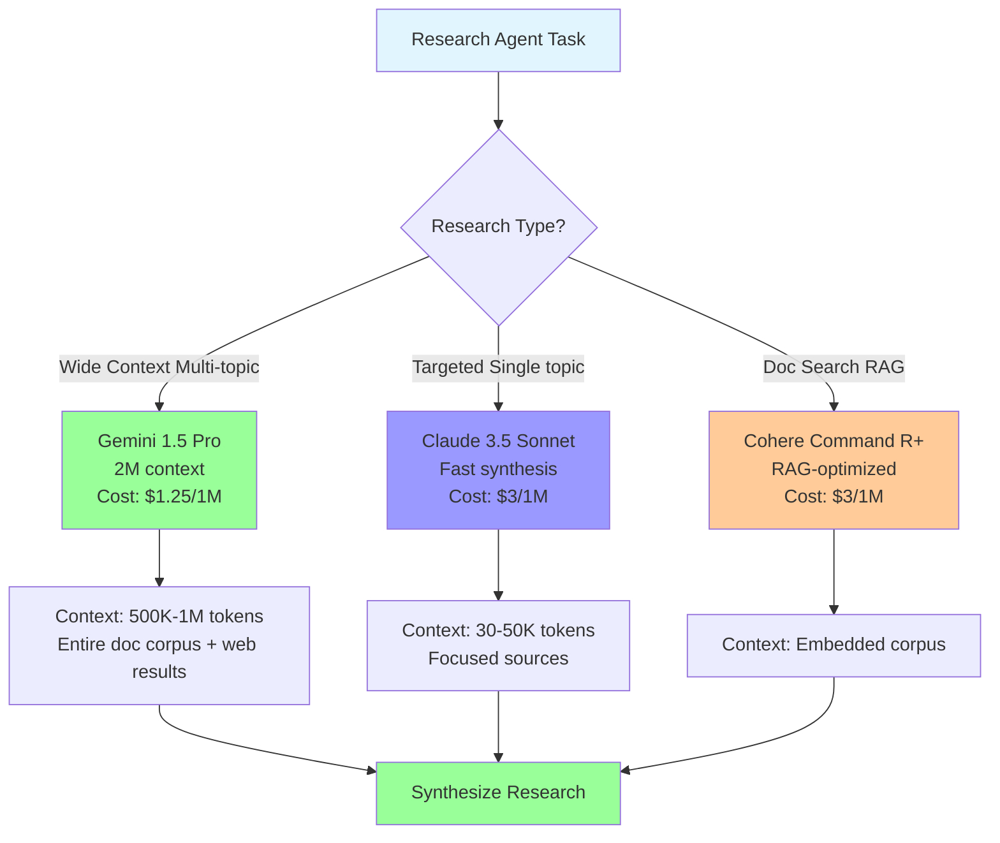

### ARTIFACTS AGENT

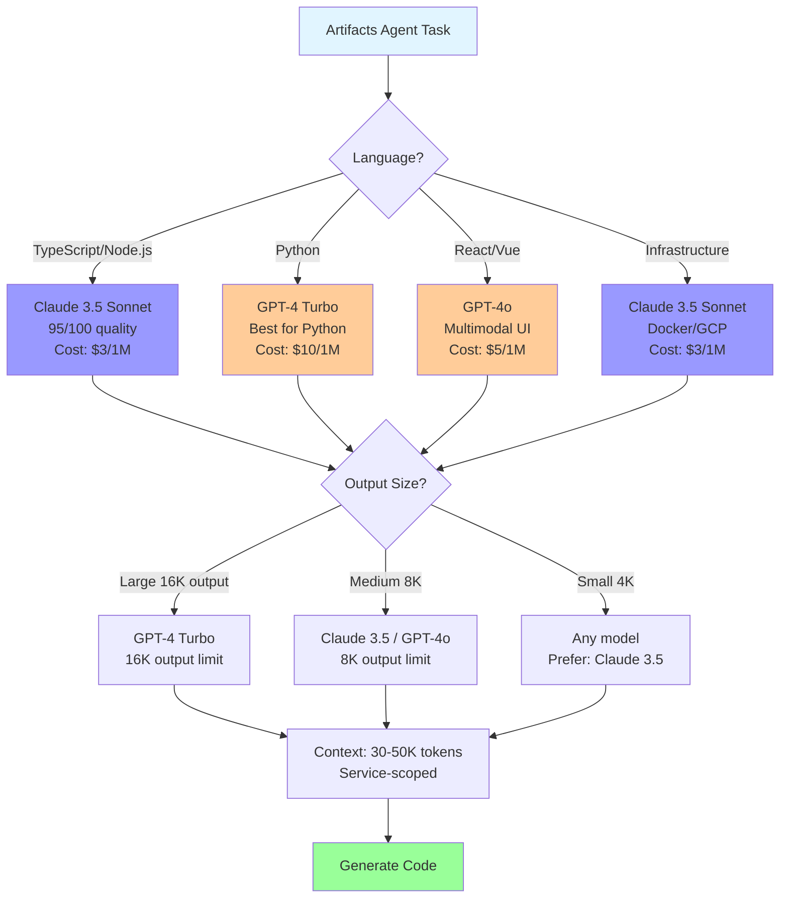

### EXECUTION MONITOR

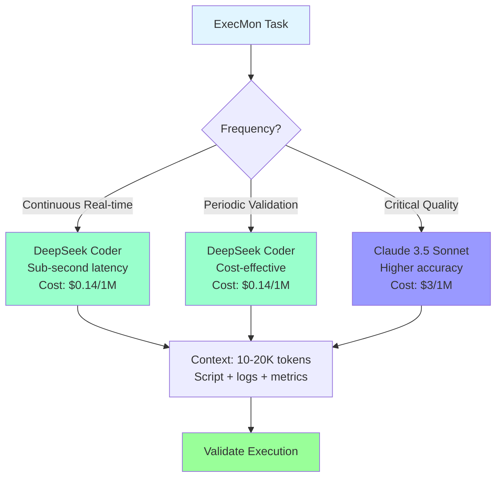

### QA AGENT

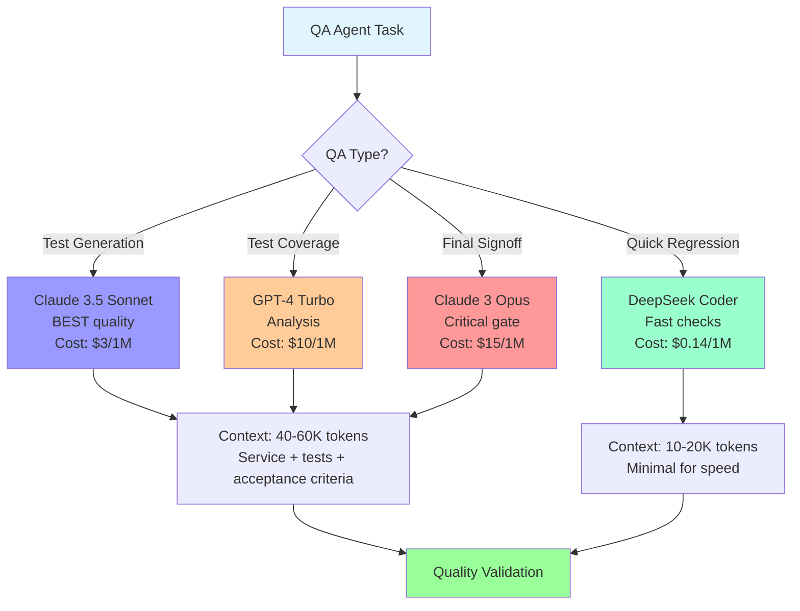

---

## COST VS QUALITY TRADE-OFF MATRIX

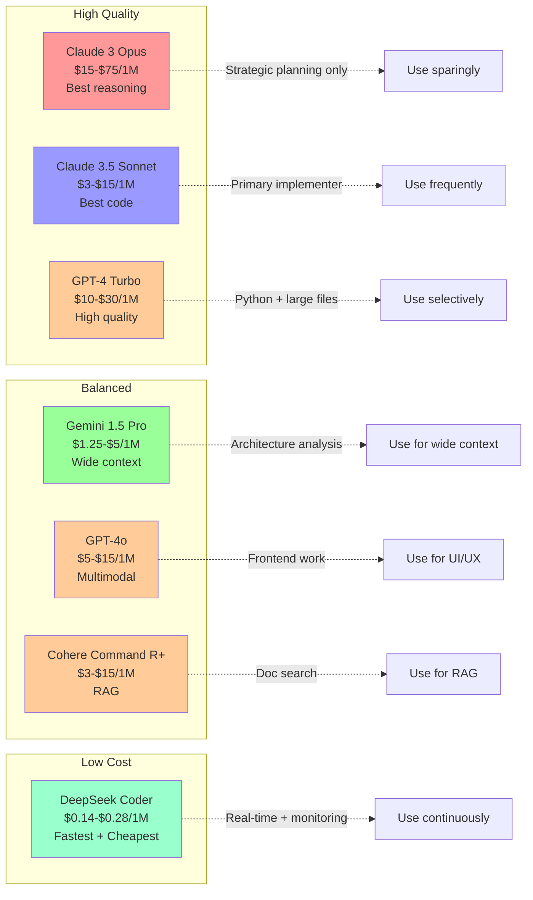

---

## CONTEXT WINDOW STRATEGY FLOWCHART

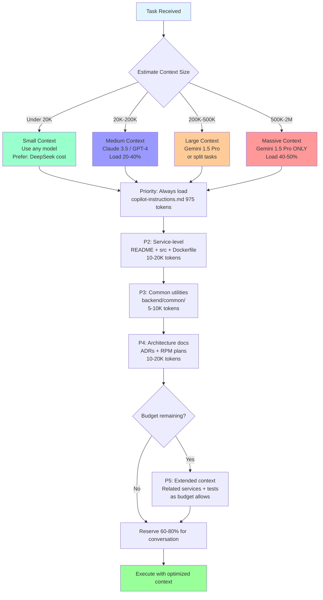

---

## FALLBACK CHAIN VISUALIZATION

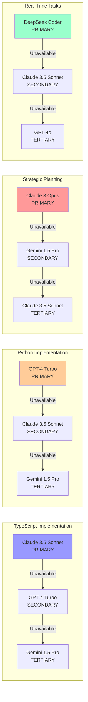

---

## USAGE EXAMPLE: STEP-BY-STEP

**Scenario**: Artifacts Agent needs to implement a new TypeScript microservice

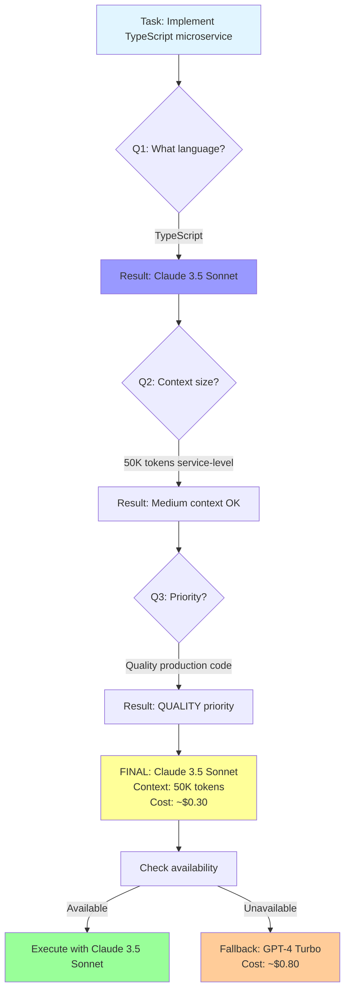

---

## LEGEND

**Color Coding**:
- 🔵 Light Blue: Start/Input
- 🔴 Red: Claude 3 Opus (most expensive, best reasoning)
- 🟣 Purple: Claude 3.5 Sonnet (best code quality, mid-cost)
- 🟠 Orange: GPT-4 Turbo / GPT-4o (expensive, large output)
- 🟢 Green: Gemini 1.5 Pro (wide context, cost-effective)
- 🟩 Cyan: DeepSeek Coder (fastest, cheapest)
- 🟡 Yellow: Final decision/output

**Decision Nodes**:
- Diamond: Decision point
- Rectangle: Model recommendation
- Rounded Rectangle: Action/Result

---

**END OF FLOWCHART DOCUMENT**

**War's won for visual decision trees. 6 agents, 5 models, clear paths. Copy to mermaid.live to render.**

**Next Session**: Render flowcharts or proceed to implementation.
