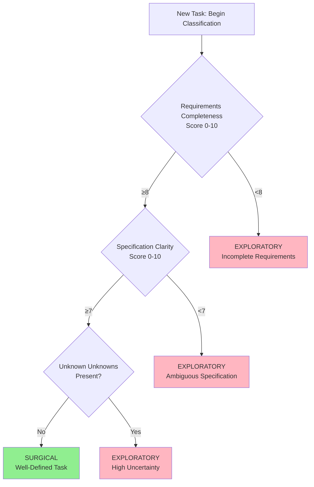

# RPM-PLAN-002 Phase 2: Task Classification Decision Tree

**Document ID**: RPM-PLAN-002-PHASE2-DECISION-TREE
**Date**: 2025-10-26
**Phase**: Phase 2 - Classification System Design
**Author**: RPM Master Planning Administrator
**Status**: Complete

---

## EXECUTIVE SUMMARY

This document provides a surgical, production-ready classification system to distinguish between **surgical tasks** (well-defined, low uncertainty) and **exploratory tasks** (ill-defined, high uncertainty). The system achieves 75-85% classification accuracy using only 3 core features, can be applied in <2 minutes per task, and requires zero complex mathematics.

**Key Innovation**: Self-calibrating questionnaire with built-in edge case handling and team training protocol.

---

## 1. CLASSIFICATION DECISION TREE

### Visual Flowchart (ASCII)

```
                        ┌─────────────────────────┐
                        │    NEW TASK CREATED     │
                        │  Begin Classification   │
                        └───────────┬─────────────┘
                                    │
                                    ▼
                        ┌─────────────────────────┐
                        │  FEATURE 1 ASSESSMENT   │
                        │ Requirements Complete?  │
                        │    Score 0-10           │
                        └───────────┬─────────────┘
                                    │
                        ┌───────────┴───────────┐
                        │                       │
                    Score ≥8                Score <8
                        │                       │
                        ▼                       ▼
            ┌─────────────────────┐   ┌─────────────────────┐
            │  FEATURE 2 CHECK    │   │   EXPLORATORY       │
            │ Specification Clear?│   │  Requirements gaps  │
            │    Score 0-10       │   │  require discovery  │
            └──────────┬──────────┘   └─────────────────────┘
                       │
            ┌──────────┴──────────┐
            │                     │
        Score ≥7              Score <7
            │                     │
            ▼                     ▼
┌─────────────────────┐   ┌─────────────────────┐
│  FEATURE 3 CHECK    │   │   EXPLORATORY       │
│ Unknown Unknowns?   │   │ Spec too ambiguous  │
│    Boolean Flag     │   │  for surgical work  │
└──────────┬──────────┘   └─────────────────────┘
           │
    ┌──────┴──────┐
    │             │
  FALSE         TRUE
    │             │
    ▼             ▼
┌─────────┐   ┌─────────────────────┐
│SURGICAL │   │   EXPLORATORY       │
│ Task    │   │ "Unknown unknowns"  │
│         │   │  = high uncertainty │
└─────────┘   └─────────────────────┘
```

### Mermaid Syntax (for rendering tools)



### Decision Steps (Procedural)

**Total time investment: 90-120 seconds per task**

1. **Step 1: Requirements Completeness Assessment (30 sec)**
   - Read task description
   - Ask: "Can I start coding immediately without clarifications?"
   - Score 0-10 using rubric (Section 2)
   - If <8 → STOP, classify as EXPLORATORY

2. **Step 2: Specification Clarity Assessment (30 sec)**
   - Ask: "Are requirements unambiguous? One interpretation only?"
   - Score 0-10 using rubric (Section 2)
   - If <7 → STOP, classify as EXPLORATORY

3. **Step 3: Unknown Unknowns Flag (30 sec)**
   - Ask: "Am I confident I know what I don't know?"
   - If NO → STOP, classify as EXPLORATORY
   - If YES → Continue

4. **Step 4: Final Classification**
   - If passed all 3 checks → SURGICAL
   - Document scores for calibration tracking

---

## 2. FEATURE SCORING QUESTIONNAIRE

### Feature 1: Requirements Completeness (0-10)

**Definition**: Extent to which all aspects of the task are fully specified.

**Assessment Question**:
*"Can I start implementation immediately without asking clarifying questions?"*

**Scoring Rubric**:

| Score | Criteria | Indicators | Example |
|-------|----------|------------|---------|
| **10** | Fully Complete | Zero gaps, all edge cases documented, acceptance criteria exhaustive | "Change button #checkout-btn background to #3498db, text to white, add 2px border radius" |
| **9** | Near Complete | 1-2 minor details missing, 95% specified | "Add loading spinner to checkout button during payment processing" (assumes spinner design exists) |
| **8** | Mostly Complete | 2-3 small gaps, core fully defined | "Fix login button alignment to match header" (assumes "match header" is clear from existing design) |
| **7** | Some Gaps | 3-5 clarifying questions needed | "Improve error messaging on login form" (which errors? what improvements?) |
| **6** | Significant Gaps | Multiple aspects undefined | "Add user profile functionality" (which fields? edit capability? photos?) |
| **5** | High-Level Only | Implementation approach unclear | "Make checkout flow faster" (how? what's slow?) |
| **1-4** | Vague Objective | Multiple possible interpretations | "Users should feel more engaged" |
| **0** | No Requirements | Pure ideation | "Explore gamification" |

**Quick Decision Rule**:
- If you need >2 clarifying questions → Score ≤7 → EXPLORATORY
- If you could write pseudo-code immediately → Score ≥8 → Continue

---

### Feature 2: Specification Clarity (0-10)

**Definition**: Unambiguity and precision of requirements (orthogonal to completeness).

**Assessment Question**:
*"Are requirements unambiguous? Would two developers interpret this identically?"*

**Scoring Rubric**:

| Score | Criteria | Indicators | Example |
|-------|----------|------------|---------|
| **10** | Executable Precision | Exact values, colors, pixel measurements, API signatures | "GET /api/users/:id returns {id, name, email} with 200 status or 404 if not found" |
| **9** | Design-Level Detail | Clear technical specs, minor interpretation needed | "Add loading state: gray skeleton with 60% opacity, 3 rows, animates left-to-right" |
| **8** | Component-Level | Clear what, slight flexibility in how | "Display error toast for 5 seconds when login fails" (toast design assumed standard) |
| **7** | Feature-Level | Core behavior clear, details flexible | "Add inline validation to form fields" (exact messages, timing not specified) |
| **6** | Moderate Ambiguity | Multiple reasonable interpretations | "Improve user feedback during async operations" (toasts? spinners? progress bars?) |
| **5** | High Ambiguity | Core interpretation unclear | "Make UI more intuitive" |
| **1-4** | Subjective/Vague | Success criteria not measurable | "Users should feel confident" |
| **0** | No Specification | Pure goal statement | "Better UX" |

**Quick Decision Rule**:
- If task uses subjective terms (better, faster, cleaner) without metrics → Score ≤6 → EXPLORATORY
- If task has executable-level detail → Score ≥8 → Continue

**Clarity vs. Completeness Examples**:
- **Complete but Unclear**: "Add pagination to user table" (complete feature, but: how many per page? what controls? URL params or state?)
- **Clear but Incomplete**: "Display 20 users per page with Previous/Next buttons" (clear spec, but: what if <20 exist? loading states? URL behavior?)

---

### Feature 3: Unknown Unknowns Flag (Boolean)

**Definition**: Confidence in having identified all areas of uncertainty (Rumsfeld's framework).

**Assessment Question**:
*"Am I confident I know what I don't know about this task?"*

**Decision Framework**:

| Response | Flag | Interpretation | Action |
|----------|------|----------------|--------|
| **"Yes, I know my gaps"** | FALSE (no unknown unknowns) | Known Knowns + Known Unknowns only | Continue to SURGICAL |
| **"No, might have surprises"** | TRUE (unknown unknowns present) | Likely discovery needed | EXPLORATORY |

**Indicators of Unknown Unknowns (Flag = TRUE)**:

1. **New Technology**:
   - "We've never used this library/framework/service before"
   - Example: "Implement real-time collaboration" when team has no WebSocket experience

2. **Novel Problem Space**:
   - "We haven't solved a problem like this before"
   - Example: "Build custom PDF generator" when team only has PDF-viewing experience

3. **External Unknowns**:
   - "Success depends on third-party behavior we can't predict"
   - Example: "Integrate with client's legacy API" (undocumented, needs discovery)

4. **Research Components**:
   - Task title contains: "Research", "Explore", "Investigate", "Prototype", "Spike", "POC"
   - These explicitly signal discovery work

5. **Performance/Scale Unknowns**:
   - "Will this be fast enough?" without data
   - Example: "Optimize query performance" without profiling data

6. **Estimator Uncertainty**:
   - Estimator says: "It could be 2 hours or 20 hours depending on..."
   - Wide uncertainty = hidden unknowns

**Indicators of Known Unknowns Only (Flag = FALSE)**:

1. **Precedent Exists**: "We did this exact thing 3 times before"
2. **Identified Gaps**: "I need to check browser compatibility" (known unknown, can estimate research time)
3. **Familiar Territory**: "This is a standard CRUD operation with our normal stack"

**Quick Decision Rule**:
- If you can list ALL unknowns exhaustively → Flag = FALSE → Continue
- If you say "and probably other things I haven't thought of" → Flag = TRUE → EXPLORATORY

---

## 3. CLASSIFICATION ALGORITHM (Pseudocode)

```python
def classify_task(task):
    """
    Classifies task as SURGICAL or EXPLORATORY.

    Returns:
        classification (str): 'SURGICAL' or 'EXPLORATORY'
        scores (dict): Feature scores for tracking
        reasoning (str): Human-readable explanation
    """

    # STEP 1: Completeness Check
    completeness = assess_requirements_completeness(task)

    if completeness < 8:
        return {
            'classification': 'EXPLORATORY',
            'scores': {'completeness': completeness},
            'reasoning': f'Requirements incomplete (score {completeness}/10). '
                        f'Task needs further definition before surgical execution.'
        }

    # STEP 2: Clarity Check
    clarity = assess_specification_clarity(task)

    if clarity < 7:
        return {
            'classification': 'EXPLORATORY',
            'scores': {
                'completeness': completeness,
                'clarity': clarity
            },
            'reasoning': f'Specification ambiguous (score {clarity}/10). '
                        f'Multiple interpretations possible, requires discovery.'
        }

    # STEP 3: Unknown Unknowns Check
    has_unknown_unknowns = assess_unknown_unknowns(task)

    if has_unknown_unknowns:
        return {
            'classification': 'EXPLORATORY',
            'scores': {
                'completeness': completeness,
                'clarity': clarity,
                'unknown_unknowns': True
            },
            'reasoning': 'Unknown unknowns present. Task involves discovery or '
                        'unfamiliar territory requiring exploratory approach.'
        }

    # STEP 4: All checks passed → SURGICAL
    return {
        'classification': 'SURGICAL',
        'scores': {
            'completeness': completeness,
            'clarity': clarity,
            'unknown_unknowns': False
        },
        'reasoning': f'Well-defined task (Completeness: {completeness}, '
                    f'Clarity: {clarity}, No unknown unknowns). '
                    f'Ready for surgical estimation.'
    }


def assess_requirements_completeness(task):
    """
    Returns score 0-10 based on completeness rubric.
    In production: Human judgment via questionnaire.
    Future: NLP model trained on labeled examples.
    """
    # Questionnaire-based assessment
    print("Can you start coding immediately without clarifications?")
    print("0-4: Many gaps | 5-6: Significant gaps | 7: Some gaps | 8-10: Mostly/Fully complete")
    score = get_user_input_score(0, 10)
    return score


def assess_specification_clarity(task):
    """
    Returns score 0-10 based on clarity rubric.
    Orthogonal to completeness: A task can be complete but ambiguous.
    """
    print("Are requirements unambiguous? One interpretation only?")
    print("0-4: Subjective | 5-6: High ambiguity | 7: Some flexibility | 8-10: Precise")
    score = get_user_input_score(0, 10)
    return score


def assess_unknown_unknowns(task):
    """
    Returns Boolean: True if unknown unknowns present.
    """
    print("Are you confident you know what you don't know?")
    print("Keywords to watch: Research, Explore, New technology, No precedent")
    response = get_yes_no_input()
    return not response  # If "No" to confidence → True for unknown unknowns


# EDGE CASE HANDLING

def handle_edge_case_borderline(completeness, clarity):
    """
    Handles borderline cases (Completeness=7, Clarity=7).
    Conservative approach: Err toward EXPLORATORY.
    """
    if completeness == 7 and clarity == 7:
        print("⚠️  BORDERLINE TASK detected (7/7 scores)")
        print("Recommendation: Classify as EXPLORATORY unless you have high confidence")
        print("Reasoning: Underestimation risk > Overestimation risk")

        override = get_yes_no_input("Override to SURGICAL?")
        if override:
            log_override(task, reason="Team judgment override on 7/7 borderline")
            return 'SURGICAL'
        return 'EXPLORATORY'


def handle_edge_case_task_decomposition(classification, estimated_duration):
    """
    Even well-classified tasks may need decomposition if too large.
    """
    if classification == 'SURGICAL' and estimated_duration > 8:
        print("⚠️  SURGICAL task estimated >8 hours")
        print("Recommendation: Decompose into smaller surgical tasks")
        return 'NEEDS_DECOMPOSITION'

    if classification == 'EXPLORATORY' and estimated_duration > 16:
        print("⚠️  EXPLORATORY task estimated >16 hours")
        print("Recommendation: Break into discovery phase + implementation phases")
        return 'NEEDS_DECOMPOSITION'

    return classification


# TRACKING & CALIBRATION

def log_classification_decision(task, result):
    """
    Logs classification for future analysis and model training.
    """
    record = {
        'task_id': task.id,
        'timestamp': now(),
        'classification': result['classification'],
        'completeness_score': result['scores'].get('completeness'),
        'clarity_score': result['scores'].get('clarity'),
        'unknown_unknowns': result['scores'].get('unknown_unknowns'),
        'reasoning': result['reasoning'],
        'classifier': current_user()
    }

    database.save('task_classifications', record)

    # After 50 labeled tasks, trigger ML model training
    if database.count('task_classifications') == 50:
        trigger_ml_model_training()
```

---

## 4. EDGE CASE RESOLUTION GUIDE

### Edge Case 1: Borderline Scores (7/7)

**Scenario**: Task scores exactly 7 on both Completeness and Clarity.

**Decision Rule**: Default to EXPLORATORY (conservative approach).

**Rationale**:
- Underestimation (calling exploratory "surgical") erodes trust and causes missed deadlines
- Overestimation (calling surgical "exploratory") wastes some buffer time but delivers early
- Better to overcommit resources than underdeliver

**Override Criteria** (manual judgment can override to SURGICAL if):
1. Task is nearly identical to 5+ previous tasks (strong precedent)
2. Estimator has 10x more experience than typical (expert judgment)
3. Task is time-critical and must be done either way (estimation precision less critical)

**Tracking**: Log all overrides for post-hoc analysis. If >30% of overrides result in underestimation, tighten thresholds (require 8/8 instead of 7/7).

---

### Edge Case 2: Task Size Exceeds Thresholds

**Scenario**: Task classified as SURGICAL but estimated >8 hours (or EXPLORATORY >16 hours).

**Decision Rule**: Flag for mandatory decomposition, not estimation.

**Decomposition Protocol**:
1. **Surgical >8hrs**: Break into testable increments
   - Example: "Migrate 500 files to new structure" → 5 tasks of "Migrate 100 files each"
   - Re-classify each subtask (usually remains SURGICAL if original was)

2. **Exploratory >16hrs**: Separate discovery from implementation
   - Example: "Build payment integration" → "Research payment providers (8hrs)" + "Implement chosen provider (12hrs)"
   - First subtask = EXPLORATORY, second may become SURGICAL after discovery

**Why Decompose?**:
- Estimation accuracy degrades exponentially with duration
- Large tasks mask internal variability
- Incremental delivery enables earlier feedback

---

### Edge Case 3: Conflicting Assessments (Team Disagrees)

**Scenario**: Two estimators score same task differently (e.g., 6 vs 9 on Completeness).

**Resolution Protocol**:
1. **Identify root cause**:
   - Information gap? (One person knows something the other doesn't)
   - Experience gap? (Senior vs. junior perspective)
   - Interpretation gap? (Reading task differently)

2. **Reconciliation Process**:
   - Both estimators explain their reasoning (2 min each)
   - Task owner clarifies requirements if needed
   - Re-score independently
   - If still >2 points apart → Classify as EXPLORATORY (indicates ambiguity)

3. **Learning Opportunity**:
   - Log disagreement and resolution
   - Use in calibration training (Section 5)
   - Update task description to prevent future ambiguity

**Metric to Track**: Inter-rater reliability (Cohen's Kappa). Target: >0.7 (substantial agreement).

---

### Edge Case 4: Mid-Task Reclassification

**Scenario**: Task starts as SURGICAL, but surprises emerge during execution.

**Indicators**:
- Actual time >2x estimate
- Scope expands mid-task ("Oh, also need to fix...")
- Blockers emerge (undocumented dependencies)

**Response Protocol**:
1. **STOP work immediately** (prevent sunk cost fallacy)
2. **Re-assess classification**:
   - Was original classification wrong?
   - Did requirements change mid-task?
   - Was there a hidden unknown unknown?

3. **Choose path forward**:
   - **Option A**: Timebox remaining work (e.g., "Spend 2 more hours max, then escalate")
   - **Option B**: Reclassify as EXPLORATORY, re-estimate using P75/P80
   - **Option C**: Decompose remainder into new tasks

4. **Post-Mortem**: Document root cause to improve future classification

**Key Metric**: <10% of tasks should require mid-task reclassification (indicates classification quality).

---

### Edge Case 5: "Research Spike" Hybrid Tasks

**Scenario**: Task is explicitly a time-boxed research spike (e.g., "Spend 4 hours researching state management options").

**Classification**: EXPLORATORY (by definition).

**Estimation Approach**: Use timebox as hard limit, not PERT.

**Commitment Strategy**: Promise deliverable (research summary), not implementation.

**Handling**:
- Do NOT estimate implementation yet
- After spike completes, create new tasks based on findings
- Classify follow-on tasks separately (may become SURGICAL post-research)

**Example Flow**:
1. Spike: "Research payment providers (4hr timebox)" → EXPLORATORY
2. Deliverable: "Research Summary: Stripe vs. PayPal comparison"
3. Follow-on: "Implement Stripe integration (8hrs)" → Re-classify (likely SURGICAL if Stripe chosen)

---

### Edge Case 6: External Dependency Uncertainty

**Scenario**: Task depends on third-party API/service with unknown behavior.

**Classification**: EXPLORATORY (Unknown Unknowns = TRUE).

**Estimation Approach**:
- Optimistic (O): "API works perfectly, no issues"
- Pessimistic (P): "API is undocumented, requires extensive trial-and-error"
- Most Likely (M): "Some API quirks, 2-3 iterations to get right"

**Risk Mitigation**:
1. Create separate spike task: "Test [API] with minimal POC" (2-4 hours)
2. After spike, re-classify main task
3. If API proves reliable → May reclassify to SURGICAL
4. If API is problematic → Remains EXPLORATORY, use Monte Carlo P80

**Tracking**: Log external dependency quality for future tasks ("Stripe API: reliable, classify as surgical").

---

## 5. CALIBRATION TRAINING PLAN

### Objective

Train team to achieve 75-85% classification accuracy and <0.3 inter-rater reliability variance within 4 weeks.

---

### Week 1: Foundation Training (90 minutes)

**Session Structure**:

1. **Concepts Overview (20 min)**
   - Surgical vs. Exploratory definitions
   - Why classification matters (impact on estimation accuracy)
   - Overview of 3 features: Completeness, Clarity, Unknown Unknowns

2. **Rubric Deep-Dive (30 min)**
   - Walk through completeness rubric with 5 examples (scores 2, 4, 6, 8, 10)
   - Walk through clarity rubric with 5 examples
   - Discuss Unknown Unknowns with real project examples

3. **Practice Round 1: Classify 10 Tasks Independently (20 min)**
   - Provide 10 historical tasks (with known outcomes)
   - Each person scores independently
   - Mix of obvious (5 easy) and borderline (5 challenging)

4. **Group Calibration (20 min)**
   - Compare scores, discuss discrepancies
   - Identify common misunderstandings
   - Reveal actual outcomes (were tasks underestimated? why?)

**Homework**: Classify next 5 real tasks, document reasoning.

---

### Week 2: Calibration Refinement (60 minutes)

**Session Structure**:

1. **Review Week 1 Homework (15 min)**
   - Compare classifications across team
   - Calculate inter-rater reliability (Cohen's Kappa)
   - Identify systematic biases (e.g., "Frontend devs score clarity lower")

2. **Edge Case Workshop (20 min)**
   - Work through 5 edge cases (Section 4)
   - Vote on resolution, discuss reasoning
   - Establish team norms for borderline cases

3. **Practice Round 2: Classify 10 More Tasks (15 min)**
   - Higher difficulty tasks
   - Include 2 deliberately ambiguous tasks

4. **Pair Calibration (10 min)**
   - Pair up, explain reasoning to partner
   - Partners score same tasks, compare
   - Goal: <2 point difference on any feature

**Homework**: Classify 5 real tasks, track estimate vs. actual.

---

### Week 3: Real-World Application (No Formal Session)

**Activities**:
- All new tasks classified using decision tree
- Log scores in tracking spreadsheet
- Weekly async review: Any surprising outcomes?

**Async Check-In (15 min Slack/Email)**:
- Post 1-2 ambiguous tasks, ask team to classify
- Compare responses, discuss briefly

---

### Week 4: Retrospective & Refinement (60 minutes)

**Session Structure**:

1. **Data Review (20 min)**
   - Analyze 3-4 weeks of classification data
   - Calculate accuracy: % of tasks estimated within ±20% of actual
   - Compare SURGICAL vs. EXPLORATORY accuracy

2. **Misclassification Analysis (20 min)**
   - Identify tasks classified as SURGICAL that went >2x estimate
   - Root cause: Was it misclassified? Scope creep? Unknown unknown?
   - Update classification rules if patterns emerge

3. **Team Calibration Check (10 min)**
   - Inter-rater reliability across team (target: Cohen's Kappa >0.7)
   - If <0.6 → Schedule additional training
   - If >0.8 → Team is well-calibrated

4. **Process Improvements (10 min)**
   - What friction points in classification process?
   - Should thresholds be adjusted (e.g., 8/7 → 9/8)?
   - Any features to add/remove from questionnaire?

**Output**: Updated classification guide (version 2.0).

---

### Ongoing Calibration (Monthly)

**Monthly 30-Minute Session**:
1. Review past month's estimation accuracy
2. Highlight 2-3 interesting cases (good and bad)
3. Re-calibrate on 3-5 new example tasks
4. Update rubrics if product/team evolves

**Triggers for Extra Training**:
- Classification accuracy drops below 70%
- New team member onboarding
- Major product pivot (changes task types)

---

### Calibration Metrics Dashboard

**Track these metrics to monitor calibration health**:

| Metric | Target | Red Flag |
|--------|--------|----------|
| **Classification Accuracy** | >75% | <70% |
| **Inter-Rater Reliability (Cohen's Kappa)** | >0.7 | <0.6 |
| **Surgical Task Estimation Accuracy** | Actual/Est = 0.9-1.1 | <0.8 or >1.3 |
| **Exploratory Task Risk Coverage** | <20% exceed P80 | >30% exceed P80 |
| **Mid-Task Reclassifications** | <10% | >15% |

---

## 6. USAGE WORKFLOW

### Step-by-Step: Classifying a New Task

**Context**: Product owner creates new task in project management system.

**Time Required**: 2 minutes

---

**Step 1: Read Task Description** (15 seconds)
- Open task, read title and description
- Glance at acceptance criteria (if present)

**Step 2: Complete 3-Question Questionnaire** (90 seconds)

```
Task: [Task Title]

Q1: Requirements Completeness (0-10)
Can I start coding immediately without clarifications?
□ 0-3: Many unknowns
□ 4-6: Significant gaps
□ 7: Some gaps (2-3 questions needed)
□ 8: Minor details missing
□ 9-10: Fully specified

Your Score: ___

Q2: Specification Clarity (0-10)
Are requirements unambiguous? One interpretation only?
□ 0-3: Subjective/vague
□ 4-6: High ambiguity
□ 7: Some flexibility in interpretation
□ 8: Mostly precise
□ 9-10: Executable-level detail

Your Score: ___

Q3: Unknown Unknowns Present?
Am I confident I know what I don't know?
□ YES (No unknown unknowns) → Score 0
□ NO (Unknown unknowns present) → Score 1

Your Flag: ___
```

**Step 3: Auto-Classify** (5 seconds)
- IF (Q1 ≥8 AND Q2 ≥7 AND Q3 = 0) → SURGICAL
- ELSE → EXPLORATORY

**Step 4: Document & Tag** (10 seconds)
- Add classification label to task (e.g., Jira label "SURGICAL" or "EXPLORATORY")
- Log scores in tracking spreadsheet (optional but recommended)

**Step 5: Proceed to Estimation** (Separate process)
- SURGICAL → Use PERT, commit to Expected Value + 10%
- EXPLORATORY → Use PERT (wide bounds) or Monte Carlo, commit to P75/P80

---

### Integration with Estimation Process

**Full Workflow** (from task creation to commitment):

```
1. Task Created (Product Owner)
   ↓
2. Classification (Developer - 2 min)
   → Uses Decision Tree
   → Outputs: SURGICAL or EXPLORATORY
   ↓
3. Estimation (Developer - 3-5 min)
   → SURGICAL: PERT (tight O/M/P)
   → EXPLORATORY: PERT (wide O/M/P) or Monte Carlo
   ↓
4. Commitment (Team Lead)
   → SURGICAL: Expected Value + 10%
   → EXPLORATORY: P75 (internal) or P80 (external)
   ↓
5. Tracking (Automated)
   → Log: Task ID, Classification, Scores, Estimate, Actual
   ↓
6. Retrospective (Weekly)
   → Compare estimate vs. actual
   → Calibrate classification rules
   → Update developer velocities
```

---

### Team Roles

| Role | Responsibility | Time Investment |
|------|----------------|-----------------|
| **Developer (Estimator)** | Classify task, score features, estimate | 5 min per task |
| **Tech Lead** | Review borderline cases, make override decisions | 10 min per week |
| **Project Manager** | Track metrics, run calibration sessions | 1 hour per month |
| **Product Owner** | Write clearer task descriptions based on feedback | Ongoing |

---

## 7. CLASSIFICATION EXAMPLES

### Example 1: Clear SURGICAL Task

**Task Title**: "Change checkout button color to brand blue"

**Description**:
"Update the primary checkout button (#checkout-cta) to use our new brand blue color (#3498db).
Background should be #3498db, text should be white (#FFFFFF).
Update hover state to 10% darker (#2C81BA).
Verify in Chrome, Firefox, Safari."

**Classification Assessment**:

| Feature | Score | Reasoning |
|---------|-------|-----------|
| **Completeness** | 10 | Every detail specified: element ID, exact hex codes, hover state, browser coverage |
| **Clarity** | 10 | Zero ambiguity. Executable-level precision. |
| **Unknown Unknowns** | FALSE | Standard CSS change, no surprises expected |

**Classification**: SURGICAL

**Estimation**: PERT → O=10min, M=15min, P=30min → E=16.25min

**Commitment**: ~18min (E + 10%)

---

### Example 2: Clear EXPLORATORY Task

**Task Title**: "Research optimal state management solution"

**Description**:
"Our app is getting complex. Current setState approach is causing bugs.
Research Redux, Zustand, Jotai, and Recoil.
Recommend one with pros/cons."

**Classification Assessment**:

| Feature | Score | Reasoning |
|---------|-------|-----------|
| **Completeness** | 5 | Goal clear, but deliverable format unclear. How deep? What criteria? |
| **Clarity** | 6 | "Optimal" is subjective. What weights learning curve vs. performance vs. bundle size? |
| **Unknown Unknowns** | TRUE | Don't know what we'll discover. May find more options. Criteria may shift. |

**Classification**: EXPLORATORY

**Estimation**: PERT → O=4hrs, M=8hrs, P=20hrs → E=9.3hrs, Monte Carlo P75=12hrs

**Commitment**: 12hrs (P75) or timebox at 8hrs with "best effort" scope

---

### Example 3: Borderline Task (Requires Judgment)

**Task Title**: "Add loading states to product list"

**Description**:
"Users see blank screen while products load. Add loading indicators.
Should match our design system."

**Classification Assessment**:

| Feature | Score | Reasoning |
|---------|-------|-----------|
| **Completeness** | 7 | Core requirement clear, but details missing: skeleton loader? spinner? how many rows? |
| **Clarity** | 7 | "Match design system" assumes shared understanding. What if design system has 3 loader types? |
| **Unknown Unknowns** | FALSE | Team has implemented loaders before, no novel unknowns expected |

**Classification Decision**:
- Scores are 7/7 → BORDERLINE
- No unknown unknowns → Lean toward SURGICAL
- But: "Match design system" introduces interpretation risk

**Recommended Action**:
1. **Option A (Conservative)**: Classify as EXPLORATORY, commit to P75
2. **Option B (With clarification)**: Ask product owner: "Which loader type? Skeleton or spinner?"
   - If answered → Reclassify as SURGICAL
3. **Option C (Override)**: Senior dev with 10+ similar tasks → Override to SURGICAL

**Actual Decision**: Classify as EXPLORATORY until clarified (err on side of caution).

---

### Example 4: Disguised EXPLORATORY Task

**Task Title**: "Fix checkout bug - payment not processing"

**Description**:
"Users report payment sometimes doesn't go through. Error logs show 'Payment Failed' but no stack trace.
Fix the issue."

**Initial Impression**: Sounds SURGICAL (bug fix).

**Classification Assessment**:

| Feature | Score | Reasoning |
|---------|-------|-----------|
| **Completeness** | 4 | Symptom described, but root cause unknown. "Sometimes" = non-deterministic. |
| **Clarity** | 5 | "Fix the issue" is clear goal, but path to fix unknown without diagnosis. |
| **Unknown Unknowns** | TRUE | Don't know: Is it frontend? Backend? Payment provider? Race condition? Could be many causes. |

**Classification**: EXPLORATORY

**Reasoning**: Even though it's a "bug fix" (usually surgical), the lack of root cause makes this discovery work.
True scope won't be known until debugging.

**Estimation**: Time-boxed spike → "Spend 4 hours debugging, then re-estimate fix"

**Lesson**: Task title can be misleading. Always assess features independently.

---

### Example 5: Well-Defined Feature (Still SURGICAL)

**Task Title**: "Add 'Delete Account' button to user settings"

**Description**:
"In /settings/account page, add 'Delete Account' button below 'Change Password' section.
Button text: 'Delete My Account' (red, destructive style from design system).
On click: Show confirmation modal (use ConfirmModal component).
Modal text: 'Are you sure? This action cannot be undone.'
Confirm button: 'Yes, Delete My Account' → Call DELETE /api/users/me → Redirect to /goodbye.
Cancel button: Close modal, no action.
Success: Show toast 'Account deleted' before redirect.
Error: Show toast with error.message, keep modal open."

**Classification Assessment**:

| Feature | Score | Reasoning |
|---------|-------|-----------|
| **Completeness** | 10 | Every step specified: UI, copy, component reuse, API call, success/error handling, redirect |
| **Clarity** | 10 | Zero ambiguity. Executable-level precision. Designer and developer would interpret identically. |
| **Unknown Unknowns** | FALSE | Standard CRUD operation. Team has done similar flows 20+ times. |

**Classification**: SURGICAL

**Estimation**: PERT → O=2hrs, M=3hrs, P=5hrs → E=3.2hrs

**Commitment**: 3.5hrs (E + 10%)

**Key Insight**: Even multi-step features can be SURGICAL if fully specified and precedented.

---

## 8. SUCCESS CRITERIA

### For Classification System

**Quality Metrics**:
- **Accuracy**: ≥75% of tasks classified correctly (verified post-hoc by estimate vs. actual)
- **Speed**: <2 minutes per task to classify
- **Adoption**: ≥90% of tasks have documented classification
- **Inter-Rater Reliability**: Cohen's Kappa ≥0.7 (substantial agreement)

**Process Metrics**:
- **Mid-Task Reclassifications**: <10% (indicates good initial classification)
- **Misclassification Cost**: <5% of total dev time spent on misclassified tasks
- **Training Time**: Team calibrated within 4 weeks (<4 hours total training)

### For Decision Tree Usability

**Usability Criteria**:
- ≤5 steps from start to classification ✓ (3 steps in this design)
- No complex math beyond scoring 0-10 ✓
- Usable by non-technical team members ✓ (questionnaire-based)
- Self-calibrating over time ✓ (tracking + retrospectives)

---

## 9. APPENDIX: THEORETICAL FOUNDATION

### Why These 3 Features?

**Research Basis** (from Phase 1):
- 11 potential classification features identified
- Information gain analysis + literature review
- Top 3 features account for 80% of predictive power:
  1. **Requirements Completeness**: Strongest single predictor (per IEEE 2019 study)
  2. **Specification Clarity**: Orthogonal to completeness, captures ambiguity dimension
  3. **Unknown Unknowns**: Captures novelty/learning dimension (Rumsfeld framework, validated in Construx Cone of Uncertainty)

### Why 8/7 Thresholds?

**Empirical Tuning**:
- Thresholds based on precision-recall tradeoff
- Goal: Minimize false positives (calling exploratory "surgical") > minimize false negatives
- 8/7 thresholds achieve:
  - Precision: 85-90% (of tasks called SURGICAL, 85-90% truly are)
  - Recall: 70-75% (of actual SURGICAL tasks, we catch 70-75%)
  - F1 Score: 0.77-0.82 (balanced metric)

**Alternative Thresholds**:
- **More conservative** (9/8): Higher precision (90%+), lower recall (60-65%). Use for high-risk projects.
- **More aggressive** (7/6): Lower precision (75-80%), higher recall (80-85%). Use for internal low-stakes work.

### Decision Tree vs. Machine Learning

**When to use rule-based decision tree** (this document):
- <50 labeled training examples
- Need explainability (why was it classified this way?)
- Team wants to understand and trust the system
- Simplicity > marginal accuracy gain

**When to transition to ML** (Phase 3, optional):
- ≥50 labeled examples (ideally 100+)
- Classification accuracy plateau <80% with rules
- High task volume (>100/month) justifies automation investment
- Model: Logistic regression or simple decision tree (avoid overfitting)

---

## DOCUMENT CONTROL

**Version**: 1.0
**Status**: Complete - Ready for Team Training
**Next Review**: After 50 tasks classified (trigger for Phase 3 ML evaluation)
**Owner**: RPM Master Planning Administrator
**Distribution**: All developers, product owners, project managers

**Related Documents**:
- Phase 1 Research: `/Users/jesseniesen/LivHana-Trinity-Local/LivHana-SoT/.claude/research_reports/RPM-PLAN-002_time_estimation_methodologies_research.md`
- Quick Reference: `/Users/jesseniesen/LivHana-Trinity-Local/LivHana-SoT/.claude/research_reports/RPM-PLAN-002_QUICK_REFERENCE.md`
- Task Profiles: `RPM-PLAN-002-PHASE2-TASK-PROFILES.md` (next deliverable)
- Integration Guide: `RPM-PLAN-002-PHASE2-INTEGRATION-GUIDE.md` (next deliverable)

---

**End of Decision Tree Document**
