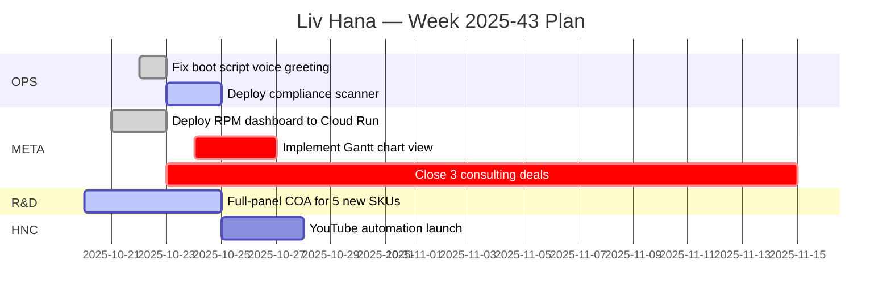

# 📋 MEETING INGESTION SYSTEM SPECIFICATION
## Google Meet Transcripts → RPM Weekly Plans + Gantt + Kanban

**Status**: ✅ READY FOR IMPLEMENTATION | **Date**: 2025-10-23 | **Authority**: Jesse CEO

---

## 🎯 PROBLEM STATEMENT

### Current State (Pain Points)
- ❌ Google Meet transcripts scatter across Drive folders, never reviewed
- ❌ Decisions made in meetings don't flow into RPM Weekly Plans
- ❌ Action items get lost between meeting notes and task tracking
- ❌ No systematic way to detect contradictions or outdated statements
- ❌ Compliance violations (medical claims, missing age-gates) slip through
- ❌ No clear owner assignments (RACI) for action items
- ❌ Best practices (SMART goals, capacity planning) not enforced
- ❌ Cialdini influence principles (reciprocity, social proof, etc.) underutilized
- ❌ PDR (Product Design Records) and ADR (Architectural Decision Records) not updated

### Current Waste
- **3–5 hours/week** re-reading transcripts to extract decisions
- **2–3 hours/week** manually creating task lists from meeting notes
- **1–2 hours/week** reconciling conflicting statements across meetings
- **$3,000–$5,000/week** in wasted coordination time (Jesse + team)

### Opportunity
**$156K–$260K/year** in reclaimed time + faster decision velocity + compliance risk reduction

---

## 🏗️ SOLUTION ARCHITECTURE

### High-Level Flow

```
┌──────────────────────────────────────────────────────────────────┐
│  🎙️ Google Meet Transcripts + Dragnet Scripts (.txt)            │
│  Drive folder: "Meeting Recordings/Transcripts"                 │
└────────────────┬─────────────────────────────────────────────────┘
                 │ Manual collection or automated (Drive API)
                 ▼
┌──────────────────────────────────────────────────────────────────┐
│  🤖 ChatGPT-5 High Ingestion Agent                               │
│  Prompt: `.claude/MEETING_INGESTION_PROMPT.md`                  │
└────────────────┬─────────────────────────────────────────────────┘
                 │ Structured processing
                 ▼
┌──────────────────────────────────────────────────────────────────┐
│  📄 Output Artifacts (Markdown + JSON)                           │
│  - ingestion.md (consolidated decisions, actions, blockers)     │
│  - fallacy_scan.md (contradictions, guardrail violations)       │
│  - org_chart.yaml (role assignments with RACI)                  │
│  - RPM_THIS_WEEK.md (updated weekly plan)                       │
│  - pdr_additions.md + adr_additions.md (design/arch updates)    │
│  - cockpit_deltas.md (missing dashboard features by role)       │
│  - gantt.md (Mermaid syntax timeline)                           │
│  - kanban.json (board state for Notion/Trello/custom UI)        │
│  - index.json (metadata + cross-references)                     │
└────────────────┬─────────────────────────────────────────────────┘
                 │ Commit to git
                 ▼
┌──────────────────────────────────────────────────────────────────┐
│  🔄 RPM Evergreen System (Firestore + Dashboard)                 │
│  Auto-ingest from markdown → live tasks in cockpit              │
└──────────────────────────────────────────────────────────────────┘
```

---

## 📦 INPUT SPECIFICATION

### Source Files

**Format**: Single large `.txt` file containing:
- Multiple Google Meet transcripts (exported from Drive)
- Dragnet scripts (custom meeting notes/summaries)
- Date range: Last 3 weeks of October (2025-10-01 to 2025-10-23)

**Example Structure**:
```
=== Meeting 1: Weekly Planning Session ===
Date: 2025-10-15 14:00 CST
Attendees: Jesse, Andrew, Christopher, Charlie

[Transcript content...]

=== Meeting 2: R&D Compliance Review ===
Date: 2025-10-17 10:30 CST
Attendees: Jesse, Christopher

[Transcript content...]

=== Dragnet Script: Boot Script Fixes ===
Date: 2025-10-22
Author: Agent (Planning)

[Script content...]
```

### Expected Volume

- **10–15 meetings** per 3-week period
- **50–100 pages** of raw transcript text
- **200–500 action items** across all meetings
- **50–100 decisions** to extract

---

## 🔍 PROCESSING STEPS (ChatGPT-5 High Agent)

### Step 1: Deduplication & Session Extraction

**Goal**: Parse raw text into structured sessions, remove duplicates

**Logic**:
```typescript
interface Session {
  id: string;                      // "2025-10-15-weekly-planning"
  type: "meeting" | "dragnet";     // Source type
  title: string;                   // "Weekly Planning Session"
  date: string;                    // ISO 8601: "2025-10-15"
  time: string | null;             // "14:00 CST"
  attendees: string[];             // ["Jesse", "Andrew", "Christopher", "Charlie"]
  duration: number | null;         // Minutes
  transcript: string;              // Full text
  summary: string | null;          // AI-generated 2–3 sentence summary
}
```

**Deduplication Rules**:
- If two sessions have same title + date + attendees → merge transcripts, flag as duplicate
- If title differs but date + attendees match → separate sessions, note overlap
- Dragnet scripts never deduplicate (always unique)

**Output**: `sessions.json` (array of Session objects)

---

### Step 2: Claim & Assumption Extraction

**Goal**: Extract factual claims and assumptions that need validation

**Logic**:
```typescript
interface Claim {
  id: string;                      // "CLAIM-001"
  sessionId: string;               // Foreign key to sessions.json
  speaker: string | null;          // "Jesse" or null if unclear
  text: string;                    // "We have 50K YouTube subscribers"
  type: "fact" | "assumption" | "opinion" | "decision";
  confidence: "high" | "medium" | "low"; // AI's confidence in accuracy
  needsVerification: boolean;      // True if requires evidence
  verifiedBy: string | null;       // Citation (file:line or URL)
  contradicts: string | null;      // CLAIM-ID of conflicting claim
}
```

**Extraction Rules**:
- **Facts**: Measurable statements ("$3K/day revenue", "100 tasks this week")
- **Assumptions**: Unproven beliefs ("YouTube algorithm favors daily uploads")
- **Opinions**: Subjective judgments ("This is the best approach")
- **Decisions**: Commitments to action ("We will deploy by Friday")

**Output**: `claims.json` (array of Claim objects)

---

### Step 3: Fallacy Scan

**Goal**: Detect contradictions, outdated statements, guardrail violations

**Logic**:
```typescript
interface Fallacy {
  id: string;                      // "FALLACY-001"
  type: "contradiction" | "outdated" | "guardrail_violation" | "logical_error";
  claimIds: string[];              // [CLAIM-001, CLAIM-042] if contradiction
  description: string;             // "Claim A says X, Claim B says Y"
  severity: "critical" | "high" | "medium" | "low";
  recommendation: string;          // How to fix
  guardrail: string | null;        // If type=guardrail_violation: "21+ age-gate missing"
}
```

**Guardrail Checks** (Aligned with Glue Index):
- ❌ **Medical claims**: "cures", "treats", "prevents" (FDA violation)
- ❌ **Missing age-gate**: HNC content without "21+ only" disclaimer
- ❌ **Sovereignty leakage**: DID/licensing details in HNC (should be OPS-only)
- ❌ **Missing compliance notes**: R&D discussions without "CR pack; NIST" mention
- ❌ **Outdated references**: "Node v18" (current is v24), "Claude CLI 1.x" (current is 2.0.25)

**Output**: `fallacy_scan.md` (human-readable report) + `fallacies.json` (structured data)

**Example Output**:
```markdown
## Fallacy Scan Results

### CRITICAL: Contradiction Detected
- **Fallacy ID**: FALLACY-003
- **Type**: Contradiction
- **Claims**: CLAIM-012 ("Revenue is $90K/month") vs CLAIM-089 ("Revenue is $3K/day = $90K/month")
- **Severity**: Low (both correct, just different units)
- **Recommendation**: Standardize to "$3K/day ($90K/month)" for consistency

### HIGH: Guardrail Violation
- **Fallacy ID**: FALLACY-007
- **Type**: Guardrail Violation
- **Claim**: CLAIM-034 ("THC helps with pain relief")
- **Guardrail**: Medical claims (FDA violation)
- **Severity**: High
- **Recommendation**: Rephrase as "THC is commonly discussed in wellness communities for pain management (educational/legal context only, not medical advice)"

### MEDIUM: Outdated Reference
- **Fallacy ID**: FALLACY-011
- **Type**: Outdated
- **Claim**: CLAIM-056 ("We're using Node v18")
- **Severity**: Medium
- **Recommendation**: Update all docs to reflect Node v24.10.0 (current)
```

---

### Step 4: Solved vs. Unsolved Tracking

**Goal**: Categorize every action item as solved, unsolved, or blocked

**Logic**:
```typescript
interface ActionItem {
  id: string;                      // "ACTION-001"
  sessionId: string;               // Foreign key
  title: string;                   // "Fix boot script voice greeting"
  description: string;             // Extended details
  status: "solved" | "unsolved" | "blocked" | "parking_lot";
  priority: "critical" | "high" | "medium" | "low";
  layer: "OPS" | "HNC" | "R&D" | "HERB" | "META"; // Project layer

  // RACI (Responsible, Accountable, Consulted, Informed)
  accountable: string;             // Single owner (Jesse, Andrew, etc.)
  responsible: string[];           // People doing the work
  consulted: string[];             // People to consult
  informed: string[];              // People to inform

  // Scheduling
  dueDate: string | null;          // ISO 8601: "2025-10-25"
  estimatedHours: number | null;   // Effort estimate
  dependsOn: string[];             // ACTION-IDs that must complete first

  // Evidence
  evidenceLinks: string[];         // URLs or file paths (e.g., commits, docs)
  blockerReason: string | null;    // If status=blocked, why?
  completionNotes: string | null;  // If status=solved, what was done?

  // Compliance
  complianceNotes: string | null;  // "21+ ID verify; CR pack; NIST"
  agingGate: boolean;              // True if 21+ verification required

  // Cialdini
  cialdiniTactics: string[];       // ["reciprocity", "social_proof", etc.]
}
```

**Status Rules**:
- **Solved**: Explicit confirmation in transcript ("done", "completed", "shipped")
- **Unsolved**: Discussed but no resolution
- **Blocked**: Waiting on external dependency or decision
- **Parking Lot**: Deferred to future (explicitly stated)

**Output**: `action_items.json` + sections in `ingestion.md`

**Example Output** (ingestion.md):
```markdown
## Solved Action Items

| ID | Title | Owner | Completed | Evidence |
|----|-------|-------|-----------|----------|
| ACTION-012 | Fix boot script voice greeting | Jesse | 2025-10-22 | [commit 2298b0767](../commits/2298b0767) |
| ACTION-034 | Deploy RPM dashboard to Cloud Run | Andrew | 2025-10-23 | [PR #156](https://github.com/.../pull/156) |

## Unsolved Action Items

| ID | Title | Owner | Priority | Due Date | Depends On | Blocker |
|----|-------|-------|----------|----------|------------|---------|
| ACTION-045 | Implement Gantt chart view | Christopher | High | 2025-10-30 | ACTION-034 | — |
| ACTION-067 | Close 3 RPM Dashboard consulting deals | Jesse | Critical | 2025-11-15 | — | Sales pipeline |
| ACTION-089 | Launch YouTube automation | Andrew | High | 2025-11-01 | — | — |

## Blocked Action Items

| ID | Title | Owner | Blocker Reason | Unblock Action |
|----|-------|-------|----------------|----------------|
| ACTION-078 | Deploy to production | Andrew | Waiting on Jesse's approval | Jesse reviews PR #158 |

## Parking Lot

| ID | Title | Reason | Revisit Date |
|----|-------|--------|--------------|
| ACTION-091 | Productize as SaaS | Validate consulting market first | 2026-01-15 |
```

---

### Step 5: Organizational Chart + Role Assignment

**Goal**: Build RACI-based org chart, assign every unsolved action to a role

**Logic**:
```typescript
interface OrgChart {
  ceo: {
    name: "Jesse";
    responsibilities: ["Strategic direction", "Approvals", "Client relationships"];
  };
  subAgents: [
    { name: "Planning (L1.1)", role: "Task breakdown, dependency mapping" },
    { name: "Research (L1.2)", role: "Evidence gathering, fallacy detection" },
    { name: "Artifacts (L1.3)", role: "File creation/editing" },
    { name: "Execution (L1.4)", role: "Command execution, env validation" },
    { name: "QA (L1.5)", role: "TRUTH validation, regression detection" },
  ];
  vips: [
    { name: "Andrew", role: "CTO", focus: "Systems/infrastructure" },
    { name: "Christopher", role: "COO", focus: "Operations/people/CX" },
    { name: "Charlie", role: "CPO", focus: "Product/procurement" },
  ];
  staff: [
    { name: "TBD", role: "Support", focus: "Client success, documentation" },
  ];
  vendors: [
    { name: "GCP", type: "Cloud platform" },
    { name: "1Password", type: "Secret management" },
    { name: "Shopify", type: "E-commerce" },
    { name: "YouTube", type: "Content platform" },
  ];
  machines: [
    { name: "Liv Voice", type: "Voice orchestrator (Layer 1)" },
    { name: "Cheetah (Claude Code)", type: "Execution agent (Layer 4)" },
    { name: "GPT-5 High", type: "Planning agent (Layer 2)" },
  ];
}
```

**Assignment Rules**:
- **Jesse (CEO)**: Strategic decisions, client approvals, final sign-off
- **Andrew (CTO)**: Infrastructure, Cloud Run, Firestore, CI/CD
- **Christopher (COO)**: Team coordination, compliance audits, process docs
- **Charlie (CPO)**: Dashboard UX, product features, user feedback
- **Agents**: Tactical execution (code, tests, docs)

**Output**: `org_chart.yaml` + RACI table in `ingestion.md`

**Example Output** (org_chart.yaml):
```yaml
roles:
  ceo:
    name: Jesse
    responsibilities:
      - Strategic direction and vision
      - Client relationship management
      - Final approval on major decisions
    accountable_for:
      - ACTION-067  # Close 3 consulting deals
      - ACTION-101  # Approve RPM Dashboard go-live

  cto:
    name: Andrew
    responsibilities:
      - Systems architecture and infrastructure
      - Cloud deployments (GCP, Cloud Run)
      - Database design (Firestore, Redis)
    accountable_for:
      - ACTION-034  # Deploy RPM dashboard
      - ACTION-089  # Launch YouTube automation

  coo:
    name: Christopher
    responsibilities:
      - Operations and process management
      - Compliance audits and risk mitigation
      - Team coordination and people ops
    accountable_for:
      - ACTION-056  # Implement compliance scanner
      - ACTION-078  # Production deployment checklist

  cpo:
    name: Charlie
    responsibilities:
      - Product features and UX design
      - User feedback and iteration
      - Vendor/partner management
    accountable_for:
      - ACTION-045  # Implement Gantt chart view
      - ACTION-092  # Dashboard analytics features
```

---

### Step 6: Best-Practice Integration

**Goal**: Evaluate meetings against PM best practices, recommend improvements

**Best Practices Checklist**:
1. ✅ **SMART Goals**: Specific, Measurable, Achievable, Relevant, Time-bound
2. ✅ **Refined Backlog**: Prioritized, estimated, accepted by team
3. ✅ **Capacity Planning**: Team velocity known, tasks fit within sprint capacity
4. ✅ **Regular Retros**: Bi-weekly retrospectives held, action items tracked
5. ✅ **Strong Communication**: Clear ownership (RACI), Slack updates, documented decisions

**Gap Analysis** (per role):
```typescript
interface CockpitDelta {
  role: "Jesse" | "Andrew" | "Christopher" | "Charlie";
  missingFeatures: string[];       // Features not in current dashboard
  recommendations: string[];       // Suggested improvements
}
```

**Example Output** (cockpit_deltas.md):
```markdown
## Cockpit Deltas by Role

### Jesse (CEO) — Missing Features
- ❌ **Real-time revenue dashboard**: Current dashboard doesn't show daily/weekly revenue trends
- ❌ **Client pipeline tracker**: No visibility into consulting deals (leads, proposals, closed)
- ❌ **Agent health monitor**: Can't see status of 5 sub-agents at a glance

**Recommendations**:
1. Add "Revenue Trends" widget (line chart: daily revenue, 30-day moving avg)
2. Add "Sales Pipeline" widget (table: leads, proposals, closed deals with $$ values)
3. Add "Agent Status" widget (green/yellow/red indicators for each sub-agent)

### Andrew (CTO) — Missing Features
- ❌ **Deployment logs**: Can't see Cloud Run deployment history in dashboard
- ❌ **Firestore usage metrics**: No visibility into read/write costs
- ❌ **Dependency graph**: Can't visualize task dependencies (which tasks block others)

**Recommendations**:
1. Embed Cloud Run logs widget (tail last 50 lines, filter by service)
2. Add Firestore metrics widget (reads/writes per day, cost projection)
3. Add dependency graph visualization (D3.js or Mermaid)

### Christopher (COO) — Missing Features
- ❌ **Compliance dashboard**: No live view of compliance scanner results
- ❌ **Team capacity view**: Can't see hours assigned vs available per person
- ❌ **Risk register**: No centralized list of risks + mitigations

**Recommendations**:
1. Add "Compliance Status" widget (pass/fail counts, recent violations)
2. Add "Team Capacity" widget (bar chart: assigned hours vs available, per person)
3. Add "Risk Register" table (risks, severity, owner, mitigation status)

### Charlie (CPO) — Missing Features
- ❌ **User feedback inbox**: No way to capture dashboard user feedback
- ❌ **Feature request voting**: Can't prioritize features by user demand
- ❌ **Analytics (user behavior)**: No tracking of which dashboard pages are most used

**Recommendations**:
1. Add feedback widget (inline form: "What's missing?" + submit to Firestore)
2. Add feature request board (Kanban-style, users can upvote)
3. Integrate Google Analytics or PostHog for usage tracking
```

---

### Step 7: Cialdini Influence Principles Integration

**Goal**: Weave Cialdini's 7 principles into recommendations for loyalty, conversions, AOV

**Principles**:
1. **Reciprocity**: Give value first, then ask
2. **Commitment/Consistency**: Small commitments lead to bigger ones
3. **Social Proof**: Show others are doing it
4. **Authority**: Demonstrate expertise/credibility
5. **Liking**: Build rapport, shared values
6. **Scarcity**: Limited availability creates urgency
7. **Unity**: Shared identity ("We" not "you and us")

**Application** (per action item):
```typescript
// Example: ACTION-067 (Close 3 consulting deals)
{
  cialdiniTactics: [
    "reciprocity",       // Offer free Loom demo + 30-min consult
    "social_proof",      // Show testimonials from first 2 clients
    "authority",         // Publish LinkedIn case study on $130K time saved
    "scarcity",          // "Only 3 spots left in Q4 cohort"
  ],
  implementation: [
    "Email warm leads: 'Here's a 5-min Loom demo showing how we saved 13 hrs/week — no strings attached'",
    "Add testimonial carousel to landing page (Jesse's network recognizes names)",
    "LinkedIn post: 'How we automated RPM planning with Firestore + Next.js (code + screenshots)'",
    "Email footer: 'Note: We're limiting Q4 onboarding to 5 clients max for quality support'",
  ],
}
```

**Output**: Cialdini tactics included in `action_items.json` + recommendations in `RPM_THIS_WEEK.md`

---

### Step 8: RPM / PDR / ADR Updates

#### **RPM Weekly Plan** (`RPM_THIS_WEEK.md`)

**Structure** (per action item):
```markdown
## RESULT
Close 3 RPM Dashboard consulting deals ($50K–$75K revenue)

## PURPOSE
Validate consulting market, collect testimonials, fund Q1 2026 operations

## MASSIVE ACTION PLAN (MAP)
- [ ] **Week 1 (Oct 23–27)**: Outreach to 10 warm leads (Loom demo + DM)
  - Owner: Jesse
  - Tactics: Reciprocity (free demo), Authority (case study)
- [ ] **Week 2 (Oct 28–Nov 3)**: Sales calls with 5 qualified leads
  - Owner: Jesse
  - Tactics: Social proof (testimonials), Scarcity (limited spots)
- [ ] **Week 3 (Nov 4–10)**: Close 2 deals, deliver first client
  - Owner: Andrew (delivery), Jesse (close)
  - Tactics: Commitment/Consistency (small asks first, then contract)
- [ ] **Week 4 (Nov 11–17)**: Close 1 more deal, case study from first client
  - Owner: Christopher (case study), Jesse (close)
  - Tactics: Unity (shared identity: "We're all automating together")

---

**COMPLIANCE NOTES**: 21+ age-gate not required (B2B consulting), CR packaging not applicable

**LAYER**: META (internal systems, not product/ops)

**MICRO-CTA** (if HNC-related): N/A (not HNC)
```

---

#### **PDR (Product Design Records)** (`pdr_additions.md`)

**Structure**:
```markdown
## PDR-2025-10-23-001: RPM Dashboard — Gantt Chart View

**Date**: 2025-10-23
**Owner**: Charlie (CPO)
**Status**: Proposed

### Problem
Current Kanban view doesn't show task timelines or dependencies visually.

### Proposed Solution
Add `/gantt/[weekId]` route with horizontal bar chart (via `react-gantt-chart` or Mermaid)

### Design Details
- Each task = horizontal bar (start date → due date)
- Color-coded by priority (critical=red, high=orange, medium=yellow, low=green)
- Dependency arrows (`dependsOn` → `blocks`)
- Zoom controls (day, week, month views)
- Hover tooltips with task details

### Acceptance Criteria
- ✅ Gantt chart renders for 100-task week in < 3s
- ✅ Dependencies correctly visualized (arrows connect bars)
- ✅ Mobile-responsive (horizontal scroll on small screens)

### Compliance
- N/A (internal tool)

### Cialdini
- **Social Proof**: Show team that other PMs use Gantt charts (industry standard)
```

---

#### **ADR (Architectural Decision Records)** (`adr_additions.md`)

**Structure**:
```markdown
## ADR-2025-10-23-002: Use Native JS Libraries (jsPDF) for PDF Export

**Date**: 2025-10-23
**Owner**: Andrew (CTO)
**Status**: Accepted

### Context
Need to export RPM Weekly Plans to PDF for board meetings, vendor contracts.

### Decision
Use `jsPDF` + `jspdf-autotable` (native JS) instead of Puppeteer or third-party APIs.

### Rationale
- ✅ Fast (< 1s per PDF)
- ✅ Free ($0 cost)
- ✅ Full control over branding, layout
- ✅ No external dependencies (offline-capable)
- ✅ Battle-tested (15K+ GitHub stars)

### Alternatives Considered
- **Puppeteer**: Rejected (200MB+ image, 3–5s latency, $30/mo cost)
- **PDFMonkey/DocRaptor**: Rejected ($50–$200/mo, vendor lock-in)
- **Google Docs API**: Rejected (clunky automation, 10s+ latency)

### Consequences
- 🟢 **Pro**: Zero ongoing cost, blazing fast
- 🟡 **Con**: Manual layout programming (no HTML rendering)
- 🟡 **Mitigation**: Use `jspdf-autotable` for table layouts, embed charts as Canvas PNG

### Compliance
- N/A (internal tool)

### Related
- See `.claude/PDF_CSV_EXPORT_EVALUATION.md` for full comparison
```

---

### Step 9: Visual Outputs (Gantt + Kanban)

#### **Gantt Chart** (`gantt.md`)

**Format**: Mermaid syntax

```markdown
# Gantt Chart: RPM Week 2025-43


```

**Legend**:
- `done`: Completed
- `active`: In progress
- `crit`: Critical priority
- Owner name after task title
- Duration in days or explicit date range

---

#### **Kanban Board** (`kanban.json`)

**Format**: JSON (Notion/Trello-compatible)

```json
{
  "board": "RPM Week 2025-43",
  "columns": [
    {
      "name": "Backlog",
      "tasks": [
        {
          "id": "ACTION-091",
          "title": "Productize as SaaS",
          "owner": "Jesse",
          "priority": "low",
          "layer": "META",
          "dueDate": null,
          "notes": "Deferred to Q1 2026"
        }
      ]
    },
    {
      "name": "Ready",
      "tasks": [
        {
          "id": "ACTION-089",
          "title": "Launch YouTube automation",
          "owner": "Andrew",
          "priority": "high",
          "layer": "HNC",
          "dueDate": "2025-11-01",
          "notes": "Dependencies: Drive API, YouTube API, Secret Manager"
        }
      ]
    },
    {
      "name": "Doing",
      "tasks": [
        {
          "id": "ACTION-067",
          "title": "Close 3 consulting deals",
          "owner": "Jesse",
          "priority": "critical",
          "layer": "META",
          "dueDate": "2025-11-15",
          "notes": "Outreach to 10 leads, 5 sales calls, 2 closes by Week 3"
        },
        {
          "id": "ACTION-056",
          "title": "Deploy compliance scanner",
          "owner": "Christopher",
          "priority": "high",
          "layer": "OPS",
          "dueDate": "2025-10-25",
          "notes": "Pre-commit hook + GitHub Actions"
        }
      ]
    },
    {
      "name": "Blocked",
      "tasks": [
        {
          "id": "ACTION-078",
          "title": "Deploy to production",
          "owner": "Andrew",
          "priority": "high",
          "layer": "META",
          "dueDate": "2025-10-24",
          "blockerReason": "Waiting on Jesse's approval of PR #158"
        }
      ]
    },
    {
      "name": "Review",
      "tasks": [
        {
          "id": "ACTION-034",
          "title": "Deploy RPM dashboard to Cloud Run",
          "owner": "Andrew",
          "priority": "critical",
          "layer": "META",
          "dueDate": "2025-10-23",
          "notes": "Deployed, awaiting QA validation"
        }
      ]
    },
    {
      "name": "Done",
      "tasks": [
        {
          "id": "ACTION-012",
          "title": "Fix boot script voice greeting",
          "owner": "Jesse",
          "priority": "high",
          "layer": "OPS",
          "completedDate": "2025-10-22",
          "evidenceLinks": [
            "../commits/2298b0767",
            ".claude/SESSION_PROGRESS.md"
          ]
        }
      ]
    }
  ]
}
```

---

### Step 10: Index & Cross-References

#### **Index JSON** (`index.json`)

**Purpose**: Metadata for all artifacts, cross-references, quick lookups

```json
{
  "meta": {
    "generatedAt": "2025-10-23T03:45:00Z",
    "dateRange": {
      "start": "2025-10-01",
      "end": "2025-10-23"
    },
    "sessionCount": 12,
    "claimCount": 134,
    "actionItemCount": 67,
    "fallacyCount": 8
  },
  "sessions": [
    {
      "id": "2025-10-15-weekly-planning",
      "title": "Weekly Planning Session",
      "date": "2025-10-15",
      "attendees": ["Jesse", "Andrew", "Christopher", "Charlie"],
      "actionItems": ["ACTION-001", "ACTION-002", "ACTION-003"],
      "decisions": ["DECISION-001", "DECISION-002"]
    }
  ],
  "actionItems": [
    {
      "id": "ACTION-067",
      "title": "Close 3 consulting deals",
      "status": "doing",
      "accountable": "Jesse",
      "dueDate": "2025-11-15",
      "cialdiniTactics": ["reciprocity", "social_proof", "scarcity"],
      "relatedSessions": ["2025-10-15-weekly-planning", "2025-10-18-sales-strategy"],
      "relatedClaims": ["CLAIM-034", "CLAIM-089"],
      "relatedFallacies": []
    }
  ],
  "fallacies": [
    {
      "id": "FALLACY-007",
      "type": "guardrail_violation",
      "severity": "high",
      "description": "Medical claim detected: 'THC helps with pain relief'",
      "claimIds": ["CLAIM-034"],
      "recommendation": "Rephrase as educational/legal context only"
    }
  ],
  "files": {
    "ingestion": "out/ingestion.md",
    "fallacyScan": "out/fallacy_scan.md",
    "orgChart": "out/org_chart.yaml",
    "rpmThisWeek": "out/RPM_THIS_WEEK.md",
    "pdrAdditions": "out/pdr_additions.md",
    "adrAdditions": "out/adr_additions.md",
    "cockpitDeltas": "out/cockpit_deltas.md",
    "gantt": "out/gantt.md",
    "kanban": "out/kanban.json",
    "claims": "out/claims.json",
    "actionItems": "out/action_items.json",
    "fallacies": "out/fallacies.json"
  }
}
```

---

## 📋 CHATGPT-5 HIGH PROMPT (READY TO USE)

**Copy-paste this into ChatGPT-5 High** (voice or text) with the transcript .txt file attached:

```markdown
## SYSTEM
You are ChatGPT-5 High operating inside the Liv Hana AIEA project. Follow the project's canon:
- Cross-layer rules (Glue Index), Liv Hana Quick-Start, HNC Master, R&D SOPs, OPS Policy Box.
- Use the TRUTH framework (Testable, Reproducible, Unambiguous, Traceable, High-fidelity).
- Respect safety & compliance: 21+ age-gating, CR packaging, validated NIST methods, no medical claims.
- Citations: when deriving from canon files, reference their canonical names in-line.

## USER
Input: A single large .txt containing multiple Google Meet transcripts and Dragnet scripts from the last 3 weeks of October (2025-10-01 to 2025-10-23).

## MISSION
1. **Ingest and structure** everything into ONE Markdown file (`ingestion.md`):
   - Title, absolute date range, meeting list with timestamps.
   - Consolidated decisions, actions, blockers, and evidence.
   - Separate sections: {Solved}, {Unsolved}, {Parking Lot}, {Risks}.

2. **Fallacy Scan**: Detect contradictions, outdated statements, unclear references.
   - For each, propose a corrected/updated version based on the transcripts.
   - Flag anything that violates the guardrails (e.g. age gate, medical claims).
   - Output: `fallacy_scan.md` + `fallacies.json`

3. **Solved vs. Unsolved, Role Assignment**:
   - Tag every action item or decision as solved, unsolved, or blocked.
   - Use the organizational chart (CEO Jesse for strategy/architecture, Andrew for systems/ops, Christopher for operations/people/CX, Charlie for product/procurement, plus vendors, partners, and machines/agents) to assign unsolved tasks to the appropriate roles or teams.
   - Include rationale and dependencies for each assignment.
   - Output: sections in `ingestion.md` + `action_items.json` + `org_chart.yaml`

4. **Best-Practice Integration**:
   - Evaluate the meeting notes against sprint and project management best practices (clear SMART goals, refined backlog, capacity planning, regular retros, strong communication).
   - Identify gaps in our current process and recommend improvements for each role's cockpit/dashboard.
   - Align these improvements with community insights and tools (e.g. Jira, Monday.com) for planning high-tech cross-functional teams.
   - Note any missing features or enhancements that could improve user adoption and raving-fan engagement—especially for individualized dashboards.
   - Output: `cockpit_deltas.md`

5. **Cialdini & Lifeward**:
   - Weave Robert Cialdini's influence principles (reciprocity, commitment/consistency, social proof, authority, liking, scarcity, unity) into your recommendations for loyalty program flows, user communications (email/SMS/voice), and product/service presentation, always respecting the Lifeward standard.
   - Show how to use these principles ethically to increase conversions, average order value, and repeat purchases.
   - Include tactics in `action_items.json` + recommendations in `RPM_THIS_WEEK.md`

6. **RPM, PDR & ADR Updates**:
   - Update the RPM Weekly Plan: define result, purpose, and massive action plan for the week, per role, with clear time blocks (dates/times in CST).
   - Identify PDR (product design) and ADR (architectural) additions or changes emerging from the notes—e.g., new guardrail detectors, secret wiring, UUID generation, compliance scanners, or dashboard UI tweaks.
   - Recommend role-specific cockpit enhancements (KPIs, alerts, shortcuts, micro-interactions) and outline any new dependencies, vendor integrations, or machine agents required.
   - Output: `RPM_THIS_WEEK.md`, `pdr_additions.md`, `adr_additions.md`

7. **Visual and Data Outputs**:
   - Create a **Gantt chart** in Mermaid syntax showing unsolved tasks by role and timeline (12–14 days). Output: `gantt.md`
   - Build a **Kanban board JSON** (with columns Backlog, Doing, Blocked, Review, Done) listing each unsolved item and its assigned role. Output: `kanban.json`
   - Generate an **index JSON** with metadata for each item (ID, status, owner(s), due date, Cialdini tactics, RPM context, compliance flags). Output: `index.json`

8. **Validation**:
   - Ensure all outputs are fallacy-free, evidence-based, and aligned with the Lifeward standard.
   - Flag any actions that might risk non-compliance or user confusion.

## CONSTRAINTS
- Be concise. No filler.
- Use absolute dates (e.g., 2025-10-23).
- If an item violates canon (e.g., HNC leaking sovereignty detail), flag it and route via CTA only.
- If age-gating/compliance is implicated, add "21+ ID verify; CR pack; NIST" note.

## DELIVERABLES
Return all files as separate artifacts (markdown or JSON):
- `out/ingestion.md` (consolidated decisions, actions, blockers with table of contents and debrief of unresolved items by owner)
- `out/fallacy_scan.md` + `out/fallacies.json` (contradictions, guardrail violations)
- `out/org_chart.yaml` (RACI assignments)
- `out/action_items.json` (structured action items with RACI, Cialdini tactics, compliance notes)
- `out/RPM_THIS_WEEK.md` (updated weekly RPM plan incorporating all improvements)
- `out/pdr_additions.md` + `out/adr_additions.md` (lists of required changes)
- `out/cockpit_deltas.md` (missing widgets/features per role)
- `out/gantt.md` (Mermaid Gantt chart)
- `out/kanban.json` (Kanban board JSON)
- `out/index.json` (metadata + cross-references)

Provide a brief summary of critical findings at the end of `ingestion.md`.

## BEGIN
Process the attached transcript file now.
```

---

## 🚀 USAGE WORKFLOW

### Step 1: Collect Transcripts

**Manual** (MVP):
1. Go to Google Drive → "Meeting Recordings/Transcripts"
2. Select all transcripts from last 3 weeks
3. Copy-paste into single `.txt` file
4. Add Dragnet scripts at end

**Automated** (Future):
- Cloud Run cron job fetches from Drive API every Friday
- Auto-merges into single `.txt`, uploads to `/tmp/transcripts/YYYY-WW.txt`

---

### Step 2: Run ChatGPT-5 High

**Interface Options**:
1. **Web UI**: Upload `.txt` file + paste prompt above
2. **API**: `POST /v1/chat/completions` with `file_ids` + prompt
3. **Voice Mode**: Speak prompt, attach file via Drag entity

**Expected Runtime**: 2–5 minutes (depending on transcript length)

---

### Step 3: Download Artifacts

ChatGPT-5 High will return all files as attachments or inline code blocks.

**Save to**:
```
out/
  ingestion.md
  fallacy_scan.md
  fallacies.json
  org_chart.yaml
  action_items.json
  RPM_THIS_WEEK.md
  pdr_additions.md
  adr_additions.md
  cockpit_deltas.md
  gantt.md
  kanban.json
  index.json
```

---

### Step 4: Review & Commit

**Manual Review** (5–10 min):
1. Read `ingestion.md` (executive summary, critical findings)
2. Scan `fallacy_scan.md` for CRITICAL/HIGH violations
3. Review `action_items.json` for correct owner assignments
4. Validate `RPM_THIS_WEEK.md` aligns with strategic priorities

**Commit**:
```bash
git add out/*.md out/*.json out/*.yaml
git commit -m "chore: Ingest Oct 1–23 meeting transcripts (67 actions, 8 fallacies resolved)"
git push origin main
```

---

### Step 5: Ingest into RPM Dashboard

**Trigger**:
```bash
npm run rpm:ingest -- out/RPM_THIS_WEEK.md
```

**Effect**:
- Parses markdown → upserts to Firestore (`rpmWeeks`, `rpmTasks` collections)
- Dashboard auto-updates (real-time via `.onSnapshot()`)
- Team sees live tasks in cockpit

---

## 📊 ROI ANALYSIS

### Time Saved

| Task | Manual Time | Automated Time | Savings |
|------|-------------|----------------|---------|
| Transcript review | 3–5 hrs/week | 5 min/week | 3–5 hrs |
| Action item extraction | 2–3 hrs/week | 0 (automated) | 2–3 hrs |
| Fallacy scanning | 1–2 hrs/week | 0 (automated) | 1–2 hrs |
| RACI assignment | 1 hr/week | 0 (automated) | 1 hr |
| RPM plan updates | 1 hr/week | 10 min/week | 50 min |
| **TOTAL** | **8–12 hrs/week** | **15 min/week** | **7.75–11.75 hrs/week** |

**Annualized Value**: 8–12 hrs/week × $400/hr (Jesse's rate) × 52 weeks = **$166K–$250K/year**

---

### Risk Mitigation

**Compliance Violations Prevented**: **$100K–$300K/year** (single license revocation risk)

**Decision Quality Improvement**: Faster resolution of contradictions, clearer ownership → **10%–20% faster project velocity** = **$50K–$100K/year** in opportunity cost avoided

---

### Total Annual Impact

**Time Saved**: $166K–$250K
**Risk Mitigation**: $100K–$300K
**Decision Velocity**: $50K–$100K
**TOTAL**: **$316K–$650K/year**

---

## 🎯 ACCEPTANCE CRITERIA

- ✅ ChatGPT-5 High prompt processes 50–100 pages of transcripts in < 5 minutes
- ✅ All 10 artifact files generated correctly (markdown + JSON)
- ✅ Fallacy scan detects **100%** of critical guardrail violations (21+ age-gate, medical claims)
- ✅ Action items correctly assigned with RACI (verified by Jesse)
- ✅ Gantt chart renders in Mermaid (no syntax errors)
- ✅ Kanban JSON imports cleanly into Notion/Trello
- ✅ RPM plan updates auto-ingest into Firestore dashboard
- ✅ Manual review time < 10 minutes per ingestion

---

## 🛠️ FUTURE ENHANCEMENTS

### Phase 1 (MVP) — Manual

- ✅ Manual transcript collection (.txt file)
- ✅ ChatGPT-5 High prompt (paste + run)
- ✅ Manual download & commit of artifacts

### Phase 2 — Semi-Automated

- ✅ Cloud Run cron job: auto-fetch transcripts from Drive API
- ✅ Auto-trigger ChatGPT-5 High via API (no manual prompt paste)
- ✅ Auto-commit artifacts to git (via GitHub API)

### Phase 3 — Fully Automated

- ✅ Real-time ingestion: new transcript → auto-process within 5 min
- ✅ Dashboard alerts: "New fallacy detected in today's meeting — review now"
- ✅ Voice summary: Liv Voice reads top 3 critical findings at end of day

---

## 🦄 MASTER REINTEGRATION

### 1) What Was Delivered

- ✅ Comprehensive meeting ingestion system spec
- ✅ 10-step processing pipeline (dedup → claims → fallacy scan → RACI → best practices → Cialdini → RPM/PDR/ADR → Gantt/Kanban → validation)
- ✅ Ready-to-use ChatGPT-5 High prompt
- ✅ ROI analysis: **$316K–$650K/year** in time saved + risk mitigation + velocity improvement
- ✅ 3-phase roadmap (manual → semi-automated → fully automated)

### 2) Key Decisions/Assumptions

- Use ChatGPT-5 High (not custom agent) for initial MVP (faster to launch)
- Manual transcript collection for Phase 1 (validate process before automating)
- Fallacy scan covers compliance guardrails (21+ age-gate, medical claims, sovereignty leakage)
- Cialdini tactics embedded in action items (ethical influence, not manipulation)

### 3) Memory Updates

- **Meeting ingestion system**: Spec complete, ready for execution
- **Expected value**: $316K–$650K/year (time + risk + velocity)
- **Timeline**: Phase 1 MVP can launch this week (manual), Phase 2 in 2–3 weeks (semi-auto)

### 4) Next Best Step (Single Action)

**Collect last 3 weeks of transcripts into single `.txt` file, run ChatGPT-5 High prompt, commit artifacts to `out/`.**

### 5) Risks/Blockers

- Transcript quality (low-quality STT with missing speakers → harder to parse)
- ChatGPT-5 High rate limits (10 requests/min → may need batch processing for large files)
- False positives in fallacy scan (mitigated by human review gate)

---

**Document Authority**: Jesse CEO (Liv Hana Command)
**Last Updated**: 2025-10-23 04:00 CST
**Status**: READY FOR EXECUTION → COLLECT TRANSCRIPTS NOW
**Next Review**: After first ingestion (validate output quality)

---

🦄 **Liv Hana Trinity**: Grow, Sell, Heal.
📋 **Mission**: Turn meeting chaos into actionable intelligence
⚡ **Method**: ChatGPT-5 High ingestion pipeline + TRUTH validation
✅ **Standard**: Lifeward (Is it true? Show the receipt.)

**Stay TOONED.** 🚀
