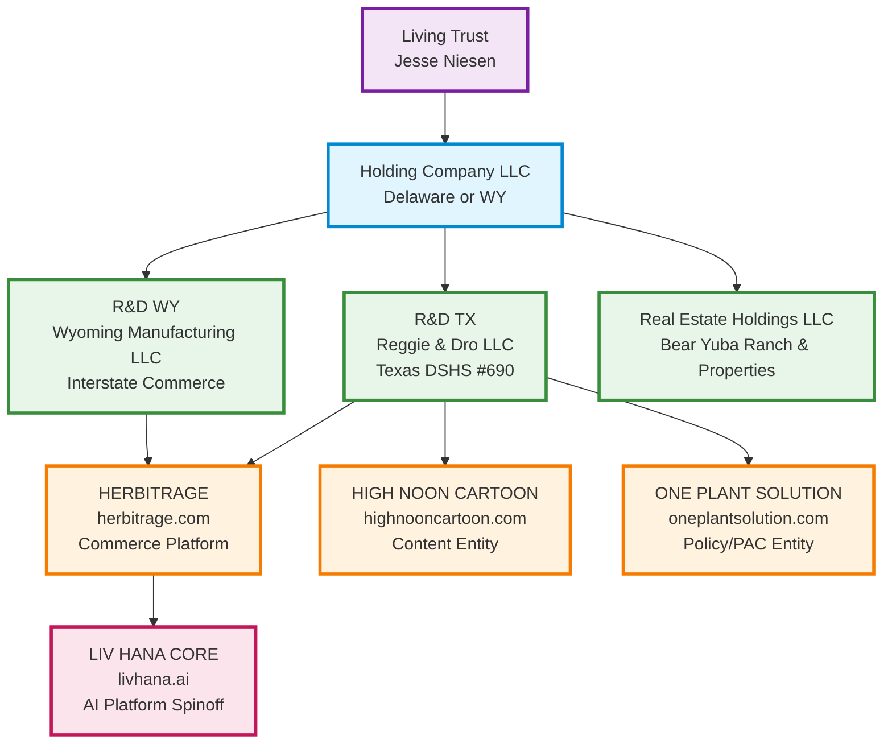

## 🏢 ENTITY STRUCTURE: THE SPIN-OFF HIERARCHY

```mermaid
graph TD
    A[Living Trust<br/>Jesse Niesen] --> B[Holding Company LLC<br/>Delaware or WY]

    B --> C1[R&D TX<br/>Reggie & Dro LLC<br/>Texas DSHS #690]
    B --> C2[R&D WY<br/>Wyoming Manufacturing LLC<br/>Interstate Commerce]

    C1 --> D1[HERBITRAGE<br/>herbitrage.com<br/>Commerce Platform]
    C2 --> D1

    D1 --> E1[LIV HANA CORE<br/>livhana.ai<br/>AI Platform Spinoff]

    C1 --> D2[HIGH NOON CARTOON<br/>highnooncartoon.com<br/>Content Entity]

    C1 --> D3[ONE PLANT SOLUTION<br/>oneplantsolution.com<br/>Policy/PAC Entity]

    B --> F1[Real Estate Holdings LLC<br/>Bear Yuba Ranch & Properties]

    classDef trust fill:#f3e5f5,stroke:#7b1fa2,stroke-width:3px
    classDef holding fill:#e1f5fe,stroke:#0288d1,stroke-width:3px
    classDef operations fill:#e8f5e9,stroke:#388e3c,stroke-width:3px
    classDef spinoff fill:#fff3e0,stroke:#f57c00,stroke-width:3px
    classDef ai fill:#fce4ec,stroke:#c2185b,stroke-width:3px

    class A trust
    class B holding
    class C1,C2 operations
    class D1,D2,D3 spinoff
    class E1 ai
    class F1 operations
```

---
