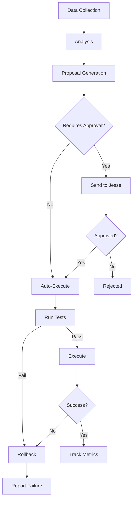

## 🚦 Workflow

```mermaid
graph TD
    A[Data Collection] --> B[Analysis]
    B --> C[Proposal Generation]
    C --> D{Requires Approval?}
    D -->|Yes| E[Send to Jesse]
    D -->|No| F[Auto-Execute]
    E --> G{Approved?}
    G -->|Yes| F
    G -->|No| H[Rejected]
    F --> I[Run Tests]
    I -->|Pass| J[Execute]
    I -->|Fail| K[Rollback]
    J --> L{Success?}
    L -->|Yes| M[Track Metrics]
    L -->|No| K
    K --> N[Report Failure]
```
