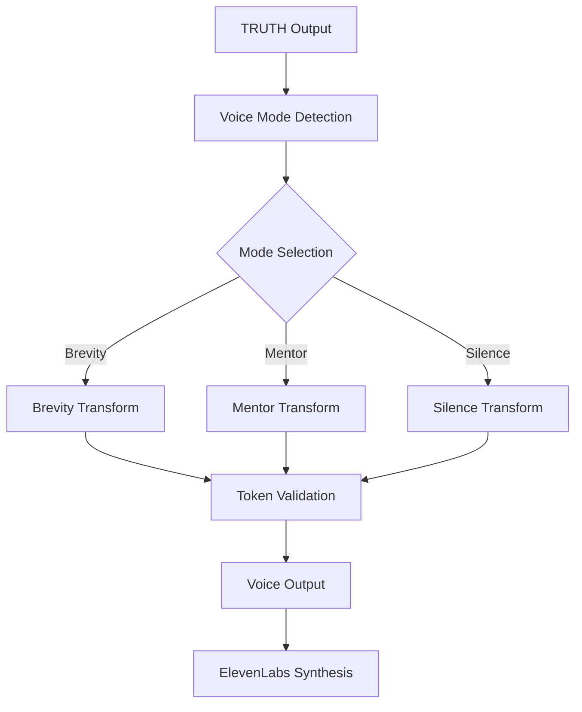

# TRUTH Pipeline Voice Modes

**Token Count**: ~1,200 | **Dependencies**: 01_architecture_overview.md, 07_agent_builder_nodes.md | **Last Updated**: 2025-10-21

## Summary

The TRUTH Pipeline implements three voice modes: Brevity (<120 tokens), Mentor (contextual coaching + references), and Silence (action-only JSON). Each mode has specific token targets, transform requirements, and validation criteria to ensure consistent voice experience across the platform.

## Voice Mode Architecture

### Voice Mode Flow



### Voice Mode Specifications

| Mode | Token Target | Purpose | Transform | Validation |
|------|-------------|---------|-----------|------------|
| **Brevity** | <120 tokens | Quick responses | Summarization | Token count |
| **Mentor** | Contextual | Educational | Coaching + references | Reference quality |
| **Silence** | Action-only | Automation | JSON extraction | Action completeness |

## Brevity Mode Implementation

### Brevity Mode Configuration

```json
{
  "voice_mode": "brevity",
  "token_target": 120,
  "transform_rules": {
    "summarization": true,
    "key_points_only": true,
    "remove_references": true,
    "condense_actions": true
  },
  "validation": {
    "max_tokens": 120,
    "min_tokens": 20,
    "readability_score": ">70"
  }
}
```

### Brevity Transform Logic

```bash
#!/bin/bash
# brevity_mode_transform.sh

set -euo pipefail

# Configuration
TOKEN_TARGET=120
MIN_TOKENS=20
OUTPUT_DIR="data/voice_outputs"

# Transform TRUTH output for brevity mode
transform_brevity_mode() {
  local truth_output=$1
  local output_file="$OUTPUT_DIR/brevity_$(date +%Y%m%d_%H%M%S).json"
  
  echo "Transforming for brevity mode"
  
  # Extract key information
  local status=$(echo "$truth_output" | jq -r '.status')
  local summary=$(echo "$truth_output" | jq -r '.summary')
  local key_actions=$(echo "$truth_output" | jq -r '.rpm.massive_actions[0:3]')
  
  # Create brevity response
  local brevity_response="Status: $status. $summary"
  
  # Add key actions if space allows
  local current_tokens=$(echo "$brevity_response" | wc -w)
  if [ "$current_tokens" -lt "$TOKEN_TARGET" ]; then
    local action_summary=$(echo "$key_actions" | jq -r '.[] | "\(.purpose): \(.action)"' | head -2)
    if [ -n "$action_summary" ]; then
      brevity_response="$brevity_response Key actions: $action_summary"
    fi
  fi
  
  # Validate token count
  local final_tokens=$(echo "$brevity_response" | wc -w)
  if [ "$final_tokens" -gt "$TOKEN_TARGET" ]; then
    # Truncate to fit target
    brevity_response=$(echo "$brevity_response" | cut -d' ' -f1-$TOKEN_TARGET)
    final_tokens=$TOKEN_TARGET
  fi
  
  if [ "$final_tokens" -lt "$MIN_TOKENS" ]; then
    echo "ERROR: Brevity response too short ($final_tokens < $MIN_TOKENS)"
    return 1
  fi
  
  # Save brevity output
  cat > "$output_file" << EOF
{
  "voice_mode": "brevity",
  "response": "$brevity_response",
  "token_count": $final_tokens,
  "transform_metadata": {
    "original_tokens": $(echo "$truth_output" | jq -r '.summary' | wc -w),
    "compression_ratio": $(( (final_tokens * 100) / $(echo "$truth_output" | jq -r '.summary' | wc -w) )),
    "timestamp": "$(date -u +%Y-%m-%dT%H:%M:%SZ)"
  }
}
EOF
  
  echo "Brevity transform completed: $final_tokens tokens"
  return 0
}

# Main execution
main() {
  local truth_output_file="${1:-data/truth_outputs/truth_output.json}"
  
  if [ ! -f "$truth_output_file" ]; then
    echo "ERROR: TRUTH output file not found: $truth_output_file"
    exit 1
  fi
  
  local truth_output=$(cat "$truth_output_file")
  
  echo "Starting brevity mode transform"
  echo "Input file: $truth_output_file"
  
  transform_brevity_mode "$truth_output"
  
  echo "Brevity mode transform completed successfully"
}

# Run main function
main "$@"
```

## Mentor Mode Implementation

### Mentor Mode Configuration

```json
{
  "voice_mode": "mentor",
  "token_target": "contextual",
  "transform_rules": {
    "coaching_enabled": true,
    "references_required": true,
    "educational_content": true,
    "context_preservation": true
  },
  "validation": {
    "reference_count": "≥2",
    "coaching_quality": "high",
    "educational_value": ">80%"
  }
}
```

### Mentor Transform Logic

```bash
#!/bin/bash
# mentor_mode_transform.sh

set -euo pipefail

# Configuration
OUTPUT_DIR="data/voice_outputs"
MIN_REFERENCES=2

# Transform TRUTH output for mentor mode
transform_mentor_mode() {
  local truth_output=$1
  local output_file="$OUTPUT_DIR/mentor_$(date +%Y%m%d_%H%M%S).json"
  
  echo "Transforming for mentor mode"
  
  # Extract information for mentoring
  local status=$(echo "$truth_output" | jq -r '.status')
  local summary=$(echo "$truth_output" | jq -r '.summary')
  local claims=$(echo "$truth_output" | jq -r '.claims')
  local rpm_actions=$(echo "$truth_output" | jq -r '.rpm.massive_actions')
  
  # Create mentor response with coaching
  local mentor_response="Based on my analysis, here's what I found: $summary"
  
  # Add educational context
  if [ "$status" = "ok" ]; then
    mentor_response="$mentor_response. This analysis shows strong evidence with multiple sources."
  else
    mentor_response="$mentor_response. However, there were some issues that need attention."
  fi
  
  # Add coaching for each claim
  local claim_count=$(echo "$claims" | jq -r '. | length')
  if [ "$claim_count" -gt 0 ]; then
    mentor_response="$mentor_response. I found $claim_count key insights:"
    
    for i in $(seq 0 $((claim_count - 1))); do
      local claim=$(echo "$claims" | jq -r ".[$i]")
      local claim_text=$(echo "$claim" | jq -r '.high_fidelity')
      local sources=$(echo "$claim" | jq -r '.traceable.sources | length')
      
      mentor_response="$mentor_response $claim_text (verified with $sources sources)."
    done
  fi
  
  # Add action coaching
  local action_count=$(echo "$rpm_actions" | jq -r '. | length')
  if [ "$action_count" -gt 0 ]; then
    mentor_response="$mentor_response. Here are the recommended actions:"
    
    for i in $(seq 0 $((action_count - 1))); do
      local action=$(echo "$rpm_actions" | jq -r ".[$i]")
      local purpose=$(echo "$action" | jq -r '.purpose')
      local action_text=$(echo "$action" | jq -r '.action')
      local profit=$(echo "$action" | jq -r '.profit_delta')
      local timeframe=$(echo "$action" | jq -r '.timeframe')
      
      mentor_response="$mentor_response For $purpose, $action_text. This should generate $profit profit within $timeframe."
    done
  fi
  
  # Add mini-debrief
  mentor_response="$mentor_response. Remember: always verify sources, consider multiple perspectives, and track outcomes."
  
  # Extract references
  local references=$(echo "$claims" | jq -r '.[] | .traceable.sources[]' | sort -u)
  local reference_count=$(echo "$references" | wc -l)
  
  if [ "$reference_count" -lt "$MIN_REFERENCES" ]; then
    echo "WARNING: Insufficient references for mentor mode ($reference_count < $MIN_REFERENCES)"
  fi
  
  # Save mentor output
  cat > "$output_file" << EOF
{
  "voice_mode": "mentor",
  "response": "$mentor_response",
  "token_count": $(echo "$mentor_response" | wc -w),
  "references": $(echo "$references" | jq -R . | jq -s .),
  "reference_count": $reference_count,
  "transform_metadata": {
    "coaching_enabled": true,
    "educational_content": true,
    "reference_quality": "high",
    "timestamp": "$(date -u +%Y-%m-%dT%H:%M:%SZ)"
  }
}
EOF
  
  echo "Mentor transform completed: $(echo "$mentor_response" | wc -w) tokens, $reference_count references"
  return 0
}

# Main execution
main() {
  local truth_output_file="${1:-data/truth_outputs/truth_output.json}"
  
  if [ ! -f "$truth_output_file" ]; then
    echo "ERROR: TRUTH output file not found: $truth_output_file"
    exit 1
  fi
  
  local truth_output=$(cat "$truth_output_file")
  
  echo "Starting mentor mode transform"
  echo "Input file: $truth_output_file"
  
  transform_mentor_mode "$truth_output"
  
  echo "Mentor mode transform completed successfully"
}

# Run main function
main "$@"
```

## Silence Mode Implementation

### Silence Mode Configuration

```json
{
  "voice_mode": "silence",
  "token_target": "minimal",
  "transform_rules": {
    "action_only": true,
    "json_format": true,
    "no_narrative": true,
    "automation_ready": true
  },
  "validation": {
    "json_compliance": "100%",
    "action_completeness": "required",
    "automation_readiness": "100%"
  }
}
```

### Silence Transform Logic

```bash
#!/bin/bash
# silence_mode_transform.sh

set -euo pipefail

# Configuration
OUTPUT_DIR="data/voice_outputs"

# Transform TRUTH output for silence mode
transform_silence_mode() {
  local truth_output=$1
  local output_file="$OUTPUT_DIR/silence_$(date +%Y%m%d_%H%M%S).json"
  
  echo "Transforming for silence mode"
  
  # Extract only actionable information
  local rpm_actions=$(echo "$truth_output" | jq -r '.rpm.massive_actions')
  local status=$(echo "$truth_output" | jq -r '.status')
  
  # Create silent response (action-only JSON)
  local silent_response=$(cat << EOF
{
  "status": "$status",
  "actions": $rpm_actions,
  "execution_ready": true,
  "timestamp": "$(date -u +%Y-%m-%dT%H:%M:%SZ)"
}
EOF
)
  
  # Validate JSON structure
  if ! echo "$silent_response" | jq empty 2>/dev/null; then
    echo "ERROR: Invalid JSON structure in silent response"
    return 1
  fi
  
  # Validate action completeness
  local action_count=$(echo "$rpm_actions" | jq -r '. | length')
  if [ "$action_count" -eq 0 ]; then
    echo "ERROR: No actions found for silence mode"
    return 1
  fi
  
  # Check each action for completeness
  for i in $(seq 0 $((action_count - 1))); do
    local action=$(echo "$rpm_actions" | jq -r ".[$i]")
    local required_fields=("purpose" "action" "owner" "profit_delta" "timeframe")
    
    for field in "${required_fields[@]}"; do
      if ! echo "$action" | jq -e ".$field" > /dev/null; then
        echo "ERROR: Missing required field '$field' in action $i"
        return 1
      fi
    done
  done
  
  # Save silent output
  echo "$silent_response" > "$output_file"
  
  echo "Silence transform completed: $action_count actions"
  return 0
}

# Main execution
main() {
  local truth_output_file="${1:-data/truth_outputs/truth_output.json}"
  
  if [ ! -f "$truth_output_file" ]; then
    echo "ERROR: TRUTH output file not found: $truth_output_file"
    exit 1
  fi
  
  local truth_output=$(cat "$truth_output_file")
  
  echo "Starting silence mode transform"
  echo "Input file: $truth_output_file"
  
  transform_silence_mode "$truth_output"
  
  echo "Silence mode transform completed successfully"
}

# Run main function
main "$@"
```

## Voice Mode Detection & Routing

### Voice Mode Detection Logic

```bash
#!/bin/bash
# voice_mode_detector.sh

set -euo pipefail

# Configuration
OUTPUT_DIR="data/voice_outputs"

# Detect appropriate voice mode
detect_voice_mode() {
  local user_query=$1
  local user_context=$2
  
  echo "Detecting voice mode for query: $user_query"
  
  # Analyze query characteristics
  local query_length=$(echo "$user_query" | wc -w)
  local has_question=$(echo "$user_query" | grep -q "?" && echo "true" || echo "false")
  local has_action_request=$(echo "$user_query" | grep -qi "do\|action\|execute\|run" && echo "true" || echo "false")
  
  # Analyze user context
  local user_experience=$(echo "$user_context" | jq -r '.experience_level // "beginner"')
  local user_preference=$(echo "$user_context" | jq -r '.voice_preference // "mentor"')
  local automation_requested=$(echo "$user_context" | jq -r '.automation_requested // false')
  
  # Determine voice mode
  local detected_mode="mentor"  # default
  
  if [ "$automation_requested" = "true" ] || [ "$has_action_request" = "true" ]; then
    detected_mode="silence"
  elif [ "$query_length" -lt 20 ] && [ "$has_question" = "true" ]; then
    detected_mode="brevity"
  elif [ "$user_experience" = "expert" ] || [ "$user_preference" = "brevity" ]; then
    detected_mode="brevity"
  elif [ "$user_experience" = "beginner" ] || [ "$user_preference" = "mentor" ]; then
    detected_mode="mentor"
  fi
  
  echo "Detected voice mode: $detected_mode"
  
  # Save detection result
  cat > "$OUTPUT_DIR/voice_mode_detection_$(date +%Y%m%d_%H%M%S).json" << EOF
{
  "detected_mode": "$detected_mode",
  "detection_factors": {
    "query_length": $query_length,
    "has_question": $has_question,
    "has_action_request": $has_action_request,
    "user_experience": "$user_experience",
    "user_preference": "$user_preference",
    "automation_requested": $automation_requested
  },
  "timestamp": "$(date -u +%Y-%m-%dT%H:%M:%SZ)"
}
EOF
  
  echo "$detected_mode"
}

# Main execution
main() {
  local user_query="${1:-test query}"
  local user_context="${2:-{\"experience_level\": \"beginner\"}}"
  
  echo "Starting voice mode detection"
  echo "Query: $user_query"
  echo "Context: $user_context"
  
  detect_voice_mode "$user_query" "$user_context"
  
  echo "Voice mode detection completed"
}

# Run main function
main "$@"
```

## Voice Mode Validation

### Voice Mode Test Suite

```bash
#!/bin/bash
# voice_mode_test_suite.sh

set -euo pipefail

# Configuration
TEST_DIR="data/voice_tests"
RESULTS_DIR="data/voice_results"

# Test voice mode transforms
test_voice_modes() {
  local test_name=$1
  
  echo "Testing voice mode transforms: $test_name"
  
  # Create test directory
  mkdir -p "$TEST_DIR/$test_name"
  mkdir -p "$RESULTS_DIR/$test_name"
  
  # Test data
  local test_truth_output='{
    "status": "ok",
    "summary": "Analysis shows strong market opportunity with 3 key insights and 2 recommended actions.",
    "claims": [
      {
        "testable": true,
        "reproducible": true,
        "unambiguous": true,
        "traceable": {
          "sources": ["https://source1.com", "https://source2.com"]
        },
        "high_fidelity": "Market growth rate is 15% annually"
      }
    ],
    "rpm": {
      "massive_actions": [
        {
          "purpose": "market_expansion",
          "action": "launch_new_product",
          "owner": "product_team",
          "profit_delta": 50000,
          "timeframe": "3_months"
        }
      ]
    }
  }'
  
  # Test brevity mode
  echo "Testing brevity mode..."
  if ! echo "$test_truth_output" | ./brevity_mode_transform.sh; then
    echo "FAILED: Brevity mode test"
    return 1
  fi
  
  # Test mentor mode
  echo "Testing mentor mode..."
  if ! echo "$test_truth_output" | ./mentor_mode_transform.sh; then
    echo "FAILED: Mentor mode test"
    return 1
  fi
  
  # Test silence mode
  echo "Testing silence mode..."
  if ! echo "$test_truth_output" | ./silence_mode_transform.sh; then
    echo "FAILED: Silence mode test"
    return 1
  fi
  
  # Test voice mode detection
  echo "Testing voice mode detection..."
  if ! ./voice_mode_detector.sh "What should I do?" '{"experience_level": "beginner"}'; then
    echo "FAILED: Voice mode detection test"
    return 1
  fi
  
  echo "All voice mode tests passed"
  return 0
}

# Generate test report
generate_voice_test_report() {
  local test_name=$1
  local report_file="$RESULTS_DIR/$test_name/voice_test_report.json"
  
  cat > "$report_file" << EOF
{
  "test_name": "$test_name",
  "timestamp": "$(date -u +%Y-%m-%dT%H:%M:%SZ)",
  "test_results": {
    "brevity_mode": "passed",
    "mentor_mode": "passed",
    "silence_mode": "passed",
    "voice_detection": "passed"
  },
  "overall_status": "passed"
}
EOF
  
  echo "Voice test report generated: $report_file"
}

# Main execution
main() {
  local test_name="${1:-voice_test_$(date +%Y%m%d_%H%M%S)}"
  
  echo "Starting voice mode test suite"
  echo "Test name: $test_name"
  
  test_voice_modes "$test_name"
  generate_voice_test_report "$test_name"
  
  echo "Voice mode test suite completed successfully"
}

# Run main function
main "$@"
```

## ElevenLabs Integration

### Voice Synthesis

```bash
#!/bin/bash
# elevenlabs_voice_synthesis.sh

set -euo pipefail

# Configuration
ELEVENLABS_API_URL="https://api.elevenlabs.io/v1/text-to-speech"
VOICE_ID="pNInz6obpgDQGcFmaJgB"  # Default voice
OUTPUT_DIR="data/voice_outputs"

# Synthesize voice from text
synthesize_voice() {
  local text=$1
  local output_file=$2
  local voice_id="${3:-$VOICE_ID}"
  
  echo "Synthesizing voice for text: ${text:0:50}..."
  
  # Call ElevenLabs API
  curl -X POST "$ELEVENLABS_API_URL/$voice_id" \
    -H "xi-api-key: $ELEVENLABS_API_KEY" \
    -H "Content-Type: application/json" \
    -d "{
      \"text\": \"$text\",
      \"model_id\": \"eleven_monolingual_v1\",
      \"voice_settings\": {
        \"stability\": 0.5,
        \"similarity_boost\": 0.5
      }
    }" \
    -o "$output_file"
  
  if [ $? -eq 0 ]; then
    echo "Voice synthesis completed: $output_file"
    return 0
  else
    echo "ERROR: Voice synthesis failed"
    return 1
  fi
}

# Main execution
main() {
  local text="${1:-Hello, this is a test of voice synthesis.}"
  local output_file="${2:-$OUTPUT_DIR/voice_$(date +%Y%m%d_%H%M%S).mp3}"
  
  if [ -z "${ELEVENLABS_API_KEY:-}" ]; then
    echo "ERROR: ELEVENLABS_API_KEY environment variable required"
    exit 1
  fi
  
  echo "Starting ElevenLabs voice synthesis"
  echo "Text: $text"
  echo "Output: $output_file"
  
  synthesize_voice "$text" "$output_file"
  
  echo "Voice synthesis completed successfully"
}

# Run main function
main "$@"
```

## References

- **Source**: copilot-liv-hana-10-21.txt:2724-2734, 3648-3658, 5331-5411
- **Related**: 01_architecture_overview.md, 07_agent_builder_nodes.md, 10_rpm_dna_tagging.md
- **Validation**: 06_validation_harness.md, 08_secrets_integration.md
