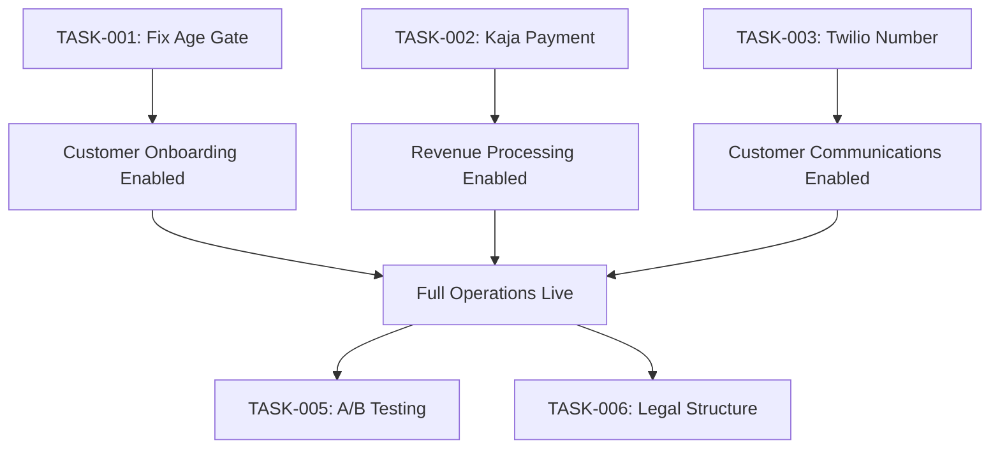

# Task Tickets - 2025/10/06

**Source**: ATC Key Information Extraction + Meeting Notes
**Created**: 2025-10-06 23:45:00
**Review Frequency**: Daily

## Priority Matrix

| Priority | Count | ETA |
|----------|-------|-----|
| 🔴 P0 (Critical) | 3 | 24-48 hours |
| 🟠 P1 (High) | 3 | 3-5 days |
| 🟡 P2 (Medium) | 2 | 1-2 weeks |
| 🟢 P3 (Low/Ongoing) | 2 | Continuous |
| **Total** | **10** | - |

---

## 🔴 P0: CRITICAL (24-48 Hours)

### TASK-001: Fix Age Gate Link

**Priority**: 🔴 P0 (CRITICAL)
**Owner**: Jesse Niesen
**Assigned To**: Development Team
**Status**: 🚨 BLOCKED - Non-functional
**Due Date**: 2025-10-07 EOD

**Description**:
Age gate link is live but buttons are non-functional (error on click). Blocking customer access and compliance verification.

**Acceptance Criteria**:

- [ ] Age gate buttons functional
- [ ] Successful verification flow test
- [ ] Error logging implemented
- [ ] Compliance verification passed

**Dependencies**: None
**Risk**: HIGH - Blocking customer onboarding
**Effort**: 4 hours

**Technical Notes**:

- Location: reggieanddro.company.site
- Error: Button click returns error
- Impact: Customer acquisition blocked

---

### TASK-002: Connect Kaja Payment to Square

**Priority**: 🔴 P0 (CRITICAL)
**Owner**: Jesse Niesen
**Assigned To**: Jesse + Romeo Trevino
**Status**: 🟡 IN PROGRESS
**Due Date**: 2025-10-08 EOD

**Description**:
Integrate Kaja payment processing with Square website to enable payment processing for cannabis sales.

**Acceptance Criteria**:

- [ ] Kaja API credentials obtained from 1Password
- [ ] Square API integration configured
- [ ] Payment flow tested (sandbox)
- [ ] Payment flow tested (production)
- [ ] Romeo verifies Square access
- [ ] Transaction logging to BigQuery

**Dependencies**:

- Romeo Trevino (Square access)
- 1Password (Kaja credentials)

**Risk**: HIGH - Revenue blocking
**Effort**: 8-12 hours

**Technical Notes**:

- Provider: KAJA/Authorize.Net
- Integration: Square website
- Compliance: PCI DSS required
- Testing: Sandbox → Production migration

**Contact**:

- Romeo Trevino: Square website access (birthday 10/5)

---

### TASK-003: Obtain Twilio Dedicated Number

**Priority**: 🔴 P0 (CRITICAL)
**Owner**: Jesse Niesen
**Assigned To**: Jesse Niesen
**Status**: 🔴 NOT STARTED
**Due Date**: 2025-10-08 EOD

**Description**:
Acquire dedicated Twilio phone number for business operations (customer support, order notifications, verification).

**Acceptance Criteria**:

- [ ] Twilio account verified
- [ ] Dedicated number purchased
- [ ] Number configured in integration-service
- [ ] SMS notifications tested
- [ ] Voice calls tested (if applicable)
- [ ] Number documented in 1Password

**Dependencies**:

- Twilio account access
- Budget approval (~$1-2/month)

**Risk**: MEDIUM - Operations delay
**Effort**: 2 hours

**Technical Notes**:

- Provider: Twilio
- Use Case: Customer notifications, support
- Integration: backend/integration-service
- Cost: ~$1/month base + usage

---

## 🟠 P1: HIGH PRIORITY (3-5 Days)

### TASK-004: Ruthless Editing - AI Output Refinement

**Priority**: 🟠 P1 (HIGH)
**Owner**: Jesse Niesen
**Assigned To**: Jesse + Content Team
**Status**: 🟢 CONTINUOUS
**Due Date**: Ongoing

**Description**:
AI-generated output from "invisible code base" requires human refinement and brand alignment. Establish editing workflow.

**Acceptance Criteria**:

- [ ] AI output review process defined
- [ ] Brand voice guidelines created
- [ ] Editing checklist established
- [ ] 3 sample edits completed
- [ ] Feedback loop to AI system

**Dependencies**: None
**Risk**: LOW - Quality control
**Effort**: 4 hours (setup) + ongoing

**Technical Notes**:

- Source: Cheetah AI + Claude + ChatGPT5
- Focus: Brand alignment, accuracy
- Process: AI → Human review → Publish
- Quality: "Ruthless editing" required

---

### TASK-005: Implement A/B Testing Framework

**Priority**: 🟠 P1 (HIGH)
**Owner**: Jesse Niesen
**Assigned To**: Development Team
**Status**: 🔴 NOT STARTED
**Due Date**: 2025-10-11

**Description**:
Implement A/B split testing for conversion language optimization on website.

**Acceptance Criteria**:

- [ ] A/B testing framework selected (e.g., Google Optimize)
- [ ] Test variations created:
  - [ ] "Cannabis dispensary" vs "Premium THCA private social club"
  - [ ] Product tiers: Value/Premium/Ultra Premium
- [ ] Tracking implemented (GA4)
- [ ] Statistical significance threshold defined
- [ ] First test launched

**Dependencies**:

- Google Analytics 4 setup
- Website access

**Risk**: MEDIUM - Conversion optimization
**Effort**: 12 hours

**Technical Notes**:

- Tool: Google Optimize or custom
- Metrics: Conversion rate, bounce rate
- Sample size: Calculate for significance
- Duration: 2-4 weeks per test

**Test Variants**:

1. Language: "Cannabis dispensary" → "Premium THCA private social club"
2. Tiers: Value, Premium, Ultra Premium
3. Compliance: Bank-approved language

---

### TASK-006: Legal Entity Structure Review

**Priority**: 🟠 P1 (HIGH)
**Owner**: Jesse Niesen
**Assigned To**: Jesse + Legal Counsel
**Status**: 🟡 IN PROGRESS
**Due Date**: 2025-10-11

**Description**:
Review and potentially separate legal entities for different business functions (retail, delivery, SaaS platform).

**Acceptance Criteria**:

- [ ] Current structure documented
- [ ] Separation benefits analyzed
- [ ] Legal counsel consulted (Andrea Steel)
- [ ] Tax implications reviewed
- [ ] Recommended structure proposed
- [ ] Implementation plan created

**Dependencies**:

- Legal counsel availability
- Financial advisor input

**Risk**: MEDIUM - Compliance optimization
**Effort**: 8 hours (research) + legal fees

**Technical Notes**:

- Current: Single entity structure
- Proposed: Separate entities for:
  - Retail operations (R&D)
  - Delivery service
  - SaaS platform (Liv Hana)
- Benefits: Liability protection, tax optimization
- Contact: Andrea Steel (patent attorney)

---

## 🟡 P2: MEDIUM PRIORITY (1-2 Weeks)

### TASK-007: Daily Domain Verification System

**Priority**: 🟡 P2 (MEDIUM)
**Owner**: Liv Hana (System)
**Assigned To**: Automated System
**Status**: 🟢 ACTIVE
**Due Date**: Ongoing

**Description**:
Maintain automated daily verification of 69 domain names for compliance and availability.

**Acceptance Criteria**:

- [x] Automation script implemented
- [x] Daily verification running
- [ ] Alert system for failures
- [ ] Dashboard for verification status
- [ ] Monthly report generation

**Dependencies**: None
**Risk**: LOW - Monitoring
**Effort**: 2 hours (alerts) + ongoing

**Technical Notes**:

- Domains: 69 total
- Frequency: Daily real-time
- Automation: backend/integration-service
- Alerts: Email/Slack on failure
- Storage: BigQuery logs

---

### TASK-008: Voice Mode Refinement

**Priority**: 🟡 P2 (MEDIUM)
**Owner**: Jesse Niesen
**Assigned To**: Development Team
**Status**: 🟢 ACTIVE
**Due Date**: 2025-10-13

**Description**:
Refine voice mode audio clarity for team interaction and meeting notes capture.

**Acceptance Criteria**:

- [ ] Audio quality assessment completed
- [ ] Noise reduction configured
- [ ] Transcription accuracy tested (>95%)
- [ ] Meeting notes auto-generation tested
- [ ] Team feedback collected

**Dependencies**:

- Voice integration system
- Team availability for testing

**Risk**: LOW - Collaboration efficiency
**Effort**: 6 hours

**Technical Notes**:

- System: Liv Hana voice integration
- Processing: ChatGPT5 for notes
- Storage: Local + cloud repositories
- Audio settings: Adjusted for clarity
- Output: Meeting notes by Gemini

---

## 🟢 P3: LOW/ONGOING (Continuous)

### TASK-009: Execute Domain Linking Strategy

**Priority**: 🟢 P3 (LOW)
**Owner**: Jesse Niesen
**Assigned To**: Development Team
**Status**: 🟡 IN PLANNING
**Due Date**: 2025-10-20

**Description**:
Implement multi-domain linking strategy to connect website domains for operational efficiency.

**Acceptance Criteria**:

- [ ] Domain linking strategy documented
- [ ] Primary domain identified
- [ ] DNS configuration planned
- [ ] Redirect rules defined
- [ ] SEO impact assessed
- [ ] Implementation roadmap created

**Dependencies**:

- Domain registrar access
- DNS management (Cloud DNS)

**Risk**: LOW - Operational efficiency
**Effort**: 8 hours (planning) + 4 hours (implementation)

**Technical Notes**:

- Domains: Multiple websites
- Strategy: Link domains together
- DNS: Cloud DNS management
- SEO: 301 redirects, canonical tags
- Testing: Verify all redirects work

---

### TASK-010: Notion Tasks Management

**Priority**: 🟢 P3 (LOW)
**Owner**: Claude/Jesse
**Assigned To**: Claude + Jesse
**Status**: 🟢 ACTIVE
**Due Date**: Ongoing

**Description**:
Continue Claude-assisted task review and management from Notion tasks.csv file.

**Acceptance Criteria**:

- [x] Claude accessing tasks.csv
- [x] Task review process established
- [ ] Weekly task prioritization
- [ ] Task completion tracking
- [ ] Integration with this ticket system

**Dependencies**:

- Notion API access
- tasks.csv file location

**Risk**: LOW - Task management
**Effort**: 1 hour/week

**Technical Notes**:

- Source: Notion tasks.csv
- Review: Claude-assisted
- Frequency: Weekly or on-demand
- Integration: Sync with this document

---

## Task Assignment Summary

| Owner | Tasks Assigned | Priority Breakdown |
|-------|----------------|-------------------|
| **Jesse Niesen** | 7 tasks | 🔴 3 P0, 🟠 3 P1, 🟢 1 P3 |
| **Development Team** | 4 tasks | 🔴 1 P0, 🟠 1 P1, 🟡 2 P2 |
| **Romeo Trevino** | 1 task | 🔴 1 P0 (support) |
| **Automated System** | 1 task | 🟡 1 P2 (ongoing) |
| **Claude** | 1 task | 🟢 1 P3 (ongoing) |

---

## Critical Path

---

## Daily Standup Checklist

### Morning (9 AM)

- [ ] Review P0 tasks status
- [ ] Check automated systems (domains, voice)
- [ ] Prioritize day's work

### Afternoon (3 PM)

- [ ] Update task progress
- [ ] Address blockers
- [ ] Plan next day

### Evening (6 PM)

- [ ] Complete P0 items or escalate
- [ ] Document progress
- [ ] Set next-day priorities

---

## Risk Assessment

| Risk | Impact | Mitigation |
|------|--------|------------|
| **Age gate blocking customers** | HIGH | TASK-001 P0 priority |
| **No payment processing** | HIGH | TASK-002 P0 priority |
| **Communication delays** | MEDIUM | TASK-003 P0 priority |
| **AI output quality** | MEDIUM | TASK-004 ongoing review |
| **Legal structure inefficiency** | LOW | TASK-006 P1 review |

---

## Status Legend

- 🔴 NOT STARTED - Not yet begun
- 🟡 IN PROGRESS - Actively working
- 🟢 ACTIVE - Running/Operational
- 🚨 BLOCKED - Dependency blocking progress
- ✅ COMPLETE - Finished and verified

---

## Next Review

**Date**: 2025-10-07 09:00 CDT
**Focus**: P0 task completion
**Attendees**: Jesse, Development Team, Romeo (if needed)

---

**Document Status**: ✅ Active
**Last Updated**: 2025-10-06 23:45:00
**Next Update**: 2025-10-07 09:00:00
