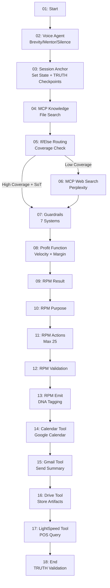

# Agent Builder 17-Node Workflow - Liv Hana TRUTH Pipeline

**Version**: 1.0.0
**Created**: 2025-10-21
**Status**: Production-Ready Configuration Complete
**Configuration**: `config/agent_builder_17_node_config.json`

---

## Visual Workflow



---

## Node Descriptions

### 01: Start

**Type**: Entry Point
**Purpose**: Initiate cannabis intelligence query workflow
**Outputs**: `user_query`, `session_id`, `timestamp`

### 02: Voice Agent

**Type**: Voice Interaction
**Modes**:

- **Brevity** (trigger: "Liv"): <120 tokens, concise status
- **Mentor** (default): <300 tokens, educational
- **Silence** (trigger: "pause"): JSON output only

**Services**:

- STT Primary: Whisper (localhost:2022)
- STT Fallback: OpenAI API
- TTS: Kokoro (localhost:8880)
- Timeout: 10s (reduced from 30s)

### 03: Session Anchor (Set State)

**Type**: State Management
**Features**:

- Machine-readable session state
- TRUTH checkpoint triggers: 1000 tokens OR topic change
- Citation enforcement: ≥1 SoT OR ≥2 web sources
- Block End node until citation requirements met

**State Schema**:

```json
{
  "session_id": "UUID",
  "anchor_version": "1.0.0",
  "topic_shard_id": "string",
  "last_truth_check_ts": "ISO8601",
  "source_of_truth_version": "string",
  "token_count": "integer",
  "citations": "array",
  "guardrails_passed": "boolean",
  "voice_mode": "brevity|mentor|silence"
}
```

### 04: MCP - Knowledge & File Search

**Type**: MCP Tool (Rube Broker)
**Tools**: `search_knowledge_base`, `search_files`, `get_document`, `get_sot_reference`
**Features**:

- Max 20 results
- Relevance threshold: 0.7
- Deduplication: enabled
- Source diversity: required
- Stale source decay: >90 days (unless SoT)

### 05: If/Else Routing

**Type**: Conditional Logic
**Conditions**:

1. `knowledge_results.coverage < 0.5` → Web Search
2. `query_type IN ['real_time', 'trending']` → Web Search
3. `knowledge_results.coverage >= 0.5 AND sot_references.count > 0` → Skip to Guardrails
4. Default → Web Search

### 06: MCP - Web Search

**Type**: MCP Tool (Rube Broker)
**Engine**: Perplexity
**Tools**: `web_search`, `fetch_url`, `verify_claim`
**Features**:

- Max 10 results
- Recency bias: 168 hours (7 days)
- Domain diversity: required

### 07: Guardrails (7 Systems)

**Type**: Compliance & Safety

**Guardrails**:

1. **AGE21**: Require 21+ confirmation → block
2. **PII Redaction**: Email/phone/SSN regex → sanitize
3. **Cannabis Compliance**: THC ≤0.3%, COA required → warn_and_verify
4. **Financial Accuracy**: velocity × margin formula → validate
5. **Secrets Handling**: IAM-only, no plaintext → block
6. **Medical Claims**: Block therapeutic claims → block_and_map to safe language
7. **Novel Cannabinoids**: NIST-approved only (CBD, CBG, CBN, THC, THCV) → block

**SLO**: False block rate <1%

### 08: Profit Function

**Type**: Algorithmic Calculation
**Formula**:

```
profit_estimate = (velocity_units/month * margin/unit * 12)
                - (fixed_costs_annual + variable_costs_annual)
```

**Confidence Bands**:

- High: >80% data completeness
- Medium: 50-80% data completeness
- Low: <50% data completeness

### 09-13: RPM Chain (5 Agents)

**Type**: Sequential Agent Pipeline

**09 - RPM Result**: Define desired outcome (precise, measurable)
**10 - RPM Purpose**: Identify underlying motivation/goal
**11 - RPM Massive Actions**: Generate up to 25 actionable steps
**12 - RPM Validation**: Feasibility, compliance, guardrails, profit checks
**13 - RPM Emit**: Output RPM card with DNA tagging

**Action Schema**:

```json
{
  "action": "description",
  "profit_contribution_estimate": "$15,000/month",
  "timeframe_hours_parallel": 720,
  "autonomous_capable": false,
  "dependencies": ["licensing", "facility"],
  "guardrails": ["AGE21", "state_testing"]
}
```

### 14-17: Business Tools (4 Integrations)

**Type**: External API Integrations

**14 - Google Calendar**: Schedule RPM tasks
**15 - Gmail**: Send RPM summary
**16 - Google Drive**: Store artifacts
**17 - LightSpeed POS**: Query dispensary inventory/sales

**Secrets**: All wired via GSM (`${GSM:*-Agent-Builder}`)
**Approval**: Human approval required for Calendar, Gmail, LightSpeed

### 18: End

**Type**: Workflow Termination
**TRUTH Validation Enforcement**:

- Min 1 SoT citation OR 2 web citations
- Block workflow completion if not met

**Output Schema**:

```json
{
  "session_id": "string",
  "result": "RPM card object",
  "citations": "array (validated)",
  "guardrails_status": "object",
  "metrics": {
    "compression_saved_pct": "float (≥40%)",
    "citation_completeness_pct": "float (≥95%)",
    "guardrail_false_block_rate": "float (<1%)",
    "voice_p95_latency_ms": "float (<1200ms)",
    "orchestrator_p95_latency_ms": "float (<3000ms)"
  },
  "artifacts": {
    "rpm_card": "object",
    "calendar_events": "array",
    "email_id": "string",
    "drive_url": "string",
    "lightspeed_data": "object"
  }
}
```

---

## SLO Targets

| Metric | Target | Monitoring |
|--------|--------|-----------|
| Voice P95 Latency | <1200ms | `.race/aggregate/comet_dashboard.json` |
| Orchestrator P95 Latency | <3000ms | `.race/aggregate/comet_dashboard.json` |
| Guardrail False Block Rate | <1% | `.race/aggregate/comet_dashboard.json` |
| Citation Completeness | ≥95% | End node validation |
| Compression Savings | ≥40% | TRUTH pipeline output |

---

## Secrets Configuration

All secrets wired via Google Secret Manager (GSM):

```json
{
  "anthropic_api_key": "${GSM:ANTHROPIC_API_KEY}",
  "openai_api_key": "${GSM:OPENAI_API_KEY}",
  "gmail_api_key": "${GSM:Gmail-Agent-Builder}",
  "drive_api_key": "${GSM:Drive-Agent-Builder}",
  "calendar_api_key": "${GSM:Calendar-Agent-Builder}",
  "lightspeed_token": "${GSM:LightSpeed-Agent-Builder}",
  "mcp_broker_key": "${GSM:Rube-Agent-Builder}",
  "gcp_cloudrun_key": "${GSM:GCP-CloudRun-Agent-Builder}"
}
```

**GSM UUID Map**: `config/gsm_secrets_uuid_map.json` (65 secrets)

---

## Deployment Instructions

### Option 1: Agent Builder UI (DoBrowser Automation)

```bash
# Use DoBrowser to build canvas node-by-node
# Paste Orchestrator prompt from node 02
# Attach State from node 03
# Wire MCP tools from nodes 04, 06
# Configure guardrails in node 07
# Add RPM chain nodes 09-13
# Connect business tools 14-17
```

### Option 2: JSON Import (if supported)

```bash
# Import config/agent_builder_17_node_config.json
# Verify all nodes connected
# Test secrets access
# Run preview with sample query
```

### Option 3: Manual Build (Codex → Cheetah)

1. **Codex**: Generate execution artifacts (scripts, configs, tests)
2. **Cheetah**: Implement nodes in Agent Builder UI
3. **Sonnet**: Validate, document, commit

---

## Testing Checklist

- [ ] Secrets validation (all 8 keys accessible from GSM)
- [ ] Voice mode STT fallback (Whisper timeout → OpenAI)
- [ ] Session state checkpointing (1000 tokens OR topic change)
- [ ] Routing logic (coverage < 0.5 → web search)
- [ ] Guardrails enforcement (7 systems, <1% false blocks)
- [ ] Profit function calculation (formula accuracy)
- [ ] RPM chain execution (5 agents sequential)
- [ ] Business tools authorization (Calendar, Gmail, Drive, LightSpeed)
- [ ] End node TRUTH validation (≥1 SoT OR ≥2 web citations)
- [ ] Metrics emission to `.race/aggregate/comet_dashboard.json`

---

## Next Steps

### Immediate (Codex Execution Artifacts)

1. Generate execution scripts for each node
2. Create test harness for node validation
3. Build secrets smoke test (GSM + MCP hello calls)
4. Generate monitoring/alerting configuration

### Implementation (Cheetah Speed Layer)

1. Build 17-node canvas in Agent Builder UI
2. Paste Orchestrator + State prompts
3. Attach Rube MCP broker
4. Wire all secrets via GSM references
5. Configure guardrails with enforcement rules
6. Test end-to-end with sample query

### Validation (Sonnet Orchestration)

1. Run integrity checks on all nodes
2. Validate SLO metrics collection
3. Verify TRUTH citation enforcement
4. Document any deviations from spec
5. Create deployment runbook

---

## Related Documentation

- **Configuration**: `config/agent_builder_17_node_config.json`
- **Secrets Map**: `config/gsm_secrets_uuid_map.json`
- **TRUTH Pipeline**: `docs/TRUTH_PIPELINE_MASTER/`
- **Forensic Analysis**: `AGENT_DEPLOYMENT_FORENSIC_ANALYSIS_2025-10-21.md`
- **RPM Weekly Plan**: Reconciled report (GPT-5 High → Orchestration)

---

**Status**: Ready for Codex execution artifacts → Cheetah implementation → Sonnet validation
**Deployment Target**: Agent Builder Cloud Run (GCP)
**Timeline**: 60-90 minutes from handoff to production preview
