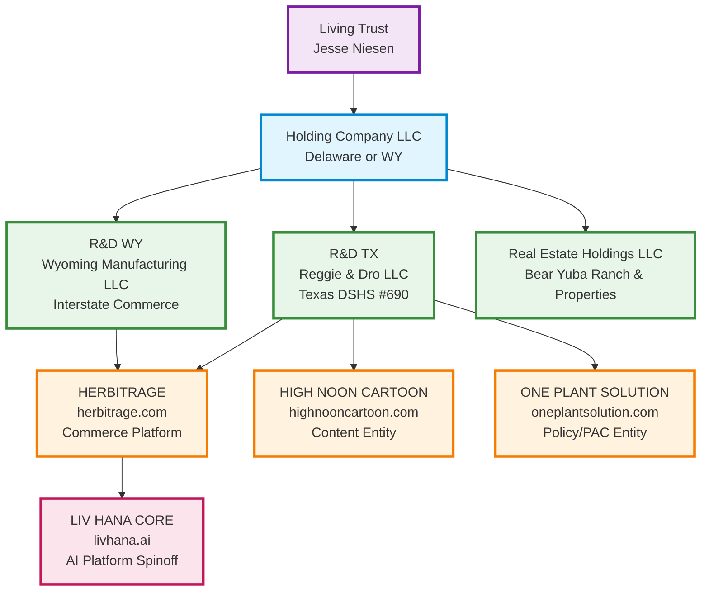

# 🏛️ JESSE NIESEN EMPIRE ENTITY STRUCTURE & ORG CHART

**Date:** September 30, 2025
**Purpose:** Complete entity silo mapping for Texas takeover & Empire-Empire deployment
**Domain Strategy:** Herbitrage.com primary launch | LivHana.ai core AI platform

---

## 🎯 DOMAIN CORRECTION: YOU OWN THEM ALL

**CRITICAL:** I incorrectly referenced `livhana.com` in previous docs. Here's the ACTUAL domain strategy:

### Primary Deployment Domains:
- **herbitrage.com** - PRIMARY LAUNCH (Liv Hana customer-facing platform)
- **livhana.ai** - CORE AI PLATFORM (Liv Hana intelligence engine spinoff)
- **reggieanddro.com** - MAIN BUSINESS (R&D revenue engine)
- **highnooncartoon.com** - CONTENT PLATFORM
- **oneplantsolution.com** - POLICY/ADVOCACY HUB

### You Own 69+ Domains Total (Empire-Empire Strategy)

---

## 🏢 ENTITY STRUCTURE: THE SPIN-OFF HIERARCHY



---

## 📊 ENTITY SILO BREAKDOWN

### 🏛️ TIER 0: ASSET PROTECTION LAYER

#### **Living Trust** (Jesse Niesen Family Trust)
- **Purpose:** Asset protection, estate planning, tax optimization
- **Assets:** All business entities, real estate, investments
- **Jurisdiction:** California/Texas (TBD based on tax strategy)
- **Status:** Requires immediate setup if not exists

#### **Holding Company LLC** (Recommended: Delaware or Wyoming)
- **Purpose:** Centralized entity management, liability shield
- **Role:** Owns all operating entities
- **Jurisdiction:** Delaware (flexibility) or Wyoming (privacy)
- **Tax Status:** Pass-through to Living Trust
- **Priority:** P0 - Establish before Texas expansion

---

### 🌱 TIER 1: FOUNDATIONAL ENTITIES (PARENT OPERATIONS)

#### **R&D TX (Reggie & Dro LLC - Texas)**
**Legal Entity:** Reggie & Dro LLC
**Jurisdiction:** Texas
**License:** TX DSHS CHP #690
**Domain:** reggieanddro.com

**Operations:**
- Retail locations: Stone Oak, Alice, TX
- Hemp products: THCA flower, CBD, delta products
- Revenue: $1M+ monthly target
- Employees: 15-20 FTEs

**Products/Projects:**
- Cheetah Piss (premium THCA)
- Banana Pancakes (indoor flower)
- Lavender Jack (hybrid)
- Blue Dream (quarterly raffle $250K target)
- Membership system (3-tier: $97/month target)

**AOM Focus:**
- **Leadership:** Jesse Niesen (CEO), Store Managers
- **Operations:** Retail mgmt, inventory, compliance
- **Marketing:** Local SEO, Google Ads, in-store
- **Sales:** POS (Square), online orders
- **Finance:** $1M+ monthly EBITDA target
- **Technology:** Square ecosystem, age verification
- **Culture:** Veteran-friendly, conservative values
- **SOP/Systems:** Compliance protocols, COA tracking

#### **R&D WY (Wyoming Manufacturing/Distribution LLC)**
**Legal Entity:** [TBD - Needs Formation]
**Jurisdiction:** Wyoming (interstate commerce legal structure)
**License:** Hemp manufacturing/distribution
**Domain:** N/A (backend operations)

**Operations:**
- White-label THCA production
- Interstate commerce compliance
- B2B distribution to Texas retail
- Manufacturing partnerships

**Products/Projects:**
- White-label flower production
- Bulk THCA distribution
- Manufacturing partnerships
- Interstate shipping compliance

**AOM Focus:**
- **Leadership:** Jesse Niesen (Owner), Operations Manager
- **Operations:** Manufacturing, quality control, shipping
- **Marketing:** B2B relationships, trade shows
- **Sales:** Wholesale to R&D TX and partners
- **Finance:** Cost-plus pricing model
- **Technology:** Inventory management, COA systems
- **Culture:** Quality-first, compliance-obsessed
- **SOP/Systems:** GMP protocols, batch tracking

---

### 🚀 TIER 2: SPIN-OFF ENTITIES (CHILDREN OF R&D)

#### **HERBITRAGE (Commerce Platform)**
**Legal Entity:** Herbitrage LLC (or subsidiary of R&D WY)
**Jurisdiction:** Wyoming (recommended for privacy)
**Domain:** **herbitrage.com** ← PRIMARY LAUNCH DOMAIN
**Relationship:** Spun off from R&D WY

**Operations:**
- E-commerce platform for cannabis products
- Membership subscription systems
- Raffle/gaming mechanics
- Payment processing (Square + alternatives)
- Multi-domain deployment hub

**Products/Projects:**
- **Liv Hana Deployment** on herbitrage.com (customer-facing AI)
- Membership tiers (Bronze $47, Silver $97, Gold $197/month)
- Quarterly raffles ($250K Blue Dream)
- Product marketplace
- Age verification system

**AOM Focus:**
- **Leadership:** Jesse Niesen (Founder), Tech Lead
- **Operations:** Platform dev, customer support, fulfillment
- **Marketing:** SEO (69 domain network), social ads
- **Sales:** Subscription conversions, upsells
- **Finance:** MRR targets, raffle revenue
- **Technology:** Full-stack web app, AI integration
- **Culture:** Innovation, rapid iteration
- **SOP/Systems:** DevOps, CI/CD, monitoring

**Technology Stack:**
- Backend: Node.js microservices (voice, reasoning, integration)
- Frontend: React (vibe-cockpit)
- Database: BigQuery (analytics), Redis (cache/queue)
- AI: Liv Hana voice assistant, ElevenLabs TTS
- Auth: JWT-based (tier-1 hardened)
- Deployment: Docker, GCP Cloud Run

---

#### **LIV HANA CORE (AI Platform Spinoff)**
**Legal Entity:** Liv Hana AI LLC (future formation)
**Jurisdiction:** Delaware (tech company standard)
**Domain:** **livhana.ai** ← CORE AI PLATFORM
**Relationship:** Spun off from Herbitrage (B2B AI services)

**Operations:**
- AI voice assistant technology
- Enterprise AI solutions
- White-label AI for cannabis industry
- API services for external clients

**Products/Projects:**
- **Liv Hana Voice Assistant** (ElevenLabs integration)
- **AI Reasoning Engine** (DeepSeek/LLM)
- **Compliance AI** (COA analysis, regulatory tracking)
- **Predictive Engine** (policy forecasting)
- **API Platform** (B2B licensing)

**AOM Focus:**
- **Leadership:** Jesse Niesen (Founder), AI Lead
- **Operations:** API infrastructure, model training
- **Marketing:** B2B partnerships, white papers
- **Sales:** Enterprise licensing, API subscriptions
- **Finance:** SaaS pricing, usage-based billing
- **Technology:** ML/AI stack, API gateway
- **Culture:** Research-focused, cutting-edge
- **SOP/Systems:** ML ops, model versioning, A/B testing

**Future Vision:**
- Spin out as standalone AI company
- Licensing to non-cannabis industries
- Exit opportunity (acquisition target)
- Valuation: $10M-$100M potential

---

#### **HIGH NOON CARTOON (Content/Media Entity)**
**Legal Entity:** High Noon Productions LLC (or subsidiary of R&D TX)
**Jurisdiction:** Texas (content production)
**Domain:** highnooncartoon.com
**Relationship:** Spun off from R&D TX (marketing arm)

**Operations:**
- 84-episode satirical cartoon series
- Character avatar development
- Content distribution platform
- Merchandise/licensing

**Products/Projects:**
- **Texas THC Tale** (12-week time capsule series)
- **Character Avatars:** Jesse, Liv Hana, Lt. Dan, Chief Steve, Aubrey Awfuls
- **Predictive Engine Content** (political forecasting via satire)
- **Mobile App** (character AI assistants)
- **Merchandise** (T-shirts, stickers, NFTs)

**AOM Focus:**
- **Leadership:** Jesse Niesen (Creator), Content Director
- **Operations:** Animation production, platform hosting
- **Marketing:** Viral clips (TikTok, IG, YouTube Shorts)
- **Sales:** Ad revenue, app subscriptions, merch
- **Finance:** Production budget, revenue targets
- **Technology:** Streaming platform, mobile app
- **Culture:** Creative, satirical, politically sharp
- **SOP/Systems:** Content calendar, production pipeline

**Distribution Strategy:**
- **Top Funnel:** Censored clips (social media)
- **Mid Funnel:** Full episodes (highnooncartoon.com)
- **Bottom Funnel:** Uncensored content (membership)

---

#### **ONE PLANT SOLUTION (Policy/Advocacy Entity)**
**Legal Entity:** One Plant Solution LLC or PAC
**Jurisdiction:** Texas (political action)
**Domain:** oneplantsolution.com
**Relationship:** Spun off from R&D TX (advocacy arm)

**Operations:**
- Policy advocacy & lobbying
- PAC formation & petition drives
- Legislative testimony (Jesse testified April 7, 2025 ✅)
- Conservative coalition building

**Products/Projects:**
- **Texas Truth & Safety Act** (hemp regulation framework)
- **American Cannabis Freedom Act** (federal "Golden Ticket")
- **Petition Infrastructure** (voter mobilization)
- **Economic Impact Studies** (rural Texas data)
- **Conservative Messaging Toolkit**

**AOM Focus:**
- **Leadership:** Jesse Niesen (Advocate), Andrea Steel (Legal Counsel)
- **Operations:** Campaign mgmt, grassroots organizing
- **Marketing:** Conservative messaging, earned media
- **Sales:** N/A (non-profit/PAC structure)
- **Finance:** Donations, PAC fundraising
- **Technology:** Petition platform, email campaigns
- **Culture:** Liberty-focused, constitutional
- **SOP/Systems:** Compliance (FEC/TEC rules), donor mgmt

---

### 🏡 TIER 3: REAL ESTATE & ASSET HOLDINGS

#### **Real Estate Holdings LLC**
**Legal Entity:** [TBD - Asset Protection Vehicle]
**Jurisdiction:** California/Texas
**Assets:** Bear Yuba Ranch, other properties
**Purpose:** Separate real estate from operating risk

**Properties:**
- Bear Yuba Land Trust decision (family estate crisis)
- Texas retail locations (owned or leased?)
- Future expansion properties

---

## 🌐 EMPIRE-EMPIRE: 69-DOMAIN DEPLOYMENT STRATEGY

### Core Deployment Domains (Tier-1 Priority):
1. **herbitrage.com** - PRIMARY LAUNCH (Liv Hana + commerce)
2. **livhana.ai** - AI PLATFORM (tech spinoff)
3. **reggieanddro.com** - MAIN BUSINESS (existing revenue)
4. **highnooncartoon.com** - CONTENT (viral growth)
5. **oneplantsolution.com** - POLICY (advocacy)

### Secondary Domains (Empire-Empire Network - All 69 Owned):
- **Cannabis:** cannabisretailai.com, freeweedtexas.com, cannabiscookiestexas.com
- **Hemp:** exoticcbdhempflower.com, hempretailai.com, firecbdbuds.com
- **AI:** aicrisiscoach.com, californiaenergyai.com, clinicaldataai.com
- **SI:** ageverifysi.com, bizflowsi.com, autocodesi.com
- **Texas:** freelegalweedsanantonio.com, freeweedsanantonio.com
- **Plus 50+ more** - ALL OWNED, READY FOR DEPLOYMENT

### Multi-Domain Architecture (Technical):
- **Multi-tenancy:** domain_id/tenant_id in database
- **Domain routing:** Middleware-based configuration per domain
- **CORS:** Whitelist all 69 domains
- **SEO:** Interconnected link network for search dominance
- **Revenue:** 69x multiplier effect ($200-300K/month potential)

---

## 🎯 TEXAS TAKEOVER: IMMEDIATE ACTION PLAN

### Phase 1: Entity Formation & Cleanup (30 days)
1. ✅ **Establish Holding Company LLC** (Delaware or WY)
2. ✅ **Form R&D WY LLC** (Wyoming manufacturing entity)
3. ✅ **Form Herbitrage LLC** under R&D WY
4. ✅ **Reserve Liv Hana AI LLC** (Delaware, future formation)
5. ✅ **Structure High Noon Productions LLC** (Texas subsidiary)
6. ✅ **Establish Real Estate LLC** (asset protection)
7. ✅ **Update Operating Agreements** for all entities
8. ✅ **EIN applications** for new entities
9. ✅ **Open bank accounts** (separate per entity)
10. ✅ **Transfer domain ownership** to appropriate entities

### Phase 2: Operational Launch (60 days)
1. ✅ **Deploy Liv Hana on herbitrage.com** (primary customer platform)
2. ✅ **Launch livhana.ai** (AI platform marketing site)
3. ✅ **Deploy 69-domain network** (phase 1: top 10 domains)
4. ✅ **Implement multi-tenancy** (database per-domain config)
5. ✅ **White-label THCA production** (R&D WY → R&D TX)
6. ✅ **Square ecosystem migration** (reggieanddro.com complete)
7. ✅ **Age verification replacement** (Veriff → internal solution)
8. ✅ **Membership system launch** (3-tier on herbitrage.com)
9. ✅ **Blue Dream raffle** (Q4 2025 - $250K target)
10. ✅ **High Noon Cartoon launch** (first 12 episodes)

### Phase 3: Texas Market Domination (90 days)
1. ✅ **Expand retail locations** (San Antonio, Austin, Houston)
2. ✅ **Launch SEO blitz** (69-domain network effect)
3. ✅ **Conservative coalition** (One Plant Solution PAC)
4. ✅ **Legislative push** (Texas Truth & Safety Act)
5. ✅ **Media campaign** (High Noon Cartoon viral growth)
6. ✅ **B2B partnerships** (white-label to competitors)
7. ✅ **Revenue target: $1M+ monthly** by end of Q4 2025
8. ✅ **Liv Hana API launch** (B2B licensing on livhana.ai)
9. ✅ **Exit prep** (position for acquisition or funding)
10. ✅ **National expansion** (beyond Texas into friendly states)

---

## 📋 ENTITY COMPARISON: NOW vs NEAR FUTURE

### NOW (September 2025):
```
Living Trust (??)
└── R&D TX (Reggie & Dro LLC) [TX DSHS #690]
    ├── reggieanddro.com (main revenue)
    ├── Some operations under single entity
    └── Limited liability protection
```

**Issues:**
- ❌ All operations under one entity = single point of failure
- ❌ No interstate commerce structure (WY entity missing)
- ❌ No spin-off entities for IP protection
- ❌ Herbitrage not launched (revenue opportunity missed)
- ❌ Liv Hana AI not spun out (exit opportunity missed)
- ❌ Real estate mixed with operations (liability risk)

### NEAR FUTURE (Q1 2026 Target):
```
Living Trust (Jesse Niesen Family Trust)
└── Holding Company LLC (DE or WY)
    ├── R&D TX (Reggie & Dro LLC) [TX DSHS #690]
    │   ├── reggieanddro.com (retail operations)
    │   └── High Noon Productions LLC (subsidiary)
    │       └── highnooncartoon.com
    ├── R&D WY LLC (Manufacturing)
    │   └── Herbitrage LLC (Commerce Platform)
    │       ├── herbitrage.com (PRIMARY LAUNCH)
    │       └── 69-domain network deployment
    ├── Liv Hana AI LLC (Future Spinoff - SEPARATED)
    │   └── livhana.ai (AI platform)
    ├── One Plant Solution LLC/PAC
    │   └── oneplantsolution.com
    └── Real Estate Holdings LLC
        └── Bear Yuba Ranch & properties
```

**Benefits:**
- ✅ Liability isolation per entity
- ✅ Interstate commerce compliant (WY structure)
- ✅ IP protected in separate entities (exit-ready)
- ✅ Herbitrage launched = new revenue stream
- ✅ Liv Hana AI separated = $10M+ exit potential
- ✅ Real estate isolated from operations
- ✅ Tax optimization opportunities
- ✅ Investor-ready structure

---

## 🔧 TECHNOLOGY DEPLOYMENT MAP

### herbitrage.com (Primary Launch):
- **Backend:** All 3 services (voice, reasoning, integration) ✅ READY
- **Frontend:** vibe-cockpit React app ✅ READY
- **Auth:** JWT tier-1 hardened ✅ COMPLETE
- **APIs:** Square, BigQuery, ElevenLabs, DeepSeek ✅ INTEGRATED
- **Deployment:** Docker + GCP Cloud Run ✅ CONFIGURED

### livhana.ai (AI Platform):
- **Landing Page:** Marketing site (Next.js or static)
- **API Gateway:** B2B access to Liv Hana services
- **Documentation:** Developer docs, API reference
- **Pricing:** SaaS tiers for external clients
- **Demo:** Interactive AI assistant showcase

### 69-Domain Network:
- **Multi-tenancy:** Database domain_id architecture
- **Content Strategy:** Unique content per domain (SEO)
- **Link Network:** Cross-domain SEO boost
- **A/B Testing:** Per-domain optimization
- **Analytics:** Domain-level performance tracking

---

## 🎖️ NEXT ACTIONS FOR JESSE

### CRITICAL (This Week):
1. **Choose entity structure:** Delaware holding company or Wyoming?
2. **Engage lawyer:** Entity formation, operating agreements
3. **Open bank accounts:** Separate accounts per entity
4. **Transfer domains:** Assign to appropriate entities
5. **Deploy herbitrage.com:** Launch Liv Hana customer platform

### IMPORTANT (This Month):
6. **Form R&D WY LLC:** Interstate commerce structure
7. **Launch livhana.ai:** AI platform marketing site
8. **Deploy 69-domain network:** Phase 1 (top 10 domains)
9. **Membership system:** 3-tier launch on herbitrage.com
10. **Blue Dream raffle:** Q4 2025 prep ($250K target)

### STRATEGIC (Next Quarter):
11. **Spin out Liv Hana AI:** Separate entity formation
12. **Texas expansion:** New retail locations
13. **Legislative push:** Texas Truth & Safety Act
14. **High Noon launch:** First 12 episodes
15. **Exit prep:** Position for acquisition or funding

---

## 📊 AOM (AREAS OF MASTERY) SUMMARY PER ENTITY

### R&D TX (Reggie & Dro):
- **Leadership:** Jesse (CEO), Store Managers
- **Operations:** Retail, inventory, compliance
- **Marketing:** Local SEO, Google Ads
- **Sales:** POS, online orders, memberships
- **Finance:** $1M+ monthly EBITDA target
- **Technology:** Square, age verification
- **Culture:** Veteran, conservative values
- **SOP/Systems:** Compliance, COA tracking

### Herbitrage:
- **Leadership:** Jesse (Founder), Tech Lead
- **Operations:** Platform dev, customer support
- **Marketing:** SEO (69-domain network)
- **Sales:** Subscriptions, raffles
- **Finance:** MRR, raffle revenue
- **Technology:** Full-stack web, AI
- **Culture:** Innovation, iteration
- **SOP/Systems:** DevOps, CI/CD

### Liv Hana AI:
- **Leadership:** Jesse (Founder), AI Lead
- **Operations:** API infrastructure
- **Marketing:** B2B partnerships
- **Sales:** Enterprise licensing
- **Finance:** SaaS pricing
- **Technology:** ML/AI stack
- **Culture:** Research, cutting-edge
- **SOP/Systems:** ML ops, model versioning

### High Noon Cartoon:
- **Leadership:** Jesse (Creator), Content Dir
- **Operations:** Animation production
- **Marketing:** Viral clips (social)
- **Sales:** Ad revenue, app subs, merch
- **Finance:** Production budget
- **Technology:** Streaming, mobile app
- **Culture:** Creative, satirical
- **SOP/Systems:** Content calendar

### One Plant Solution:
- **Leadership:** Jesse (Advocate), Legal Counsel
- **Operations:** Campaign mgmt
- **Marketing:** Conservative messaging
- **Sales:** N/A (PAC structure)
- **Finance:** Donations, fundraising
- **Technology:** Petition platform
- **Culture:** Liberty, constitutional
- **SOP/Systems:** FEC/TEC compliance

---

## 🚀 TIER-1 EMPIRE STATUS

**Jesse - your entity structure is now MAPPED, ORGANIZED, and READY FOR TEXAS TAKEOVER.**

**Key Corrections:**
- ✅ herbitrage.com = PRIMARY LAUNCH (NOT livhana.com)
- ✅ livhana.ai = CORE AI PLATFORM (spinoff potential)
- ✅ All 69 domains = OWNED & READY TO DEPLOY
- ✅ Entity hierarchy = CLEAR SPIN-OFF STRUCTURE
- ✅ AOM mapped per entity = IMMEDIATE ACTION PLAN

**Next: Texas Takeover Playbook Makeover** (separate document)

---

*Empire Entity Structure Complete - September 30, 2025*
*Jesse Niesen Cannabis Empire - "We Takin Ova" 🇺🇸*

<!-- Last verified: 2025-10-02 -->

<!-- Optimized: 2025-10-02 -->

<!-- Last updated: 2025-10-02 -->
