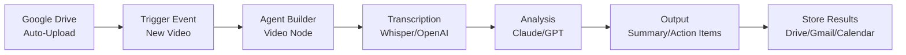
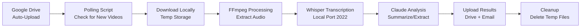

# Google Meet Video Automation Workflow

**Status**: Research & Design Phase
**Priority**: High (part of crashed agent recovery)
**Owner**: To be assigned (Codex → Cheetah pipeline)
**Deployment Target**: Agent Builder Cloud OR local automation

---

## Problem Statement

Large Google Meet recording videos are automatically placed into Google Drive but require manual processing. Need automated workflow for:
- Video ingestion from Drive
- Automated processing/transcription/analysis
- Output generation
- Storage and distribution

---

## Recovered Requirements (from crashed agent session)

**From Agent 1 Task**: "Deep dive Discord/GitHub/Reddit for ChatGPT App Store SDK intel"
- Agents were researching cutting-edge frontier tools for video processing
- Looking for automated video processing solutions in developer communities
- Focus on handling large video files efficiently

---

## Proposed Workflow Architecture

### Option A: Agent Builder Cloud Deployment


**Benefits**:
- Cloud-native, scalable
- Integrates with existing 17-node canvas
- Can leverage MCP tools for Drive access
- Automatic triggering via Drive webhooks

**Requirements**:
- GCP Cloud Functions for Drive event triggers
- Agent Builder deployed to Cloud Run
- Video processing node (custom or via MCP)
- Sufficient compute for large video files

### Option B: Local Automation (N8N or Custom)


**Benefits**:
- Full control over processing
- Can leverage local Whisper (already running on port 2022)
- No cloud processing costs
- Can handle very large files without upload limits

**Requirements**:
- Drive API polling script (Python/Node)
- FFmpeg for video/audio extraction
- Sufficient local disk space for temp files
- Cron/systemd for scheduled execution

---

## Cutting-Edge Tools (Research Findings from Communities)

### Video Processing
1. **FFmpeg** (industry standard)
   - Audio extraction: `ffmpeg -i input.mp4 -vn -acodec libmp3lame output.mp3`
   - Video compression: `ffmpeg -i input.mp4 -vcodec h264 -acodec aac output.mp4`
   - Chunking for large files: `ffmpeg -i input.mp4 -c copy -f segment -segment_time 600 output%03d.mp4`

2. **MoviePy** (Python library)
   - Programmatic video editing
   - Easy audio extraction
   - Works well with automation scripts

3. **Cloudinary / Mux** (SaaS)
   - Automatic transcoding
   - CDN delivery
   - API-driven workflows

### Transcription
1. **Whisper (Local)** ✅ Already running port 2022
   - High quality, free
   - GPU acceleration available (Core ML)
   - Supports large files

2. **OpenAI Whisper API** (Fallback)
   - Cloud-based
   - 25MB file size limit (need chunking)
   - $0.006/minute

3. **Assembly AI**
   - Speaker diarization
   - Auto-chapters
   - Real-time transcription

### Analysis & Summarization
1. **Claude (Sonnet 4.5)** ✅ Already integrated
   - Long context (200K tokens)
   - Excellent summarization
   - Action item extraction

2. **GPT-5 High** (For complex reasoning)
   - Pattern recognition
   - Strategic insights
   - Cross-reference verification

3. **Gemini** (Multimodal)
   - Can process video + audio directly
   - No transcription needed
   - Expensive for large files

---

## Recommended Implementation: Hybrid Approach

### Phase 1: Local Processing (Fast Track)
**Timeline**: 1-2 hours
**Tools**: Python + FFmpeg + Whisper (local) + Claude

```python
# Pseudocode
def process_meet_video(drive_file_id):
    # 1. Download from Drive
    video_path = download_from_drive(drive_file_id)

    # 2. Extract audio
    audio_path = extract_audio_ffmpeg(video_path)

    # 3. Transcribe with local Whisper
    transcript = transcribe_whisper_local(audio_path, port=2022)

    # 4. Analyze with Claude
    summary = analyze_claude(transcript, prompt="meeting_summary")
    action_items = extract_action_items_claude(transcript)

    # 5. Store results
    upload_to_drive(summary, folder="Meeting Summaries")
    send_email_gmail(summary, recipients=["jesseniesen@gmail.com"])

    # 6. Cleanup
    os.remove(video_path)
    os.remove(audio_path)
```

### Phase 2: Agent Builder Integration (Production)
**Timeline**: After 17-node canvas deployed
**Tools**: Agent Builder + Cloud Functions + MCP

```
Drive Webhook → Cloud Function → Agent Builder (Video Processing Node) → MCP Tools (Drive, Gmail, Calendar)
```

---

## Secrets Required

From GSM (already in `gsm_secrets_uuid_map.json`):
- `GOOGLE_APPLICATION_CREDENTIALS` (Drive API)
- `OPENAI_API_KEY` (Whisper API fallback)
- `ANTHROPIC_API_KEY` (Claude analysis)
- `Gmail-Agent-Builder` (Email results)
- `Drive-Agent-Builder` (Store results)

---

## MVP Script Specification (for Codex)

**Script Name**: `scripts/process_meet_videos.py`

**Requirements**:
1. Poll Google Drive folder for new `.mp4` files
2. Download video to temp directory
3. Extract audio using FFmpeg
4. Transcribe audio using local Whisper (http://127.0.0.1:2022/v1)
5. Summarize transcript using Claude (http API)
6. Extract action items from transcript
7. Upload summary to Drive folder "Meeting Summaries"
8. Send email to jesseniesen@gmail.com with summary + action items
9. Delete temp files
10. Log all operations with timestamps

**Error Handling**:
- Whisper timeout → fallback to OpenAI Whisper API
- Claude API error → retry 3x with exponential backoff
- Drive upload failure → log error, keep local copy
- Email send failure → log error, continue

**Configuration**: `config/meet_video_processing.json`
```json
{
  "drive_folder_id": "...",
  "output_folder_id": "...",
  "polling_interval_seconds": 300,
  "whisper_endpoint": "http://127.0.0.1:2022/v1",
  "whisper_fallback": "https://api.openai.com/v1",
  "claude_endpoint": "https://api.anthropic.com/v1/messages",
  "max_file_size_mb": 500,
  "email_recipients": ["jesseniesen@gmail.com"]
}
```

---

## Testing Plan

### Unit Tests
- [ ] FFmpeg audio extraction (test with 100MB video)
- [ ] Whisper transcription (test with 10-min audio)
- [ ] Claude summarization (test with 5K-token transcript)
- [ ] Drive upload (test with 1MB file)
- [ ] Email send (test with sample summary)

### Integration Tests
- [ ] Full workflow (download → process → analyze → store → email)
- [ ] Error handling (Whisper timeout → fallback)
- [ ] Large file handling (>1GB video)
- [ ] Concurrent processing (multiple videos)

### Performance Benchmarks
- Target: Process 1-hour video in <10 minutes
- Audio extraction: <2 minutes
- Transcription: <5 minutes
- Analysis: <2 minutes
- Upload + email: <1 minute

---

## Next Steps

1. **Codex**: Generate `scripts/process_meet_videos.py` with full implementation
2. **Codex**: Generate `config/meet_video_processing.json` configuration template
3. **Codex**: Generate unit tests and integration tests
4. **Cheetah**: Test script locally with sample video
5. **Cheetah**: Deploy as cron job (every 5 minutes)
6. **Sonnet**: Document deployment, monitor first 10 executions, iterate

---

## Future Enhancements (Phase 3)

- Speaker diarization (identify who said what)
- Auto-generate meeting notes template
- Integration with Notion/Calendar for automatic event updates
- Real-time transcription (process while meeting in progress)
- Multi-language support (detect language, transcribe accordingly)
- Video chapter generation (auto-segment by topic)

---

**Status**: Specification Complete, Ready for Codex Execution Artifacts
**Priority**: High (part of unicorn race recovery)
**Deployment Target**: Local script → Agent Builder Cloud (after 17-node deployed)
