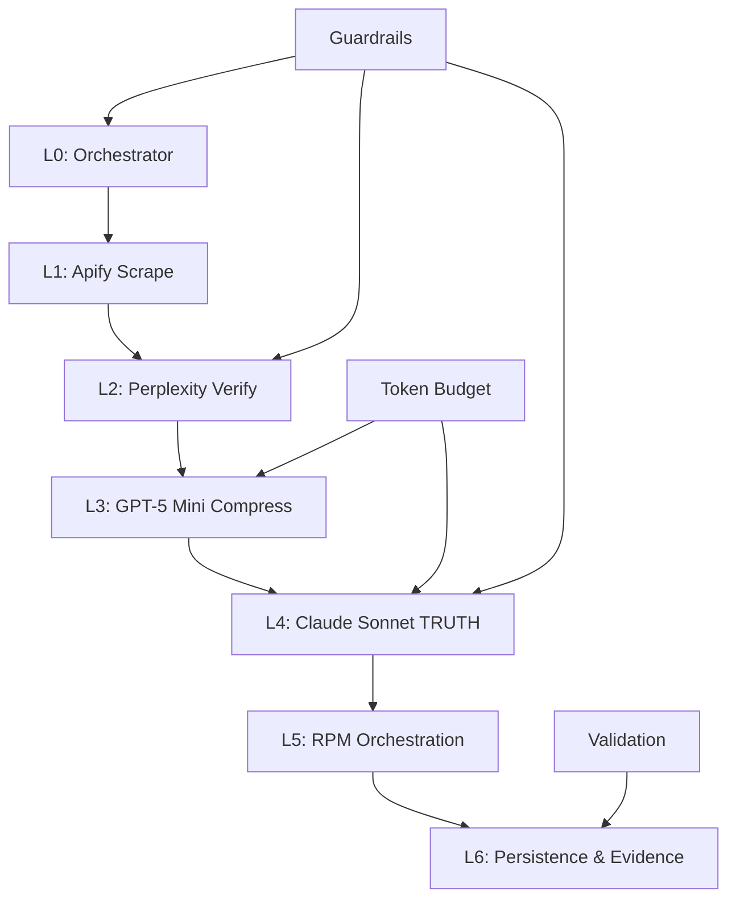

# TRUTH Pipeline Architecture Overview

**Token Count**: ~1,200 | **Dependencies**: None | **Last Updated**: 2025-10-21

## Summary

The TRUTH Pipeline is a verifiable, token-efficient multi-agent system that constrains Claude Sonnet to emit only TRUTH-compliant JSON artifacts. The architecture spans five core stages: Apify ingestion → Perplexity verification → GPT-5 Mini compression → Claude Sonnet TRUTH synthesis → RPM orchestration, with comprehensive guardrails and validation at each stage.

## Core Architecture

### Pipeline Stages



### TRUTH Contract Schema

```json
{
  "status": "ok" | "failed",
  "summary": "≤120 tokens, declarative",
  "claims": [
    {
      "testable": true,
      "reproducible": true,
      "unambiguous": true,
      "traceable": {
        "sources": ["≥2 sources"]
      },
      "high_fidelity": "numeric evidence or direct quotes"
    }
  ],
  "rpm": {
    "massive_actions": [
      {
        "purpose": "string",
        "action": "string", 
        "owner": "string",
        "profit_delta": "number > 0",
        "timeframe": "string"
      }
    ]
  },
  "token_report": {
    "input_tokens": "number",
    "output_tokens": "number",
    "compression_saved_pct": "number ≥ 40%"
  }
}
```

## Key Components

### L0 Orchestrator (Codex)

- **Role**: Pipeline coordination and retry management
- **Features**: Dynamic prompt budgeting, pre/post guardrails
- **Input**: User query + context
- **Output**: Orchestrated pipeline execution plan

### L1 Apify Scrape

- **Actors**: YouTube, Instagram, Google Business, Better Business Bureau
- **Output**: Raw payload + manifest + SHA256 hash
- **Token Budget**: 8-12k tokens (16k limit)
- **Validation**: Hash verification, manifest presence

### L2 Perplexity Verify

- **Purpose**: Cross-verification with ≥2 independent sources per fact
- **Guardrails**: AGE21, medical compliance, PCI/PII filters
- **Token Budget**: 3-4k tokens (6k limit)
- **Output**: Verified facts with source citations

### L3 GPT-5 Mini Compress

- **Function**: Deduplication and normalization
- **Target**: ≥40% token reduction
- **Rejection Criteria**: Data loss >5%
- **Token Budget**: 2-3k tokens (4k limit)

### L4 Claude Sonnet TRUTH

- **Constraint**: Strict JSON schema enforcement
- **Limitations**: No downstream API calls, deterministic prompts
- **Validation**: jsonschema compliance
- **Token Budget**: ≤2k tokens (3k limit)
- **Claim Limit**: ≤25 claims per output

### L5 RPM Orchestration

- **Enrichment**: RPM DNA tags, profit scoring, risk gating
- **Validation**: profit_delta > 0, timeframe required
- **Output**: Actionable business intelligence

### L6 Persistence

- **Storage**: `data/truth_outputs/<timestamp>.json`
- **Evidence**: `<hash>.json` + `.evidence/cli/<hash>.md`
- **Ledger**: Reproducibility tracking

## Guardrails & Compliance

### Pre-Flight Checks

- Jailbreak detection
- Forbidden content filtering
- Age 21+ verification
- PII detection and redaction

### Post-Flight Validation

- Schema compliance verification
- Profit gating (profit_delta > 0)
- Compliance assertions
- Source count validation (≥2 per claim)

### Compliance Matrix

| Guardrail | Test Command | Enforcement |
|-----------|-------------|-------------|
| AGE21 | `curl -H "Age: 18" /age-gate` | Hard block |
| PII | `grep -E "ssn|email|phone" output.json` | Auto-redact |
| Medical Claims | `jq '.claims[] | select(.medical)' output.json` | FDA source required |
| Financial Accuracy | `jq '.rpm.massive_actions[].profit_delta' output.json` | Deterministic formula |

## Token Strategy

| Stage | Avg Tokens | Budget | Optimization |
|-------|------------|--------|--------------|
| Apify | 8-12k | 16k | Hash + manifest |
| Perplexity | 3-4k | 6k | Top-3 responses |
| GPT-5 Mini | 2-3k | 4k | Compression metrics |
| Sonnet | ≤2k | 3k | Claim limit ≤25 |

## Validation Commands

```bash
# Claim count validation
jq '.claims | length' data/truth_outputs/<file>.json

# Source verification
jq '[.claims[] | (.traceable.sources|length>=2)] | all' data/truth_outputs/<file>.json

# RPM action validation
jq '.rpm.massive_actions | length > 0' data/truth_outputs/<file>.json

# Schema validation
jsonschema --instance data/truth_outputs/<file>.json schemas/truth.schema.json
```

## Observability & Operations

### Metrics

- Stage latency tracking
- Retry count monitoring
- Compression savings percentage
- Guardrail failure rates

### Alerts

- Slack notifications for `status=failed`
- Compression < 30% warnings
- Guardrail violation alerts

### Rollbacks

- Latest known-good TRUTH artifact promotion
- Ledger pointer updates
- Evidence package validation

## Implementation Status

| Component | Status | Completeness | Dependencies |
|-----------|--------|--------------|--------------|
| Core Pipeline | Partial | 80% | Token budget, Guardrails |
| Agent Builder | Partial | 70% | Guardrails, Secrets, Voice modes |
| Voice Modes | Partial | 60% | Agent Builder, Guardrails |
| Guardrails | Partial | 75% | Secrets, Validation |
| Secrets Integration | Partial | 80% | Agent Builder, Scripts |
| Validation Suite | Documented | 85% | Pipeline, Scripts |

## Next Steps

1. **Priority 1**: Complete 17-node Agent Builder workflow
2. **Priority 2**: Implement voice mode transforms and tests
3. **Priority 3**: Deploy live age gate and classifier endpoints
4. **Priority 4**: Validate secrets mapping in Agent Builder
5. **Priority 5**: Enforce token budget limits per stage

## References

- **Source**: copilot-liv-hana-10-21.txt:5-200, 772-848, 910-944
- **Related**: 02_data_flow.md, 03_token_engineering.md, 04_guardrails_matrix.md
- **Validation**: 06_validation_harness.md, 07_agent_builder_nodes.md
