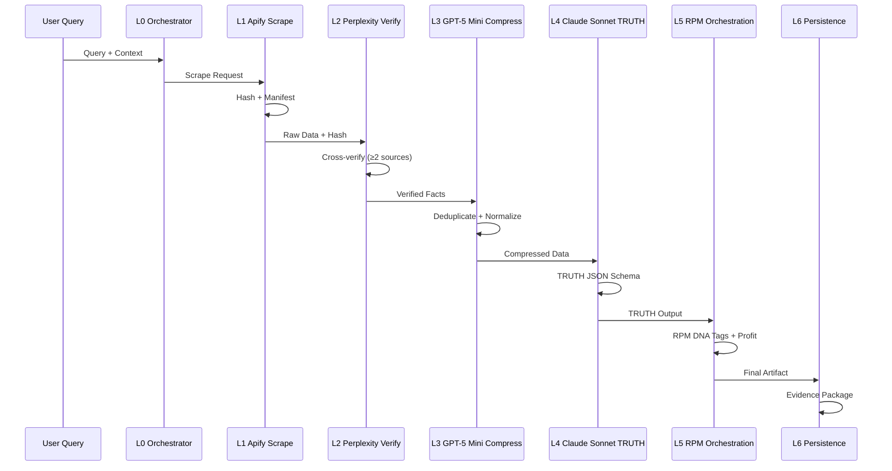

# TRUTH Pipeline Data Flow

**Token Count**: ~1,400 | **Dependencies**: 01_architecture_overview.md | **Last Updated**: 2025-10-21

## Summary

The TRUTH Pipeline implements a five-stage data flow: Apify ingestion → Perplexity verification → GPT-5 Mini compression → Claude Sonnet TRUTH synthesis → RPM orchestration. Each stage includes specific input/output formats, validation checkpoints, and error handling mechanisms to ensure verifiable, compliant outputs.

## End-to-End Data Flow



## Stage 1: L1 Apify Scrape

### Input Format

```json
{
  "query": "string",
  "actors": ["youtube", "instagram", "google_business", "better_business_bureau"],
  "max_results": 50,
  "timeout": 300
}
```

### Processing Logic

```bash
#!/bin/bash
# step_apify_v2.sh

ACTORS=("youtube" "instagram" "google_business" "better_business_bureau")
OUTPUT_DIR="data/apify_outputs"
TIMESTAMP=$(date +%Y%m%d_%H%M%S)

for actor in "${ACTORS[@]}"; do
  echo "Scraping with $actor..."
  
  # Execute Apify actor
  curl -X POST "https://api.apify.com/v2/acts/$actor/run" \
    -H "Authorization: Bearer $APIFY_API_KEY" \
    -H "Content-Type: application/json" \
    -d "{\"query\": \"$QUERY\", \"maxResults\": 50}" \
    -o "$OUTPUT_DIR/${actor}_${TIMESTAMP}.json"
    
  # Generate manifest
  echo "{\"actor\": \"$actor\", \"timestamp\": \"$TIMESTAMP\", \"hash\": \"$(sha256sum $OUTPUT_DIR/${actor}_${TIMESTAMP}.json | cut -d' ' -f1)\"}" > "$OUTPUT_DIR/${actor}_${TIMESTAMP}.manifest"
done
```

### Output Format

```json
{
  "raw_data": "object",
  "manifest": {
    "actor": "string",
    "timestamp": "string", 
    "hash": "sha256",
    "source_count": "number"
  },
  "metadata": {
    "processing_time": "number",
    "token_count": "number"
  }
}
```

## Stage 2: L2 Perplexity Verify

### Input Format

```json
{
  "facts": [
    {
      "claim": "string",
      "source": "string",
      "confidence": "number"
    }
  ],
  "verification_level": "high"
}
```

### Processing Logic

```bash
#!/bin/bash
# step_perplexity_verify_v2.sh

VERIFICATION_QUESTIONS=()
for fact in "${FACTS[@]}"; do
  VERIFICATION_QUESTIONS+=("Verify: $fact")
done

for question in "${VERIFICATION_QUESTIONS[@]}"; do
  echo "Verifying: $question"
  
  # Call Perplexity API
  curl -X POST "https://api.perplexity.ai/chat/completions" \
    -H "Authorization: Bearer $PERPLEXITY_API_KEY" \
    -H "Content-Type: application/json" \
    -d "{
      \"model\": \"llama-3.1-sonar-large-128k-online\",
      \"messages\": [{\"role\": \"user\", \"content\": \"$question\"}],
      \"max_tokens\": 1000
    }" \
    -o "data/perplexity_outputs/verify_$(date +%s).json"
    
  # Extract sources (≥2 required)
  SOURCES=$(jq -r '.choices[0].message.content' "data/perplexity_outputs/verify_$(date +%s).json" | grep -o 'https://[^ ]*' | head -3)
  SOURCE_COUNT=$(echo "$SOURCES" | wc -l)
  
  if [ "$SOURCE_COUNT" -lt 2 ]; then
    echo "ERROR: Insufficient sources ($SOURCE_COUNT < 2)"
    exit 1
  fi
done
```

### Output Format

```json
{
  "verified_facts": [
    {
      "claim": "string",
      "sources": ["url1", "url2", "url3"],
      "source_count": "number ≥ 2",
      "confidence": "number",
      "verification_timestamp": "string"
    }
  ],
  "verification_metadata": {
    "total_questions": "number",
    "successful_verifications": "number",
    "failed_verifications": "number"
  }
}
```

## Stage 3: L3 GPT-5 Mini Compress

### Input Format

```json
{
  "verified_facts": "array",
  "compression_target": 0.4,
  "max_data_loss": 0.05
}
```

### Processing Logic

```bash
#!/bin/bash
# step_gpt5_compress_v2.sh

COMPRESSION_PROMPT="Deduplicate and normalize the following facts. Target 40% token reduction. Preserve all numeric evidence and direct quotes. Output JSON array of compressed facts."

curl -X POST "https://api.openai.com/v1/chat/completions" \
  -H "Authorization: Bearer $OPENAI_API_KEY" \
  -H "Content-Type: application/json" \
  -d "{
    \"model\": \"gpt-4o-mini\",
    \"messages\": [
      {\"role\": \"system\", \"content\": \"$COMPRESSION_PROMPT\"},
      {\"role\": \"user\", \"content\": \"$(cat data/perplexity_outputs/verified_facts.json)\"}
    ],
    \"max_tokens\": 2000,
    \"temperature\": 0.1
  }" \
  -o "data/compression_outputs/compressed_$(date +%s).json"

# Calculate compression metrics
ORIGINAL_TOKENS=$(jq '.usage.prompt_tokens' "data/perplexity_outputs/verified_facts.json")
COMPRESSED_TOKENS=$(jq '.usage.completion_tokens' "data/compression_outputs/compressed_$(date +%s).json")
COMPRESSION_SAVED_PCT=$(( (ORIGINAL_TOKENS - COMPRESSED_TOKENS) * 100 / ORIGINAL_TOKENS ))

if [ "$COMPRESSION_SAVED_PCT" -lt 40 ]; then
  echo "WARNING: Compression below target ($COMPRESSION_SAVED_PCT% < 40%)"
fi
```

### Output Format

```json
{
  "compressed_facts": "array",
  "compression_metrics": {
    "original_tokens": "number",
    "compressed_tokens": "number", 
    "compression_saved_pct": "number ≥ 40",
    "data_loss_pct": "number ≤ 5"
  },
  "normalization_applied": [
    "currency_normalization",
    "percentage_normalization", 
    "deduplication"
  ]
}
```

## Stage 4: L4 Claude Sonnet TRUTH

### Input Format

```json
{
  "compressed_facts": "array",
  "schema_constraints": {
    "max_claims": 25,
    "max_tokens": 2000,
    "required_fields": ["status", "summary", "claims", "rpm", "token_report"]
  }
}
```

### Processing Logic

```bash
#!/bin/bash
# step_claude_truth_v2.sh

TRUTH_PROMPT="Generate TRUTH-compliant JSON output. Status must be 'ok' or 'failed'. Summary ≤120 tokens. Claims must be testable, reproducible, unambiguous, traceable (≥2 sources), high_fidelity. RPM actions must have profit_delta > 0. Include token_report with compression metrics."

curl -X POST "https://api.anthropic.com/v1/messages" \
  -H "x-api-key: $ANTHROPIC_API_KEY" \
  -H "Content-Type: application/json" \
  -d "{
    \"model\": \"claude-3-5-sonnet-20241022\",
    \"max_tokens\": 1000,
    \"messages\": [
      {\"role\": \"system\", \"content\": \"$TRUTH_PROMPT\"},
      {\"role\": \"user\", \"content\": \"$(cat data/compression_outputs/compressed_facts.json)\"}
    ]
  }" \
  -o "data/truth_outputs/truth_$(date +%s).json"

# Validate schema compliance
jsonschema --instance "data/truth_outputs/truth_$(date +%s).json" "schemas/truth.schema.json"
if [ $? -ne 0 ]; then
  echo "ERROR: Schema validation failed"
  exit 1
fi

# Check claim count
CLAIM_COUNT=$(jq '.claims | length' "data/truth_outputs/truth_$(date +%s).json")
if [ "$CLAIM_COUNT" -gt 25 ]; then
  echo "ERROR: Too many claims ($CLAIM_COUNT > 25)"
  exit 1
fi
```

### Output Format

```json
{
  "status": "ok" | "failed",
  "summary": "≤120 tokens, declarative",
  "claims": [
    {
      "testable": true,
      "reproducible": true,
      "unambiguous": true,
      "traceable": {
        "sources": ["≥2 sources"]
      },
      "high_fidelity": "numeric evidence or direct quotes"
    }
  ],
  "rpm": {
    "massive_actions": [
      {
        "purpose": "string",
        "action": "string",
        "owner": "string", 
        "profit_delta": "number > 0",
        "timeframe": "string"
      }
    ]
  },
  "token_report": {
    "input_tokens": "number",
    "output_tokens": "number",
    "compression_saved_pct": "number ≥ 40"
  }
}
```

## Stage 5: L5 RPM Orchestration

### Input Format

```json
{
  "truth_output": "object",
  "rpm_dna_tags": ["profit", "timeframe", "owner", "action"],
  "profit_gating": true
}
```

### Processing Logic

```bash
#!/bin/bash
# step_rpm_emit_v2.sh

# Extract RPM actions from TRUTH output
RPM_ACTIONS=$(jq '.rpm.massive_actions' "data/truth_outputs/truth_output.json")

# Validate profit gating
for action in $(echo "$RPM_ACTIONS" | jq -r '.[] | @base64'); do
  ACTION_JSON=$(echo "$action" | base64 --decode)
  PROFIT_DELTA=$(echo "$ACTION_JSON" | jq -r '.profit_delta')
  
  if [ "$(echo "$PROFIT_DELTA <= 0" | bc)" -eq 1 ]; then
    echo "ERROR: Non-profitable action detected (profit_delta: $PROFIT_DELTA)"
    exit 1
  fi
done

# Generate RPM DNA tags
echo "$RPM_ACTIONS" | jq '.[] | {
  "TAG::RPM_RESULT": .purpose,
  "TAG::RPM_ACTION": .action,
  "TAG::RPM_OWNER": .owner,
  "TAG::RPM_PROFIT": .profit_delta,
  "TAG::RPM_TIMEFRAME": .timeframe
}' > "data/rpm_outputs/rpm_dna_$(date +%s).json"
```

### Output Format

```json
{
  "rpm_actions": "array",
  "rpm_dna_tags": "array",
  "profit_validation": {
    "total_profit_delta": "number > 0",
    "action_count": "number",
    "validation_status": "passed"
  },
  "enrichment_metadata": {
    "timestamp": "string",
    "processing_time": "number"
  }
}
```

## Stage 6: L6 Persistence & Evidence

### Input Format

```json
{
  "final_artifact": "object",
  "evidence_requirements": {
    "hash_verification": true,
    "manifest_generation": true,
    "cli_proofs": true
  }
}
```

### Processing Logic

```bash
#!/bin/bash
# step_persistence_v2.sh

TIMESTAMP=$(date +%Y%m%d_%H%M%S)
OUTPUT_FILE="data/truth_outputs/truth_${TIMESTAMP}.json"
EVIDENCE_DIR="data/evidence/${TIMESTAMP}"

# Create evidence directory
mkdir -p "$EVIDENCE_DIR"

# Generate hash
ARTIFACT_HASH=$(sha256sum "$OUTPUT_FILE" | cut -d' ' -f1)

# Create manifest
cat > "$EVIDENCE_DIR/manifest.json" << EOF
{
  "timestamp": "$TIMESTAMP",
  "artifact_hash": "$ARTIFACT_HASH",
  "pipeline_stages": ["apify", "perplexity", "compression", "truth", "rpm"],
  "validation_status": "passed",
  "evidence_files": [
    "manifest.json",
    "cli_proofs.md",
    "validation_log.json"
  ]
}
EOF

# Generate CLI proofs
cat > "$EVIDENCE_DIR/cli_proofs.md" << EOF
# CLI Proofs for TRUTH Pipeline Execution

## Hash Verification
\`\`\`bash
sha256sum $OUTPUT_FILE
# Output: $ARTIFACT_HASH
\`\`\`

## Schema Validation
\`\`\`bash
jsonschema --instance $OUTPUT_FILE schemas/truth.schema.json
# Output: Validation passed
\`\`\`

## Claim Count Validation
\`\`\`bash
jq '.claims | length' $OUTPUT_FILE
# Output: $(jq '.claims | length' "$OUTPUT_FILE")
\`\`\`

## Source Verification
\`\`\`bash
jq '[.claims[] | (.traceable.sources|length>=2)] | all' $OUTPUT_FILE
# Output: true
\`\`\`
EOF
```

### Output Format

```json
{
  "persistence_status": "success",
  "artifact_location": "string",
  "evidence_package": {
    "manifest": "object",
    "cli_proofs": "string",
    "validation_log": "object"
  },
  "hash_verification": "sha256",
  "reproducibility_score": "number"
}
```

## Error Handling & Retry Logic

### Retry Matrix

| Stage | Retry Count | Backoff | Failure Action |
|-------|-------------|---------|----------------|
| Apify | 3 | 2s, 5s, 10s | Fallback actor |
| Perplexity | 2 | 5s, 15s | Skip verification |
| Compression | 1 | 10s | Use original data |
| TRUTH | 2 | 5s, 15s | Return failed status |
| RPM | 1 | 5s | Skip profit gating |

### Failure Recovery

```bash
#!/bin/bash
# failure_recovery.sh

case "$FAILED_STAGE" in
  "apify")
    echo "Switching to fallback actors..."
    # Use alternative Apify actors
    ;;
  "perplexity")
    echo "Proceeding without verification..."
    # Skip verification, mark as unverified
    ;;
  "compression")
    echo "Using original data..."
    # Bypass compression stage
    ;;
  "truth")
    echo "Returning failed status..."
    # Output failure response
    ;;
  "rpm")
    echo "Skipping profit gating..."
    # Proceed without profit validation
    ;;
esac
```

## References

- **Source**: copilot-liv-hana-10-21.txt:15-120, 326-440, 817-829
- **Related**: 01_architecture_overview.md, 03_token_engineering.md, 05_script_specifications.md
- **Validation**: 06_validation_harness.md, 07_agent_builder_nodes.md
