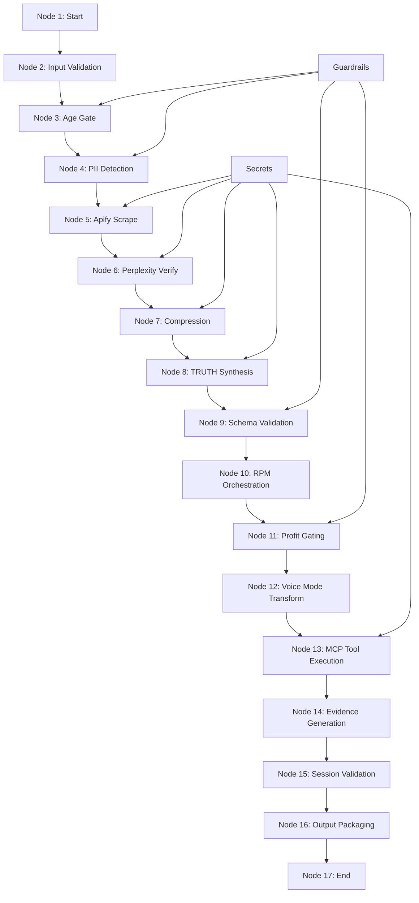

# TRUTH Pipeline Agent Builder Nodes

**Token Count**: ~1,600 | **Dependencies**: 01_architecture_overview.md, 04_guardrails_matrix.md | **Last Updated**: 2025-10-21

## Summary

The TRUTH Pipeline Agent Builder implements a 17-node workflow that orchestrates the entire pipeline from user query to RPM action emission. Each node has specific inputs, outputs, validation requirements, and error handling mechanisms to ensure reliable, compliant execution.

## 17-Node Workflow Architecture

### Node Overview


## Node Specifications

### Node 1: Start
```json
{
  "node_id": "start",
  "node_name": "Pipeline Start",
  "description": "Initialize TRUTH pipeline execution",
  "inputs": {
    "user_query": "string",
    "session_id": "string",
    "user_context": "object"
  },
  "outputs": {
    "initialized_session": "object",
    "execution_plan": "array"
  },
  "validation": {
    "required_fields": ["user_query", "session_id"],
    "query_length": "min: 10, max: 1000"
  },
  "error_handling": {
    "missing_query": "BLOCK",
    "invalid_session": "RETRY"
  }
}
```

### Node 2: Input Validation
```json
{
  "node_id": "input_validation",
  "node_name": "Input Validation",
  "description": "Validate user input and context",
  "inputs": {
    "user_query": "string",
    "user_context": "object",
    "session_metadata": "object"
  },
  "outputs": {
    "validated_input": "object",
    "validation_report": "object"
  },
  "validation": {
    "query_format": "text",
    "context_schema": "user_profile",
    "metadata_completeness": "required"
  },
  "error_handling": {
    "invalid_format": "BLOCK",
    "missing_context": "WARN",
    "schema_violation": "BLOCK"
  }
}
```

### Node 3: Age Gate
```json
{
  "node_id": "age_gate",
  "node_name": "Age Verification",
  "description": "Verify user age compliance (21+)",
  "inputs": {
    "user_age": "number",
    "session_id": "string",
    "verification_context": "object"
  },
  "outputs": {
    "age_verified": "boolean",
    "verification_token": "string",
    "compliance_status": "object"
  },
  "validation": {
    "age_minimum": 21,
    "verification_source": "trusted",
    "token_validity": "24h"
  },
  "error_handling": {
    "underage": "BLOCK",
    "verification_failed": "BLOCK",
    "token_expired": "RETRY"
  }
}
```

### Node 4: PII Detection
```json
{
  "node_id": "pii_detection",
  "node_name": "PII Detection & Redaction",
  "description": "Detect and redact personal information",
  "inputs": {
    "user_query": "string",
    "user_context": "object",
    "detection_rules": "array"
  },
  "outputs": {
    "pii_detected": "boolean",
    "redacted_content": "string",
    "detection_report": "object"
  },
  "validation": {
    "pii_patterns": ["ssn", "email", "phone", "credit_card"],
    "redaction_completeness": "100%",
    "false_positive_rate": "<5%"
  },
  "error_handling": {
    "pii_leakage": "BLOCK",
    "redaction_failed": "BLOCK",
    "pattern_mismatch": "WARN"
  }
}
```

### Node 5: Apify Scrape
```json
{
  "node_id": "apify_scrape",
  "node_name": "Apify Data Scraping",
  "description": "Scrape data using Apify actors",
  "inputs": {
    "query": "string",
    "actors": "array",
    "scraping_config": "object"
  },
  "outputs": {
    "scraped_data": "array",
    "scraping_manifest": "object",
    "data_hash": "string"
  },
  "validation": {
    "actor_success_rate": ">80%",
    "data_completeness": "required",
    "hash_verification": "sha256"
  },
  "error_handling": {
    "actor_failure": "FALLBACK",
    "data_corruption": "RETRY",
    "rate_limit": "BACKOFF"
  }
}
```

### Node 6: Perplexity Verify
```json
{
  "node_id": "perplexity_verify",
  "node_name": "Perplexity Fact Verification",
  "description": "Verify facts using Perplexity API",
  "inputs": {
    "scraped_facts": "array",
    "verification_config": "object",
    "source_requirements": "object"
  },
  "outputs": {
    "verified_facts": "array",
    "verification_report": "object",
    "source_citations": "array"
  },
  "validation": {
    "source_count_min": 2,
    "verification_confidence": ">70%",
    "citation_quality": "high"
  },
  "error_handling": {
    "insufficient_sources": "SKIP",
    "verification_failed": "FALLBACK",
    "api_error": "RETRY"
  }
}
```

### Node 7: Compression
```json
{
  "node_id": "compression",
  "node_name": "GPT-5 Mini Compression",
  "description": "Compress and normalize data",
  "inputs": {
    "verified_facts": "array",
    "compression_target": "number",
    "normalization_rules": "array"
  },
  "outputs": {
    "compressed_data": "array",
    "compression_metrics": "object",
    "normalization_report": "object"
  },
  "validation": {
    "compression_target": "≥40%",
    "data_loss_limit": "≤5%",
    "normalization_completeness": "100%"
  },
  "error_handling": {
    "compression_failed": "USE_ORIGINAL",
    "data_loss_excessive": "BLOCK",
    "normalization_error": "WARN"
  }
}
```

### Node 8: TRUTH Synthesis
```json
{
  "node_id": "truth_synthesis",
  "node_name": "Claude Sonnet TRUTH Synthesis",
  "description": "Generate TRUTH-compliant output",
  "inputs": {
    "compressed_data": "array",
    "truth_schema": "object",
    "synthesis_config": "object"
  },
  "outputs": {
    "truth_output": "object",
    "synthesis_metrics": "object",
    "compliance_report": "object"
  },
  "validation": {
    "schema_compliance": "100%",
    "claim_count_limit": "≤25",
    "summary_length": "≤120 tokens"
  },
  "error_handling": {
    "schema_violation": "BLOCK",
    "synthesis_failed": "RETRY",
    "compliance_breach": "BLOCK"
  }
}
```

### Node 9: Schema Validation
```json
{
  "node_id": "schema_validation",
  "node_name": "TRUTH Schema Validation",
  "description": "Validate TRUTH output against schema",
  "inputs": {
    "truth_output": "object",
    "validation_schema": "object",
    "validation_rules": "array"
  },
  "outputs": {
    "validation_result": "object",
    "validation_report": "object",
    "compliance_score": "number"
  },
  "validation": {
    "schema_compliance": "100%",
    "field_completeness": "required",
    "type_accuracy": "100%"
  },
  "error_handling": {
    "schema_violation": "BLOCK",
    "validation_failed": "BLOCK",
    "compliance_failure": "BLOCK"
  }
}
```

### Node 10: RPM Orchestration
```json
{
  "node_id": "rpm_orchestration",
  "node_name": "RPM Action Orchestration",
  "description": "Generate RPM actions and DNA tags",
  "inputs": {
    "truth_output": "object",
    "rpm_config": "object",
    "action_templates": "array"
  },
  "outputs": {
    "rpm_actions": "array",
    "rpm_dna_tags": "array",
    "orchestration_report": "object"
  },
  "validation": {
    "action_completeness": "required",
    "dna_tag_format": "TAG::RPM_*",
    "orchestration_success": "100%"
  },
  "error_handling": {
    "orchestration_failed": "BLOCK",
    "dna_tag_error": "WARN",
    "action_incomplete": "BLOCK"
  }
}
```

### Node 11: Profit Gating
```json
{
  "node_id": "profit_gating",
  "node_name": "Profit Validation & Gating",
  "description": "Validate profit calculations and gate actions",
  "inputs": {
    "rpm_actions": "array",
    "profit_formula": "object",
    "gating_rules": "array"
  },
  "outputs": {
    "profit_validated": "boolean",
    "gated_actions": "array",
    "profit_report": "object"
  },
  "validation": {
    "profit_delta_min": ">0",
    "timeframe_required": "100%",
    "calculation_accuracy": "100%"
  },
  "error_handling": {
    "non_profitable": "BLOCK",
    "calculation_error": "BLOCK",
    "gating_failed": "BLOCK"
  }
}
```

### Node 12: Voice Mode Transform
```json
{
  "node_id": "voice_mode_transform",
  "node_name": "Voice Mode Transformation",
  "description": "Transform output for voice modes",
  "inputs": {
    "truth_output": "object",
    "voice_mode": "string",
    "transform_config": "object"
  },
  "outputs": {
    "voice_output": "object",
    "transform_metrics": "object",
    "mode_compliance": "object"
  },
  "validation": {
    "mode_support": ["brevity", "mentor", "silence"],
    "token_limits": "mode_specific",
    "transform_completeness": "100%"
  },
  "error_handling": {
    "unsupported_mode": "BLOCK",
    "transform_failed": "FALLBACK",
    "compliance_breach": "BLOCK"
  }
}
```

### Node 13: MCP Tool Execution
```json
{
  "node_id": "mcp_tool_execution",
  "node_name": "MCP Tool Execution",
  "description": "Execute MCP tools for actions",
  "inputs": {
    "rpm_actions": "array",
    "tool_mappings": "object",
    "execution_config": "object"
  },
  "outputs": {
    "tool_results": "array",
    "execution_report": "object",
    "success_metrics": "object"
  },
  "validation": {
    "tool_availability": "required",
    "execution_success": ">90%",
    "result_completeness": "100%"
  },
  "error_handling": {
    "tool_unavailable": "SKIP",
    "execution_failed": "RETRY",
    "result_incomplete": "WARN"
  }
}
```

### Node 14: Evidence Generation
```json
{
  "node_id": "evidence_generation",
  "node_name": "Evidence Package Generation",
  "description": "Generate evidence package for audit",
  "inputs": {
    "pipeline_outputs": "array",
    "session_data": "object",
    "evidence_config": "object"
  },
  "outputs": {
    "evidence_package": "object",
    "audit_trail": "array",
    "verification_artifacts": "array"
  },
  "validation": {
    "package_completeness": "100%",
    "audit_trail_integrity": "required",
    "verification_success": "100%"
  },
  "error_handling": {
    "generation_failed": "BLOCK",
    "trail_corruption": "BLOCK",
    "verification_failed": "BLOCK"
  }
}
```

### Node 15: Session Validation
```json
{
  "node_id": "session_validation",
  "node_name": "Session Output Validation",
  "description": "Validate complete session output",
  "inputs": {
    "session_data": "object",
    "validation_rules": "array",
    "compliance_checklist": "array"
  },
  "outputs": {
    "validation_result": "object",
    "compliance_report": "object",
    "quality_score": "number"
  },
  "validation": {
    "session_completeness": "100%",
    "compliance_score": ">95%",
    "quality_threshold": ">90%"
  },
  "error_handling": {
    "validation_failed": "BLOCK",
    "compliance_breach": "BLOCK",
    "quality_failure": "BLOCK"
  }
}
```

### Node 16: Output Packaging
```json
{
  "node_id": "output_packaging",
  "node_name": "Output Package Assembly",
  "description": "Package final output for delivery",
  "inputs": {
    "validated_outputs": "array",
    "packaging_config": "object",
    "delivery_requirements": "object"
  },
  "outputs": {
    "final_package": "object",
    "delivery_manifest": "object",
    "package_hash": "string"
  },
  "validation": {
    "package_integrity": "100%",
    "manifest_completeness": "required",
    "hash_verification": "sha256"
  },
  "error_handling": {
    "packaging_failed": "BLOCK",
    "manifest_error": "BLOCK",
    "hash_mismatch": "BLOCK"
  }
}
```

### Node 17: End
```json
{
  "node_id": "end",
  "node_name": "Pipeline Completion",
  "description": "Complete pipeline execution",
  "inputs": {
    "final_package": "object",
    "execution_metrics": "object",
    "completion_config": "object"
  },
  "outputs": {
    "completion_status": "object",
    "final_metrics": "object",
    "delivery_confirmation": "object"
  },
  "validation": {
    "completion_success": "100%",
    "metrics_completeness": "required",
    "delivery_confirmed": "required"
  },
  "error_handling": {
    "completion_failed": "BLOCK",
    "metrics_incomplete": "WARN",
    "delivery_failed": "RETRY"
  }
}
```

## Node Execution Flow

### Execution Sequence
```bash
#!/bin/bash
# agent_builder_executor.sh

set -euo pipefail

# Node execution order
NODES=(
  "start"
  "input_validation"
  "age_gate"
  "pii_detection"
  "apify_scrape"
  "perplexity_verify"
  "compression"
  "truth_synthesis"
  "schema_validation"
  "rpm_orchestration"
  "profit_gating"
  "voice_mode_transform"
  "mcp_tool_execution"
  "evidence_generation"
  "session_validation"
  "output_packaging"
  "end"
)

# Execute node
execute_node() {
  local node_id=$1
  local node_config=$2
  
  echo "Executing node: $node_id"
  
  # Load node configuration
  local node_spec=$(jq -r ".$node_id" "$node_config")
  
  # Validate inputs
  if ! validate_node_inputs "$node_id" "$node_spec"; then
    echo "ERROR: Node $node_id input validation failed"
    return 1
  fi
  
  # Execute node logic
  case "$node_id" in
    "start")
      execute_start_node "$node_spec"
      ;;
    "input_validation")
      execute_input_validation_node "$node_spec"
      ;;
    "age_gate")
      execute_age_gate_node "$node_spec"
      ;;
    "pii_detection")
      execute_pii_detection_node "$node_spec"
      ;;
    "apify_scrape")
      execute_apify_scrape_node "$node_spec"
      ;;
    "perplexity_verify")
      execute_perplexity_verify_node "$node_spec"
      ;;
    "compression")
      execute_compression_node "$node_spec"
      ;;
    "truth_synthesis")
      execute_truth_synthesis_node "$node_spec"
      ;;
    "schema_validation")
      execute_schema_validation_node "$node_spec"
      ;;
    "rpm_orchestration")
      execute_rpm_orchestration_node "$node_spec"
      ;;
    "profit_gating")
      execute_profit_gating_node "$node_spec"
      ;;
    "voice_mode_transform")
      execute_voice_mode_transform_node "$node_spec"
      ;;
    "mcp_tool_execution")
      execute_mcp_tool_execution_node "$node_spec"
      ;;
    "evidence_generation")
      execute_evidence_generation_node "$node_spec"
      ;;
    "session_validation")
      execute_session_validation_node "$node_spec"
      ;;
    "output_packaging")
      execute_output_packaging_node "$node_spec"
      ;;
    "end")
      execute_end_node "$node_spec"
      ;;
    *)
      echo "ERROR: Unknown node: $node_id"
      return 1
      ;;
  esac
  
  echo "Node $node_id completed successfully"
  return 0
}

# Main execution
main() {
  local config_file="${1:-config/agent_builder_config.json}"
  
  echo "Starting Agent Builder execution"
  echo "Config file: $config_file"
  
  # Execute all nodes in sequence
  for node in "${NODES[@]}"; do
    if ! execute_node "$node" "$config_file"; then
      echo "ERROR: Node $node execution failed"
      exit 1
    fi
  done
  
  echo "Agent Builder execution completed successfully"
}

# Run main function
main "$@"
```

## Node Dependencies & Validation

### Dependency Matrix
| Node | Dependencies | Validation Requirements | Error Handling |
|------|-------------|------------------------|----------------|
| **Start** | None | Query format, session ID | Block on failure |
| **Input Validation** | Start | Schema compliance | Block on violation |
| **Age Gate** | Input Validation | Age ≥21, verification | Block on underage |
| **PII Detection** | Age Gate | PII patterns, redaction | Block on leakage |
| **Apify Scrape** | PII Detection | Actor success, data hash | Fallback on failure |
| **Perplexity Verify** | Apify Scrape | Source count ≥2 | Skip on failure |
| **Compression** | Perplexity Verify | ≥40% reduction | Use original on failure |
| **TRUTH Synthesis** | Compression | Schema compliance | Block on violation |
| **Schema Validation** | TRUTH Synthesis | 100% compliance | Block on failure |
| **RPM Orchestration** | Schema Validation | Action completeness | Block on incomplete |
| **Profit Gating** | RPM Orchestration | Profit >0 | Block on non-profitable |
| **Voice Mode Transform** | Profit Gating | Mode compliance | Fallback on failure |
| **MCP Tool Execution** | Voice Mode Transform | Tool availability | Skip on unavailable |
| **Evidence Generation** | MCP Tool Execution | Package completeness | Block on failure |
| **Session Validation** | Evidence Generation | 100% compliance | Block on failure |
| **Output Packaging** | Session Validation | Package integrity | Block on failure |
| **End** | Output Packaging | Completion success | Block on failure |

## References

- **Source**: copilot-liv-hana-10-21.txt:2752-2842, 1342-1386, 3323-3494, 5310-5389
- **Related**: 01_architecture_overview.md, 04_guardrails_matrix.md, 08_secrets_integration.md
- **Validation**: 06_validation_harness.md, 09_voice_modes.md, 10_rpm_dna_tagging.md
