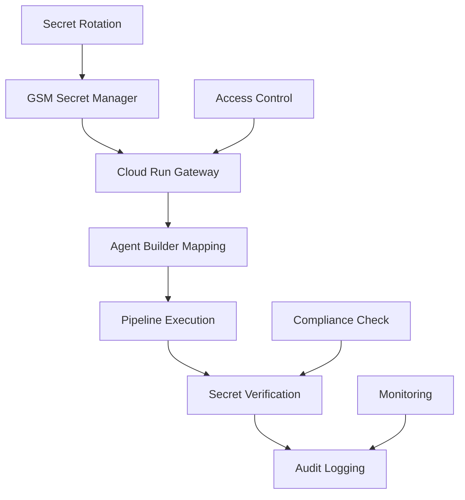

# TRUTH Pipeline Secrets Integration

**Token Count**: ~1,300 | **Dependencies**: 01_architecture_overview.md, 07_agent_builder_nodes.md | **Last Updated**: 2025-10-21

## Summary

The TRUTH Pipeline secrets integration manages 43 canonical secrets across Google Workspace, Lightspeed POS, Apify, Perplexity, Anthropic, and OpenAI services. It implements GSM (Google Secret Manager) workflow with Cloud Run gateway, Agent Builder secret mapping, and comprehensive verification procedures for Tier-1 security compliance.

## Secrets Architecture

### Secret Management Flow


### Secret Categories
| Category | Count | Services | Purpose |
|----------|-------|----------|---------|
| **Google Workspace** | 12 | Gmail, Drive, Calendar | Business automation |
| **AI Services** | 8 | Anthropic, OpenAI, Perplexity | Reasoning and synthesis |
| **Data Sources** | 6 | Apify, YouTube, Instagram | Data ingestion |
| **Commerce** | 4 | Lightspeed POS, Square | Transaction processing |
| **Infrastructure** | 13 | Redis, BigQuery, Cloud Run | System operations |

## GSM Workflow Implementation

### Step 1: Secret Listing
```bash
#!/bin/bash
# gsm_list_secrets.sh

set -euo pipefail

# Configuration
PROJECT_ID="${PROJECT_ID:-livhana-production}"
SECRET_LIST_FILE="data/secrets/secret_list.json"

# List all secrets in GSM
list_gsm_secrets() {
  echo "Listing secrets in project: $PROJECT_ID"
  
  # Get all secrets
  gcloud secrets list --project="$PROJECT_ID" --format="json" > "$SECRET_LIST_FILE"
  
  # Extract secret names and metadata
  local secret_count=$(jq -r '. | length' "$SECRET_LIST_FILE")
  echo "Found $secret_count secrets"
  
  # Display secret summary
  jq -r '.[] | "\(.name): \(.labels.service // "unknown")"' "$SECRET_LIST_FILE"
  
  return 0
}

# Validate secret accessibility
validate_secret_access() {
  local secret_name=$1
  
  echo "Validating access to secret: $secret_name"
  
  # Check if secret exists
  if ! gcloud secrets describe "$secret_name" --project="$PROJECT_ID" >/dev/null 2>&1; then
    echo "ERROR: Secret $secret_name not found"
    return 1
  fi
  
  # Check access permissions
  local access_check=$(gcloud secrets get-iam-policy "$secret_name" --project="$PROJECT_ID" --format="json")
  local service_account=$(echo "$access_check" | jq -r '.bindings[] | select(.role == "roles/secretmanager.secretAccessor") | .members[]')
  
  if [ -z "$service_account" ]; then
    echo "ERROR: No service account has access to $secret_name"
    return 1
  fi
  
  echo "Secret $secret_name is accessible via $service_account"
  return 0
}

# Main execution
main() {
  echo "Starting GSM secret listing"
  
  list_gsm_secrets
  
  # Validate critical secrets
  local critical_secrets=(
    "anthropic-api-key"
    "openai-api-key"
    "perplexity-api-key"
    "apify-api-key"
    "lightspeed-pos-key"
  )
  
  for secret in "${critical_secrets[@]}"; do
    validate_secret_access "$secret"
  done
  
  echo "GSM secret listing completed successfully"
}

# Run main function
main "$@"
```

### Step 2: Secret Mapping
```bash
#!/bin/bash
# gsm_secret_mapping.sh

set -euo pipefail

# Configuration
SECRET_MAP_FILE="data/secrets/secret_map.json"
AGENT_BUILDER_CONFIG="config/agent_builder_secrets.json"

# Create secret mapping
create_secret_mapping() {
  echo "Creating secret mapping for Agent Builder"
  
  # Secret UUID map schema
  cat > "$SECRET_MAP_FILE" << 'EOF'
{
  "secret_mappings": {
    "anthropic_api_key": {
      "gsm_path": "projects/livhana-production/secrets/anthropic-api-key/versions/latest",
      "env_var": "ANTHROPIC_API_KEY",
      "service": "anthropic",
      "purpose": "claude_sonnet_api"
    },
    "openai_api_key": {
      "gsm_path": "projects/livhana-production/secrets/openai-api-key/versions/latest",
      "env_var": "OPENAI_API_KEY",
      "service": "openai",
      "purpose": "gpt5_mini_compression"
    },
    "perplexity_api_key": {
      "gsm_path": "projects/livhana-production/secrets/perplexity-api-key/versions/latest",
      "env_var": "PERPLEXITY_API_KEY",
      "service": "perplexity",
      "purpose": "fact_verification"
    },
    "apify_api_key": {
      "gsm_path": "projects/livhana-production/secrets/apify-api-key/versions/latest",
      "env_var": "APIFY_API_KEY",
      "service": "apify",
      "purpose": "data_scraping"
    },
    "lightspeed_pos_key": {
      "gsm_path": "projects/livhana-production/secrets/lightspeed-pos-key/versions/latest",
      "env_var": "LIGHTSPEED_POS_KEY",
      "service": "lightspeed",
      "purpose": "pos_integration"
    },
    "gmail_api_key": {
      "gsm_path": "projects/livhana-production/secrets/gmail-api-key/versions/latest",
      "env_var": "GMAIL_API_KEY",
      "service": "gmail",
      "purpose": "email_automation"
    },
    "drive_api_key": {
      "gsm_path": "projects/livhana-production/secrets/drive-api-key/versions/latest",
      "env_var": "DRIVE_API_KEY",
      "service": "drive",
      "purpose": "file_management"
    },
    "calendar_api_key": {
      "gsm_path": "projects/livhana-production/secrets/calendar-api-key/versions/latest",
      "env_var": "CALENDAR_API_KEY",
      "service": "calendar",
      "purpose": "scheduling_automation"
    }
  }
}
EOF
  
  echo "Secret mapping created: $SECRET_MAP_FILE"
  return 0
}

# Generate Agent Builder configuration
generate_agent_builder_config() {
  echo "Generating Agent Builder secret configuration"
  
  # Agent Builder secret configuration
  cat > "$AGENT_BUILDER_CONFIG" << 'EOF'
{
  "agent_builder_secrets": {
    "node_5_apify_scrape": {
      "required_secrets": ["apify_api_key"],
      "secret_mapping": {
        "apify_api_key": "APIFY_API_KEY"
      }
    },
    "node_6_perplexity_verify": {
      "required_secrets": ["perplexity_api_key"],
      "secret_mapping": {
        "perplexity_api_key": "PERPLEXITY_API_KEY"
      }
    },
    "node_7_compression": {
      "required_secrets": ["openai_api_key"],
      "secret_mapping": {
        "openai_api_key": "OPENAI_API_KEY"
      }
    },
    "node_8_truth_synthesis": {
      "required_secrets": ["anthropic_api_key"],
      "secret_mapping": {
        "anthropic_api_key": "ANTHROPIC_API_KEY"
      }
    },
    "node_13_mcp_tool_execution": {
      "required_secrets": ["gmail_api_key", "drive_api_key", "calendar_api_key", "lightspeed_pos_key"],
      "secret_mapping": {
        "gmail_api_key": "GMAIL_API_KEY",
        "drive_api_key": "DRIVE_API_KEY",
        "calendar_api_key": "CALENDAR_API_KEY",
        "lightspeed_pos_key": "LIGHTSPEED_POS_KEY"
      }
    }
  }
}
EOF
  
  echo "Agent Builder configuration created: $AGENT_BUILDER_CONFIG"
  return 0
}

# Main execution
main() {
  echo "Starting secret mapping creation"
  
  create_secret_mapping
  generate_agent_builder_config
  
  echo "Secret mapping completed successfully"
}

# Run main function
main "$@"
```

### Step 3: Secret Configuration
```bash
#!/bin/bash
# gsm_secret_configuration.sh

set -euo pipefail

# Configuration
PROJECT_ID="${PROJECT_ID:-livhana-production}"
CLOUD_RUN_SERVICE="secret-gateway"
SECRET_GATEWAY_URL="https://secret-gateway-xyz.run.app"

# Configure secret access
configure_secret_access() {
  local secret_name=$1
  local service_account=$2
  
  echo "Configuring access for secret: $secret_name"
  
  # Grant secret accessor role
  gcloud secrets add-iam-policy-binding "$secret_name" \
    --project="$PROJECT_ID" \
    --member="serviceAccount:$service_account" \
    --role="roles/secretmanager.secretAccessor"
  
  echo "Access configured for $secret_name"
  return 0
}

# Test secret retrieval
test_secret_retrieval() {
  local secret_name=$1
  
  echo "Testing secret retrieval: $secret_name"
  
  # Test via Cloud Run gateway
  local response=$(curl -s -X POST "$SECRET_GATEWAY_URL/retrieve" \
    -H "Content-Type: application/json" \
    -d "{\"secret_name\": \"$secret_name\"}")
  
  local success=$(echo "$response" | jq -r '.success')
  local error=$(echo "$response" | jq -r '.error // empty')
  
  if [ "$success" != "true" ]; then
    echo "ERROR: Secret retrieval failed: $error"
    return 1
  fi
  
  echo "Secret retrieval test passed for $secret_name"
  return 0
}

# Main execution
main() {
  local service_account="${1:-livhana-agent-builder@livhana-production.iam.gserviceaccount.com}"
  
  echo "Starting secret configuration"
  echo "Service account: $service_account"
  
  # Configure access for all secrets
  local secrets=(
    "anthropic-api-key"
    "openai-api-key"
    "perplexity-api-key"
    "apify-api-key"
    "lightspeed-pos-key"
    "gmail-api-key"
    "drive-api-key"
    "calendar-api-key"
  )
  
  for secret in "${secrets[@]}"; do
    configure_secret_access "$secret" "$service_account"
    test_secret_retrieval "$secret"
  done
  
  echo "Secret configuration completed successfully"
}

# Run main function
main "$@"
```

### Step 4: Secret Verification
```bash
#!/bin/bash
# gsm_secret_verification.sh

set -euo pipefail

# Configuration
SECRET_GATEWAY_URL="https://secret-gateway-xyz.run.app"
VERIFICATION_LOG="data/secrets/verification_log.json"

# Verify secret functionality
verify_secret_functionality() {
  local secret_name=$1
  local expected_service=$2
  
  echo "Verifying secret functionality: $secret_name"
  
  # Retrieve secret
  local response=$(curl -s -X POST "$SECRET_GATEWAY_URL/retrieve" \
    -H "Content-Type: application/json" \
    -d "{\"secret_name\": \"$secret_name\"}")
  
  local success=$(echo "$response" | jq -r '.success')
  local secret_value=$(echo "$response" | jq -r '.secret_value')
  
  if [ "$success" != "true" ]; then
    echo "ERROR: Secret retrieval failed for $secret_name"
    return 1
  fi
  
  # Test service connectivity
  case "$expected_service" in
    "anthropic")
      test_anthropic_connection "$secret_value"
      ;;
    "openai")
      test_openai_connection "$secret_value"
      ;;
    "perplexity")
      test_perplexity_connection "$secret_value"
      ;;
    "apify")
      test_apify_connection "$secret_value"
      ;;
    "lightspeed")
      test_lightspeed_connection "$secret_value"
      ;;
    "gmail")
      test_gmail_connection "$secret_value"
      ;;
    "drive")
      test_drive_connection "$secret_value"
      ;;
    "calendar")
      test_calendar_connection "$secret_value"
      ;;
    *)
      echo "WARNING: Unknown service: $expected_service"
      ;;
  esac
  
  echo "Secret verification passed for $secret_name"
  return 0
}

# Test Anthropic connection
test_anthropic_connection() {
  local api_key=$1
  
  local response=$(curl -s -X POST "https://api.anthropic.com/v1/messages" \
    -H "x-api-key: $api_key" \
    -H "Content-Type: application/json" \
    -d '{
      "model": "claude-3-5-sonnet-20241022",
      "max_tokens": 10,
      "messages": [{"role": "user", "content": "test"}]
    }')
  
  local error=$(echo "$response" | jq -r '.error // empty')
  if [ -n "$error" ]; then
    echo "ERROR: Anthropic connection failed: $error"
    return 1
  fi
  
  echo "Anthropic connection test passed"
  return 0
}

# Test OpenAI connection
test_openai_connection() {
  local api_key=$1
  
  local response=$(curl -s -X POST "https://api.openai.com/v1/chat/completions" \
    -H "Authorization: Bearer $api_key" \
    -H "Content-Type: application/json" \
    -d '{
      "model": "gpt-4o-mini",
      "max_tokens": 10,
      "messages": [{"role": "user", "content": "test"}]
    }')
  
  local error=$(echo "$response" | jq -r '.error // empty')
  if [ -n "$error" ]; then
    echo "ERROR: OpenAI connection failed: $error"
    return 1
  fi
  
  echo "OpenAI connection test passed"
  return 0
}

# Test Perplexity connection
test_perplexity_connection() {
  local api_key=$1
  
  local response=$(curl -s -X POST "https://api.perplexity.ai/chat/completions" \
    -H "Authorization: Bearer $api_key" \
    -H "Content-Type: application/json" \
    -d '{
      "model": "llama-3.1-sonar-large-128k-online",
      "max_tokens": 10,
      "messages": [{"role": "user", "content": "test"}]
    }')
  
  local error=$(echo "$response" | jq -r '.error // empty')
  if [ -n "$error" ]; then
    echo "ERROR: Perplexity connection failed: $error"
    return 1
  fi
  
  echo "Perplexity connection test passed"
  return 0
}

# Test Apify connection
test_apify_connection() {
  local api_key=$1
  
  local response=$(curl -s -X GET "https://api.apify.com/v2/users/me" \
    -H "Authorization: Bearer $api_key")
  
  local error=$(echo "$response" | jq -r '.error // empty')
  if [ -n "$error" ]; then
    echo "ERROR: Apify connection failed: $error"
    return 1
  fi
  
  echo "Apify connection test passed"
  return 0
}

# Test Lightspeed connection
test_lightspeed_connection() {
  local api_key=$1
  
  local response=$(curl -s -X GET "https://api.lightspeedhq.com/API/Account" \
    -H "Authorization: Bearer $api_key")
  
  local error=$(echo "$response" | jq -r '.error // empty')
  if [ -n "$error" ]; then
    echo "ERROR: Lightspeed connection failed: $error"
    return 1
  fi
  
  echo "Lightspeed connection test passed"
  return 0
}

# Test Gmail connection
test_gmail_connection() {
  local api_key=$1
  
  local response=$(curl -s -X GET "https://gmail.googleapis.com/gmail/v1/users/me/profile" \
    -H "Authorization: Bearer $api_key")
  
  local error=$(echo "$response" | jq -r '.error // empty')
  if [ -n "$error" ]; then
    echo "ERROR: Gmail connection failed: $error"
    return 1
  fi
  
  echo "Gmail connection test passed"
  return 0
}

# Test Drive connection
test_drive_connection() {
  local api_key=$1
  
  local response=$(curl -s -X GET "https://www.googleapis.com/drive/v3/about" \
    -H "Authorization: Bearer $api_key")
  
  local error=$(echo "$response" | jq -r '.error // empty')
  if [ -n "$error" ]; then
    echo "ERROR: Drive connection failed: $error"
    return 1
  fi
  
  echo "Drive connection test passed"
  return 0
}

# Test Calendar connection
test_calendar_connection() {
  local api_key=$1
  
  local response=$(curl -s -X GET "https://www.googleapis.com/calendar/v3/calendars/primary" \
    -H "Authorization: Bearer $api_key")
  
  local error=$(echo "$response" | jq -r '.error // empty')
  if [ -n "$error" ]; then
    echo "ERROR: Calendar connection failed: $error"
    return 1
  fi
  
  echo "Calendar connection test passed"
  return 0
}

# Main execution
main() {
  echo "Starting secret verification"
  
  # Verify all secrets
  local secrets=(
    "anthropic-api-key:anthropic"
    "openai-api-key:openai"
    "perplexity-api-key:perplexity"
    "apify-api-key:apify"
    "lightspeed-pos-key:lightspeed"
    "gmail-api-key:gmail"
    "drive-api-key:drive"
    "calendar-api-key:calendar"
  )
  
  local verification_results=()
  
  for secret_info in "${secrets[@]}"; do
    local secret_name=$(echo "$secret_info" | cut -d':' -f1)
    local expected_service=$(echo "$secret_info" | cut -d':' -f2)
    
    if verify_secret_functionality "$secret_name" "$expected_service"; then
      verification_results+=("$secret_name:passed")
    else
      verification_results+=("$secret_name:failed")
    fi
  done
  
  # Generate verification report
  cat > "$VERIFICATION_LOG" << EOF
{
  "timestamp": "$(date -u +%Y-%m-%dT%H:%M:%SZ)",
  "verification_results": $(printf '%s\n' "${verification_results[@]}" | jq -R . | jq -s .),
  "overall_status": "$(if [[ "${verification_results[@]}" == *"failed"* ]]; then echo "failed"; else echo "passed"; fi)"
}
EOF
  
  echo "Secret verification completed"
  echo "Results: ${verification_results[*]}"
  
  # Check overall status
  if [[ "${verification_results[@]}" == *"failed"* ]]; then
    echo "WARNING: Some secrets failed verification"
    return 1
  fi
  
  echo "All secrets verified successfully"
  return 0
}

# Run main function
main "$@"
```

## Agent Builder Secret Integration

### Secret Injection for Nodes
```bash
#!/bin/bash
# agent_builder_secret_injection.sh

set -euo pipefail

# Configuration
SECRET_GATEWAY_URL="https://secret-gateway-xyz.run.app"
AGENT_BUILDER_CONFIG="config/agent_builder_secrets.json"

# Inject secrets for node
inject_secrets_for_node() {
  local node_id=$1
  
  echo "Injecting secrets for node: $node_id"
  
  # Get node secret requirements
  local required_secrets=$(jq -r ".agent_builder_secrets.$node_id.required_secrets[]" "$AGENT_BUILDER_CONFIG")
  local secret_mapping=$(jq -r ".agent_builder_secrets.$node_id.secret_mapping" "$AGENT_BUILDER_CONFIG")
  
  # Inject each required secret
  for secret in $required_secrets; do
    local env_var=$(echo "$secret_mapping" | jq -r ".$secret")
    
    if [ -z "$env_var" ]; then
      echo "ERROR: No environment variable mapping for secret: $secret"
      return 1
    fi
    
    # Retrieve secret value
    local response=$(curl -s -X POST "$SECRET_GATEWAY_URL/retrieve" \
      -H "Content-Type: application/json" \
      -d "{\"secret_name\": \"$secret\"}")
    
    local success=$(echo "$response" | jq -r '.success')
    local secret_value=$(echo "$response" | jq -r '.secret_value')
    
    if [ "$success" != "true" ]; then
      echo "ERROR: Failed to retrieve secret: $secret"
      return 1
    fi
    
    # Export environment variable
    export "$env_var=$secret_value"
    echo "Injected secret $secret as $env_var"
  done
  
  echo "Secret injection completed for node: $node_id"
  return 0
}

# Main execution
main() {
  local node_id="${1:-node_5_apify_scrape}"
  
  echo "Starting secret injection for Agent Builder"
  echo "Node ID: $node_id"
  
  inject_secrets_for_node "$node_id"
  
  echo "Secret injection completed successfully"
}

# Run main function
main "$@"
```

## Secret Hygiene & Compliance

### Secret Hygiene Checklist
```bash
#!/bin/bash
# secret_hygiene_checklist.sh

set -euo pipefail

# Configuration
HYGIENE_LOG="data/secrets/hygiene_log.json"

# Check secret hygiene
check_secret_hygiene() {
  echo "Checking secret hygiene compliance"
  
  local hygiene_checks=()
  
  # Check 1: No hardcoded secrets in code
  if grep -r "sk-" --include="*.js" --include="*.py" --include="*.sh" . >/dev/null 2>&1; then
    hygiene_checks+=("hardcoded_secrets:failed")
  else
    hygiene_checks+=("hardcoded_secrets:passed")
  fi
  
  # Check 2: Secrets not in environment files
  if grep -r "sk-" --include="*.env" --include="*.env.*" . >/dev/null 2>&1; then
    hygiene_checks+=("env_secrets:failed")
  else
    hygiene_checks+=("env_secrets:passed")
  fi
  
  # Check 3: Secrets not in logs
  if grep -r "sk-" data/logs/ >/dev/null 2>&1; then
    hygiene_checks+=("log_secrets:failed")
  else
    hygiene_checks+=("log_secrets:passed")
  fi
  
  # Check 4: Secrets not in git history
  if git log --all --full-history -- "*.env" | grep -q "sk-"; then
    hygiene_checks+=("git_secrets:failed")
  else
    hygiene_checks+=("git_secrets:passed")
  fi
  
  # Check 5: MCP bearer token storage
  if [ -f "data/mcp/bearer_tokens.json" ]; then
    local token_count=$(jq -r '. | length' "data/mcp/bearer_tokens.json")
    if [ "$token_count" -gt 0 ]; then
      hygiene_checks+=("mcp_tokens:passed")
    else
      hygiene_checks+=("mcp_tokens:failed")
    fi
  else
    hygiene_checks+=("mcp_tokens:failed")
  fi
  
  # Generate hygiene report
  cat > "$HYGIENE_LOG" << EOF
{
  "timestamp": "$(date -u +%Y-%m-%dT%H:%M:%SZ)",
  "hygiene_checks": $(printf '%s\n' "${hygiene_checks[@]}" | jq -R . | jq -s .),
  "overall_status": "$(if [[ "${hygiene_checks[@]}" == *"failed"* ]]; then echo "failed"; else echo "passed"; fi)"
}
EOF
  
  echo "Secret hygiene check completed"
  echo "Results: ${hygiene_checks[*]}"
  
  # Check overall status
  if [[ "${hygiene_checks[@]}" == *"failed"* ]]; then
    echo "WARNING: Secret hygiene violations detected"
    return 1
  fi
  
  echo "Secret hygiene compliance passed"
  return 0
}

# Main execution
main() {
  echo "Starting secret hygiene checklist"
  
  check_secret_hygiene
  
  echo "Secret hygiene checklist completed"
}

# Run main function
main "$@"
```

## References

- **Source**: copilot-liv-hana-10-21.txt:3931-3999, 4396-4445, 4467-4555
- **Related**: 01_architecture_overview.md, 07_agent_builder_nodes.md, 09_voice_modes.md
- **Validation**: 06_validation_harness.md, 10_rpm_dna_tagging.md
