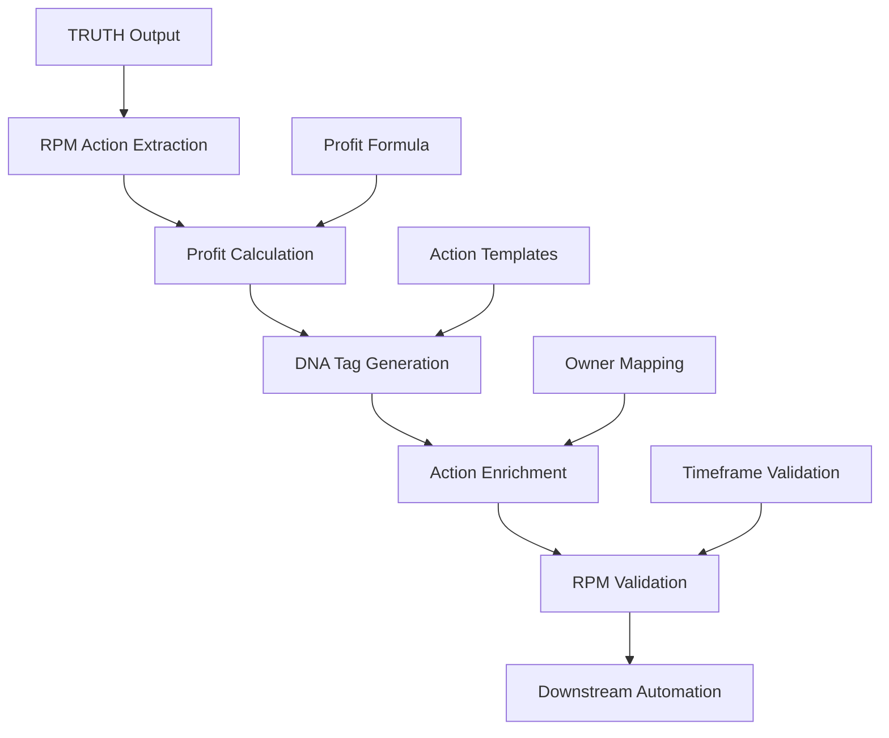

# TRUTH Pipeline RPM DNA Tagging

**Token Count**: ~1,300 | **Dependencies**: 01_architecture_overview.md, 07_agent_builder_nodes.md | **Last Updated**: 2025-10-21

## Summary

The TRUTH Pipeline RPM DNA tagging system implements profit-driven action templates with TAG::RPM_* schema, deterministic profit calculations, and comprehensive action enrichment. Each action includes purpose, action, owner, profit_delta, timeframe, and confidence metrics for downstream automation and tracking.

## RPM DNA Architecture

### RPM DNA Flow



### RPM DNA Schema

| Tag | Purpose | Format | Example |
|-----|---------|--------|---------|
| **TAG::RPM_RESULT** | Action outcome | String | "market_expansion" |
| **TAG::RPM_ACTION** | Specific action | String | "launch_new_product" |
| **TAG::RPM_OWNER** | Responsible party | String | "product_team" |
| **TAG::RPM_PROFIT** | Profit delta | Number | 50000 |
| **TAG::RPM_TIMEFRAME** | Execution timeline | String | "3_months" |
| **TAG::RPM_CONFIDENCE** | Action confidence | Number | 0.85 |

## RPM Action Templates

### Action Template Schema

```json
{
  "action_templates": {
    "market_expansion": {
      "purpose": "market_expansion",
      "action": "launch_new_product",
      "owner": "product_team",
      "profit_formula": "revenue_increase - development_cost - marketing_cost",
      "timeframe_options": ["1_month", "3_months", "6_months"],
      "confidence_factors": ["market_research", "competitive_analysis", "resource_availability"]
    },
    "cost_optimization": {
      "purpose": "cost_optimization",
      "action": "automate_process",
      "owner": "operations_team",
      "profit_formula": "labor_cost_savings - automation_cost",
      "timeframe_options": ["2_weeks", "1_month", "2_months"],
      "confidence_factors": ["process_complexity", "automation_feasibility", "team_capacity"]
    },
    "revenue_generation": {
      "purpose": "revenue_generation",
      "action": "upsell_existing_customers",
      "owner": "sales_team",
      "profit_formula": "upsell_revenue - sales_cost - support_cost",
      "timeframe_options": ["1_week", "2_weeks", "1_month"],
      "confidence_factors": ["customer_satisfaction", "product_fit", "sales_capacity"]
    }
  }
}
```

### Action Template Implementation

```bash
#!/bin/bash
# rpm_action_templates.sh

set -euo pipefail

# Configuration
TEMPLATE_DIR="data/rpm_templates"
OUTPUT_DIR="data/rpm_outputs"

# Load action templates
load_action_templates() {
  local template_file="$TEMPLATE_DIR/action_templates.json"
  
  if [ ! -f "$template_file" ]; then
    echo "ERROR: Action templates file not found: $template_file"
    return 1
  fi
  
  echo "Loaded action templates from: $template_file"
  return 0
}

# Generate RPM action from template
generate_rpm_action() {
  local template_name=$1
  local context_data=$2
  local output_file="$OUTPUT_DIR/rpm_action_$(date +%Y%m%d_%H%M%S).json"
  
  echo "Generating RPM action from template: $template_name"
  
  # Load template
  local template=$(jq -r ".action_templates.$template_name" "$TEMPLATE_DIR/action_templates.json")
  
  if [ "$template" = "null" ]; then
    echo "ERROR: Template not found: $template_name"
    return 1
  fi
  
  # Extract template fields
  local purpose=$(echo "$template" | jq -r '.purpose')
  local action=$(echo "$template" | jq -r '.action')
  local owner=$(echo "$template" | jq -r '.owner')
  local profit_formula=$(echo "$template" | jq -r '.profit_formula')
  local timeframe_options=$(echo "$template" | jq -r '.timeframe_options')
  local confidence_factors=$(echo "$template" | jq -r '.confidence_factors')
  
  # Calculate profit using formula
  local profit_delta=$(calculate_profit "$profit_formula" "$context_data")
  
  # Select appropriate timeframe
  local timeframe=$(select_timeframe "$timeframe_options" "$context_data")
  
  # Calculate confidence
  local confidence=$(calculate_confidence "$confidence_factors" "$context_data")
  
  # Generate RPM action
  cat > "$output_file" << EOF
{
  "purpose": "$purpose",
  "action": "$action",
  "owner": "$owner",
  "profit_delta": $profit_delta,
  "timeframe": "$timeframe",
  "confidence": $confidence,
  "template_used": "$template_name",
  "generated_at": "$(date -u +%Y-%m-%dT%H:%M:%SZ)"
}
EOF
  
  echo "RPM action generated: $output_file"
  return 0
}

# Calculate profit using formula
calculate_profit() {
  local formula=$1
  local context_data=$2
  
  # Extract variables from context
  local revenue_increase=$(echo "$context_data" | jq -r '.revenue_increase // 0')
  local development_cost=$(echo "$context_data" | jq -r '.development_cost // 0')
  local marketing_cost=$(echo "$context_data" | jq -r '.marketing_cost // 0')
  local labor_cost_savings=$(echo "$context_data" | jq -r '.labor_cost_savings // 0')
  local automation_cost=$(echo "$context_data" | jq -r '.automation_cost // 0')
  local upsell_revenue=$(echo "$context_data" | jq -r '.upsell_revenue // 0')
  local sales_cost=$(echo "$context_data" | jq -r '.sales_cost // 0')
  local support_cost=$(echo "$context_data" | jq -r '.support_cost // 0')
  
  # Calculate based on formula
  case "$formula" in
    "revenue_increase - development_cost - marketing_cost")
      echo "$((revenue_increase - development_cost - marketing_cost))"
      ;;
    "labor_cost_savings - automation_cost")
      echo "$((labor_cost_savings - automation_cost))"
      ;;
    "upsell_revenue - sales_cost - support_cost")
      echo "$((upsell_revenue - sales_cost - support_cost))"
      ;;
    *)
      echo "0"
      ;;
  esac
}

# Select appropriate timeframe
select_timeframe() {
  local timeframe_options=$1
  local context_data=$2
  
  # Extract urgency from context
  local urgency=$(echo "$context_data" | jq -r '.urgency // "medium"')
  
  case "$urgency" in
    "high")
      echo "$(echo "$timeframe_options" | jq -r '.[0]')"
      ;;
    "medium")
      echo "$(echo "$timeframe_options" | jq -r '.[1]')"
      ;;
    "low")
      echo "$(echo "$timeframe_options" | jq -r '.[2]')"
      ;;
    *)
      echo "$(echo "$timeframe_options" | jq -r '.[1]')"
      ;;
  esac
}

# Calculate confidence score
calculate_confidence() {
  local confidence_factors=$1
  local context_data=$2
  
  local total_confidence=0
  local factor_count=0
  
  # Evaluate each confidence factor
  for factor in $(echo "$confidence_factors" | jq -r '.[]'); do
    case "$factor" in
      "market_research")
        local market_research_score=$(echo "$context_data" | jq -r '.market_research_score // 0.5')
        total_confidence=$((total_confidence + market_research_score))
        factor_count=$((factor_count + 1))
        ;;
      "competitive_analysis")
        local competitive_score=$(echo "$context_data" | jq -r '.competitive_score // 0.5')
        total_confidence=$((total_confidence + competitive_score))
        factor_count=$((factor_count + 1))
        ;;
      "resource_availability")
        local resource_score=$(echo "$context_data" | jq -r '.resource_score // 0.5')
        total_confidence=$((total_confidence + resource_score))
        factor_count=$((factor_count + 1))
        ;;
      "process_complexity")
        local complexity_score=$(echo "$context_data" | jq -r '.complexity_score // 0.5')
        total_confidence=$((total_confidence + complexity_score))
        factor_count=$((factor_count + 1))
        ;;
      "automation_feasibility")
        local feasibility_score=$(echo "$context_data" | jq -r '.feasibility_score // 0.5')
        total_confidence=$((total_confidence + feasibility_score))
        factor_count=$((factor_count + 1))
        ;;
      "team_capacity")
        local capacity_score=$(echo "$context_data" | jq -r '.capacity_score // 0.5')
        total_confidence=$((total_confidence + capacity_score))
        factor_count=$((factor_count + 1))
        ;;
      "customer_satisfaction")
        local satisfaction_score=$(echo "$context_data" | jq -r '.satisfaction_score // 0.5')
        total_confidence=$((total_confidence + satisfaction_score))
        factor_count=$((factor_count + 1))
        ;;
      "product_fit")
        local fit_score=$(echo "$context_data" | jq -r '.fit_score // 0.5')
        total_confidence=$((total_confidence + fit_score))
        factor_count=$((factor_count + 1))
        ;;
      "sales_capacity")
        local sales_capacity_score=$(echo "$context_data" | jq -r '.sales_capacity_score // 0.5')
        total_confidence=$((total_confidence + sales_capacity_score))
        factor_count=$((factor_count + 1))
        ;;
    esac
  done
  
  # Calculate average confidence
  if [ "$factor_count" -gt 0 ]; then
    echo "scale=2; $total_confidence / $factor_count" | bc
  else
    echo "0.5"
  fi
}

# Main execution
main() {
  local template_name="${1:-market_expansion}"
  local context_file="${2:-data/context/action_context.json}"
  
  if [ ! -f "$context_file" ]; then
    echo "ERROR: Context file not found: $context_file"
    exit 1
  fi
  
  local context_data=$(cat "$context_file")
  
  echo "Starting RPM action generation"
  echo "Template: $template_name"
  echo "Context: $context_file"
  
  load_action_templates
  generate_rpm_action "$template_name" "$context_data"
  
  echo "RPM action generation completed successfully"
}

# Run main function
main "$@"
```

## RPM DNA Tag Generation

### DNA Tag Implementation

```bash
#!/bin/bash
# rpm_dna_tag_generator.sh

set -euo pipefail

# Configuration
OUTPUT_DIR="data/rpm_outputs"

# Generate RPM DNA tags
generate_rpm_dna_tags() {
  local rpm_action=$1
  local output_file="$OUTPUT_DIR/rpm_dna_$(date +%Y%m%d_%H%M%S).json"
  
  echo "Generating RPM DNA tags"
  
  # Extract action fields
  local purpose=$(echo "$rpm_action" | jq -r '.purpose')
  local action=$(echo "$rpm_action" | jq -r '.action')
  local owner=$(echo "$rpm_action" | jq -r '.owner')
  local profit_delta=$(echo "$rpm_action" | jq -r '.profit_delta')
  local timeframe=$(echo "$rpm_action" | jq -r '.timeframe')
  local confidence=$(echo "$rpm_action" | jq -r '.confidence')
  
  # Generate DNA tags
  cat > "$output_file" << EOF
{
  "TAG::RPM_RESULT": "$purpose",
  "TAG::RPM_ACTION": "$action",
  "TAG::RPM_OWNER": "$owner",
  "TAG::RPM_PROFIT": $profit_delta,
  "TAG::RPM_TIMEFRAME": "$timeframe",
  "TAG::RPM_CONFIDENCE": $confidence,
  "generated_at": "$(date -u +%Y-%m-%dT%H:%M:%SZ)"
}
EOF
  
  echo "RPM DNA tags generated: $output_file"
  return 0
}

# Main execution
main() {
  local rpm_action_file="${1:-data/rpm_outputs/rpm_action.json}"
  
  if [ ! -f "$rpm_action_file" ]; then
    echo "ERROR: RPM action file not found: $rpm_action_file"
    exit 1
  fi
  
  local rpm_action=$(cat "$rpm_action_file")
  
  echo "Starting RPM DNA tag generation"
  echo "Input file: $rpm_action_file"
  
  generate_rpm_dna_tags "$rpm_action"
  
  echo "RPM DNA tag generation completed successfully"
}

# Run main function
main "$@"
```

## RPM Action Enrichment

### Action Enrichment Logic

```bash
#!/bin/bash
# rpm_action_enrichment.sh

set -euo pipefail

# Configuration
OUTPUT_DIR="data/rpm_outputs"
ENRICHMENT_DIR="data/rpm_enrichment"

# Enrich RPM action
enrich_rpm_action() {
  local rpm_action=$1
  local enrichment_data=$2
  local output_file="$OUTPUT_DIR/enriched_rpm_$(date +%Y%m%d_%H%M%S).json"
  
  echo "Enriching RPM action"
  
  # Extract base action
  local purpose=$(echo "$rpm_action" | jq -r '.purpose')
  local action=$(echo "$rpm_action" | jq -r '.action')
  local owner=$(echo "$rpm_action" | jq -r '.owner')
  local profit_delta=$(echo "$rpm_action" | jq -r '.profit_delta')
  local timeframe=$(echo "$rpm_action" | jq -r '.timeframe')
  local confidence=$(echo "$rpm_action" | jq -r '.confidence')
  
  # Extract enrichment data
  local market_conditions=$(echo "$enrichment_data" | jq -r '.market_conditions // "stable"')
  local competitive_landscape=$(echo "$enrichment_data" | jq -r '.competitive_landscape // "moderate"')
  local resource_availability=$(echo "$enrichment_data" | jq -r '.resource_availability // "available"')
  local risk_factors=$(echo "$enrichment_data" | jq -r '.risk_factors // []')
  local success_metrics=$(echo "$enrichment_data" | jq -r '.success_metrics // []')
  
  # Calculate enriched profit (adjust for market conditions)
  local enriched_profit=$profit_delta
  case "$market_conditions" in
    "favorable")
      enriched_profit=$((profit_delta * 110 / 100))
      ;;
    "unfavorable")
      enriched_profit=$((profit_delta * 90 / 100))
      ;;
    "stable")
      enriched_profit=$profit_delta
      ;;
  esac
  
  # Adjust confidence based on risk factors
  local risk_count=$(echo "$risk_factors" | jq -r '. | length')
  local adjusted_confidence=$(echo "scale=2; $confidence - ($risk_count * 0.05)" | bc)
  
  # Generate enriched action
  cat > "$output_file" << EOF
{
  "purpose": "$purpose",
  "action": "$action",
  "owner": "$owner",
  "profit_delta": $enriched_profit,
  "timeframe": "$timeframe",
  "confidence": $adjusted_confidence,
  "enrichment": {
    "market_conditions": "$market_conditions",
    "competitive_landscape": "$competitive_landscape",
    "resource_availability": "$resource_availability",
    "risk_factors": $risk_factors,
    "success_metrics": $success_metrics,
    "original_profit": $profit_delta,
    "profit_adjustment": $((enriched_profit - profit_delta)),
    "confidence_adjustment": $(echo "scale=2; $adjusted_confidence - $confidence" | bc)
  },
  "enriched_at": "$(date -u +%Y-%m-%dT%H:%M:%SZ)"
}
EOF
  
  echo "RPM action enriched: $output_file"
  return 0
}

# Main execution
main() {
  local rpm_action_file="${1:-data/rpm_outputs/rpm_action.json}"
  local enrichment_file="${2:-data/rpm_enrichment/enrichment_data.json}"
  
  if [ ! -f "$rpm_action_file" ]; then
    echo "ERROR: RPM action file not found: $rpm_action_file"
    exit 1
  fi
  
  if [ ! -f "$enrichment_file" ]; then
    echo "ERROR: Enrichment file not found: $enrichment_file"
    exit 1
  fi
  
  local rpm_action=$(cat "$rpm_action_file")
  local enrichment_data=$(cat "$enrichment_file")
  
  echo "Starting RPM action enrichment"
  echo "Action file: $rpm_action_file"
  echo "Enrichment file: $enrichment_file"
  
  enrich_rpm_action "$rpm_action" "$enrichment_data"
  
  echo "RPM action enrichment completed successfully"
}

# Run main function
main "$@"
```

## RPM Validation & Gating

### RPM Validation Logic

```bash
#!/bin/bash
# rpm_validation.sh

set -euo pipefail

# Configuration
MIN_PROFIT_DELTA=0
MIN_CONFIDENCE=0.5
REQUIRED_TIMEFRAMES=("1_week" "2_weeks" "1_month" "2_months" "3_months" "6_months")

# Validate RPM action
validate_rpm_action() {
  local rpm_action=$1
  
  echo "Validating RPM action"
  
  # Check required fields
  local required_fields=("purpose" "action" "owner" "profit_delta" "timeframe" "confidence")
  for field in "${required_fields[@]}"; do
    if ! echo "$rpm_action" | jq -e ".$field" > /dev/null; then
      echo "ERROR: Missing required field: $field"
      return 1
    fi
  done
  
  # Validate profit delta
  local profit_delta=$(echo "$rpm_action" | jq -r '.profit_delta')
  if [ "$(echo "$profit_delta <= $MIN_PROFIT_DELTA" | bc)" -eq 1 ]; then
    echo "ERROR: Non-profitable action (profit_delta: $profit_delta <= $MIN_PROFIT_DELTA)"
    return 1
  fi
  
  # Validate confidence
  local confidence=$(echo "$rpm_action" | jq -r '.confidence')
  if [ "$(echo "$confidence < $MIN_CONFIDENCE" | bc)" -eq 1 ]; then
    echo "ERROR: Low confidence action (confidence: $confidence < $MIN_CONFIDENCE)"
    return 1
  fi
  
  # Validate timeframe
  local timeframe=$(echo "$rpm_action" | jq -r '.timeframe')
  local valid_timeframe=false
  for valid_timeframe_option in "${REQUIRED_TIMEFRAMES[@]}"; do
    if [ "$timeframe" = "$valid_timeframe_option" ]; then
      valid_timeframe=true
      break
    fi
  done
  
  if [ "$valid_timeframe" = false ]; then
    echo "ERROR: Invalid timeframe: $timeframe"
    return 1
  fi
  
  # Validate owner
  local owner=$(echo "$rpm_action" | jq -r '.owner')
  if [ -z "$owner" ]; then
    echo "ERROR: Empty owner field"
    return 1
  fi
  
  echo "RPM action validation passed"
  return 0
}

# Main execution
main() {
  local rpm_action_file="${1:-data/rpm_outputs/rpm_action.json}"
  
  if [ ! -f "$rpm_action_file" ]; then
    echo "ERROR: RPM action file not found: $rpm_action_file"
    exit 1
  fi
  
  local rpm_action=$(cat "$rpm_action_file")
  
  echo "Starting RPM validation"
  echo "Input file: $rpm_action_file"
  
  validate_rpm_action "$rpm_action"
  
  echo "RPM validation completed successfully"
}

# Run main function
main "$@"
```

## RPM Profit Assessment

### Profit Assessment Logic

```bash
#!/bin/bash
# rpm_profit_assessment.sh

set -euo pipefail

# Configuration
OUTPUT_DIR="data/rpm_outputs"
ASSESSMENT_DIR="data/rpm_assessment"

# Assess RPM profit
assess_rpm_profit() {
  local rpm_action=$1
  local market_data=$2
  local output_file="$OUTPUT_DIR/profit_assessment_$(date +%Y%m%d_%H%M%S).json"
  
  echo "Assessing RPM profit"
  
  # Extract action data
  local purpose=$(echo "$rpm_action" | jq -r '.purpose')
  local action=$(echo "$rpm_action" | jq -r '.action')
  local profit_delta=$(echo "$rpm_action" | jq -r '.profit_delta')
  local timeframe=$(echo "$rpm_action" | jq -r '.timeframe')
  local confidence=$(echo "$rpm_action" | jq -r '.confidence')
  
  # Extract market data
  local market_growth=$(echo "$market_data" | jq -r '.market_growth_rate // 0')
  local competitive_intensity=$(echo "$market_data" | jq -r '.competitive_intensity // 0.5')
  local economic_conditions=$(echo "$market_data" | jq -r '.economic_conditions // "stable"')
  
  # Calculate profit assessment
  local base_profit=$profit_delta
  
  # Adjust for market growth
  local growth_adjusted_profit=$(echo "scale=2; $base_profit * (1 + $market_growth)" | bc)
  
  # Adjust for competitive intensity
  local competitive_adjusted_profit=$(echo "scale=2; $growth_adjusted_profit * (1 - $competitive_intensity)" | bc)
  
  # Adjust for economic conditions
  case "$economic_conditions" in
    "favorable")
      local economic_adjusted_profit=$(echo "scale=2; $competitive_adjusted_profit * 1.1" | bc)
      ;;
    "unfavorable")
      local economic_adjusted_profit=$(echo "scale=2; $competitive_adjusted_profit * 0.9" | bc)
      ;;
    "stable")
      local economic_adjusted_profit=$competitive_adjusted_profit
      ;;
  esac
  
  # Calculate risk-adjusted profit
  local risk_adjusted_profit=$(echo "scale=2; $economic_adjusted_profit * $confidence" | bc)
  
  # Generate profit assessment
  cat > "$output_file" << EOF
{
  "action": "$action",
  "purpose": "$purpose",
  "profit_assessment": {
    "base_profit": $base_profit,
    "growth_adjusted_profit": $growth_adjusted_profit,
    "competitive_adjusted_profit": $competitive_adjusted_profit,
    "economic_adjusted_profit": $economic_adjusted_profit,
    "risk_adjusted_profit": $risk_adjusted_profit,
    "confidence_factor": $confidence
  },
  "market_factors": {
    "market_growth_rate": $market_growth,
    "competitive_intensity": $competitive_intensity,
    "economic_conditions": "$economic_conditions"
  },
  "timeframe": "$timeframe",
  "assessment_date": "$(date -u +%Y-%m-%dT%H:%M:%SZ)"
}
EOF
  
  echo "RPM profit assessment completed: $output_file"
  return 0
}

# Main execution
main() {
  local rpm_action_file="${1:-data/rpm_outputs/rpm_action.json}"
  local market_data_file="${2:-data/market/market_data.json}"
  
  if [ ! -f "$rpm_action_file" ]; then
    echo "ERROR: RPM action file not found: $rpm_action_file"
    exit 1
  fi
  
  if [ ! -f "$market_data_file" ]; then
    echo "ERROR: Market data file not found: $market_data_file"
    exit 1
  fi
  
  local rpm_action=$(cat "$rpm_action_file")
  local market_data=$(cat "$market_data_file")
  
  echo "Starting RPM profit assessment"
  echo "Action file: $rpm_action_file"
  echo "Market data file: $market_data_file"
  
  assess_rpm_profit "$rpm_action" "$market_data"
  
  echo "RPM profit assessment completed successfully"
}

# Run main function
main "$@"
```

## References

- **Source**: copilot-liv-hana-10-21.txt:141-147, 2722-2745, 5296-5338, 5410-5411
- **Related**: 01_architecture_overview.md, 07_agent_builder_nodes.md, 09_voice_modes.md
- **Validation**: 06_validation_harness.md, 08_secrets_integration.md
