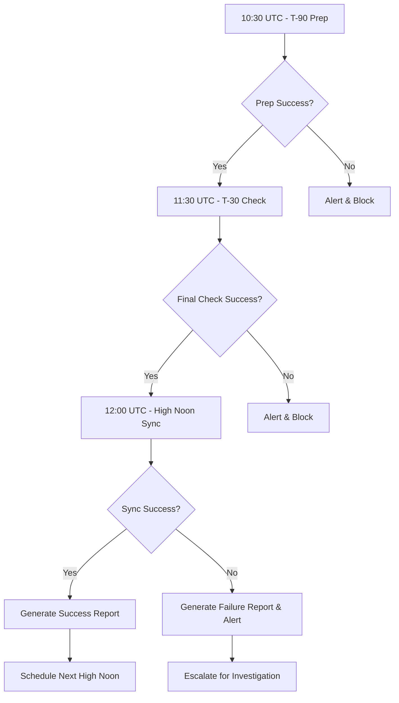

# Schedulers Summary

**Status:** Implemented  
**Source:** Current Chat Session + Existing Scripts Analysis  
**Last Updated:** 2025-09-28T12:00:00Z  
**ADR Candidate:** ADR-006 (Proposed)

---

## Overview

The Scheduler system orchestrates critical operations across the Liv Hana Sovereign Trinity using a precise timing cadence. Operations are coordinated around "High Noon" (12:00 UTC daily) with T-90 and T-30 preparation phases ensuring system readiness and compliance.

## Scheduler Architecture

### Core Scheduling Philosophy
- **High Noon Anchor:** All critical operations synchronized to 12:00 UTC daily
- **Preparation Phases:** T-90 and T-30 checkpoints ensure deployment readiness  
- **Fail-Fast:** Early validation prevents downstream issues
- **Compliance First:** 21+ guardrails enforced at every stage

## Existing Schedulers

### T-90 Preparation (10:30 UTC Daily)
**File:** `automation/schedulers/t-90-prep.sh`  
**Purpose:** System preparation and pre-flight validation  
**Duration:** ~15 minutes  

#### Key Operations
1. **Sovereign Context Validation**
   - Checks `highnoon/context_manifest.yaml`
   - Creates manifest if missing via `create_context_manifest.sh`

2. **Trinity Repository Status**
   - Executes `../scripts/check_trinity_status.sh`
   - Validates LivHana-SoT, LivHana-Kinetic, LivHana-Potential

3. **Pre-flight Compliance Check**  
   - Runs `../scripts/validate_compliance.sh`
   - Enforces 21+ guardrails

4. **Data Layer Preparation**
   - Executes `../scripts/prep_ingestion_data.sh`
   - Prepares data pipelines for High Noon sync

#### Environment Variables
```bash
export COMPLIANCE_LEVEL="21+"
export SOVEREIGN_TRINITY="LivHana-SoT,LivHana-Kinetic,LivHana-Potential"
```

#### Exit Codes
- `0`: All preparation successful
- `1`: General failure requiring investigation
- `4`: Compliance violation - immediate escalation

### T-30 Final Check (11:30 UTC Daily)
**File:** `automation/schedulers/t-30-final-check.sh`  
**Purpose:** Final validation before High Noon deployment  
**Duration:** ~10 minutes

#### Key Operations  
1. **Final Context Validation**
   - Executes `../scripts/validate_context_integrity.sh`
   - Ensures context consistency across Trinity

2. **Service Health Check**
   - Runs `../scripts/check_service_health.sh` 
   - Validates all critical services operational

3. **Data Integrity Verification**
   - Executes `../scripts/verify_data_integrity.sh`
   - Ensures data layer consistency

4. **Compliance Audit**
   - Runs `../scripts/run_compliance_audit.sh`
   - Final 21+ compliance verification

5. **Deployment Readiness Report**
   - Generates readiness assessment
   - Creates go/no-go decision data

#### Environment Variables
```bash
export COMPLIANCE_LEVEL="21+"  
export SOVEREIGN_TRINITY="LivHana-SoT,LivHana-Kinetic,LivHana-Potential"
```

#### Exit Codes
- `0`: System ready for High Noon deployment
- `1`: Readiness check failed - deployment blocked
- `4`: Compliance failure - immediate escalation

### High Noon Sync (12:00 UTC Daily)
**File:** `automation/schedulers/high-noon-sync.sh`  
**Purpose:** Main synchronization and deployment orchestration  
**Duration:** ~20 minutes

#### Key Operations
1. **Sovereign Context Update**
   - Executes `./scripts/update_sovereign_context.sh`
   - Synchronizes context across Trinity

2. **Trinity Repository Sync**
   - Runs `./scripts/sync_trinity_repositories.sh`
   - Ensures repository alignment

3. **Data Layer Refresh**  
   - Executes `./scripts/refresh_data_layer.sh`
   - Updates operational data

4. **Service Deployment Validation**
   - Runs `./scripts/validate_service_deployments.sh`
   - Confirms successful deployments

5. **Sovereign Compliance Validation**
   - Executes `./scripts/validate_sovereign_compliance.sh`
   - Final compliance confirmation

6. **High Noon Report Generation**
   - Creates detailed sync report
   - Logs success/failure status

#### Environment Variables
```bash
export COMPLIANCE_LEVEL="21+"
export SOVEREIGN_TRINITY="LivHana-SoT,LivHana-Kinetic,LivHana-Potential"
SYNC_TIMESTAMP=$(date -u +%Y-%m-%dT%H:%M:%SZ)
NEXT_HIGH_NOON=$(calculated via Python script)
```

#### Report Structure
```markdown
# 🌅 HIGH NOON SYNC REPORT
Generated: {SYNC_TIMESTAMP}

## Executive Summary
High Noon sync completed successfully across the Sovereign Trinity.

## Synchronization Details
- ✅ Sovereign Context: Updated
- ✅ Trinity Repositories: Synchronized  
- ✅ Data Layer: Refreshed
- ✅ Service Deployments: Validated
- ✅ Compliance: Maintained

## Sovereign Status
- LivHana-SoT: Active and synchronized
- LivHana-Kinetic: Active and synchronized
- LivHana-Potential: Active and synchronized

## Next High Noon
- Scheduled: {NEXT_HIGH_NOON}
- All systems operational
- 21+ compliance enforced
```

## Planned Schedulers

### Weekly Risk Review (Sundays 12:00 UTC)
**File:** `automation/schedulers/weekly-risk-review.sh` (To be created)  
**Purpose:** Comprehensive risk assessment and mitigation planning

#### Planned Operations
1. **Security Audit**
   - Full system vulnerability scan
   - Compliance drift analysis
   - Access review and cleanup

2. **Performance Analysis**  
   - Weekly metrics aggregation
   - Trend analysis and forecasting
   - Capacity planning updates

3. **Business Continuity Check**
   - Backup validation
   - Disaster recovery testing
   - Documentation currency review

### Snapshot Orchestration (Every 6 hours)
**File:** `automation/schedulers/snapshot-orchestration.sh` (To be created)  
**Purpose:** Memory system snapshot management and governance

#### Planned Operations
1. **Memory Snapshot Creation**
   - Behavioral snapshot capture
   - Context state preservation  
   - User preference evolution tracking

2. **Snapshot Validation**
   - Schema compliance verification
   - Data integrity checks
   - Freshness validation

3. **Snapshot Cleanup**
   - Aged snapshot removal
   - Storage optimization
   - Archive policy enforcement

## Orchestration Flow



## Monitoring Integration

### Custom Metrics
- `custom.googleapis.com/herbitrage/scheduler_execution_duration_ms` (Histogram)
- `custom.googleapis.com/herbitrage/scheduler_success_rate` (Gauge)  
- `custom.googleapis.com/herbitrage/high_noon_sync_status` (Gauge)
- `custom.googleapis.com/herbitrage/compliance_check_results` (Counter)

### Alerting Rules
- T-90 or T-30 failure → PagerDuty immediate
- High Noon sync failure → Critical escalation
- Compliance violations → Security team notification
- Multiple consecutive failures → Engineering oncall

## Cron Configuration

```bash
# T-90 Preparation (10:30 UTC daily)
30 10 * * * /path/to/automation/schedulers/t-90-prep.sh >> /var/log/t90-prep.log 2>&1

# T-30 Final Check (11:30 UTC daily)  
30 11 * * * /path/to/automation/schedulers/t-30-final-check.sh >> /var/log/t30-check.log 2>&1

# High Noon Sync (12:00 UTC daily)
0 12 * * * /path/to/automation/schedulers/high-noon-sync.sh >> /var/log/high-noon.log 2>&1

# Weekly Risk Review (Sundays 12:00 UTC)
0 12 * * 0 /path/to/automation/schedulers/weekly-risk-review.sh >> /var/log/weekly-risk.log 2>&1

# Snapshot Orchestration (Every 6 hours)
0 */6 * * * /path/to/automation/schedulers/snapshot-orchestration.sh >> /var/log/snapshots.log 2>&1
```

## Promotion Rules

### Success Criteria
1. All verification scripts pass (exit code 0)
2. No compliance violations detected
3. All Trinity repositories synchronized
4. Service health checks pass
5. Data integrity verified

### Failure Handling
1. **Soft Failures:** Log warning, continue with degraded functionality
2. **Hard Failures:** Block deployment, trigger alerts, require manual intervention
3. **Compliance Failures:** Immediate escalation, system lockdown if necessary

## Disaster Recovery

### Rollback Procedures
1. **T-90 Failure:** Skip High Noon, investigate offline
2. **T-30 Failure:** Emergency deployment hold, manual assessment
3. **High Noon Failure:** Immediate rollback to last known good state

### Emergency Contacts
- Engineering Oncall: PagerDuty escalation
- Security Team: Compliance violation notifications  
- Business Continuity: Service degradation alerts

---

**Verification Commands:**
```bash
# Test scheduler execution
automation/schedulers/t-90-prep.sh --dry-run
automation/schedulers/t-30-final-check.sh --dry-run  
automation/schedulers/high-noon-sync.sh --dry-run

# Check next High Noon calculation
python -c "
from datetime import datetime, timedelta
def next_noon_utc(now):
    base = now.replace(hour=12, minute=0, second=0, microsecond=0)
    if now >= base:
        base += timedelta(days=1)
    return base
print(next_noon_utc(datetime.utcnow()))
"
```

**Next Steps:**
1. Create missing schedulers (weekly risk review, snapshot orchestration)
2. Implement dry-run mode for all schedulers
3. Add comprehensive logging and monitoring
4. Create formal ADR-006 for Scheduler architecture